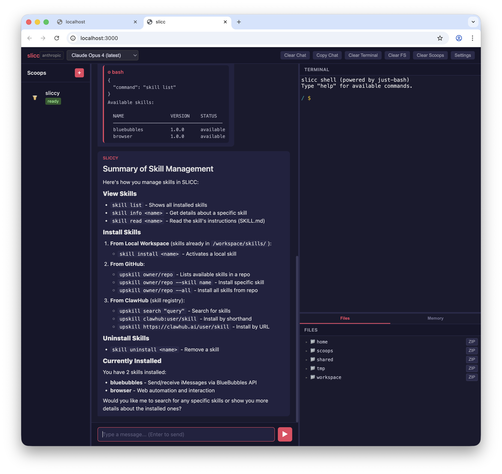
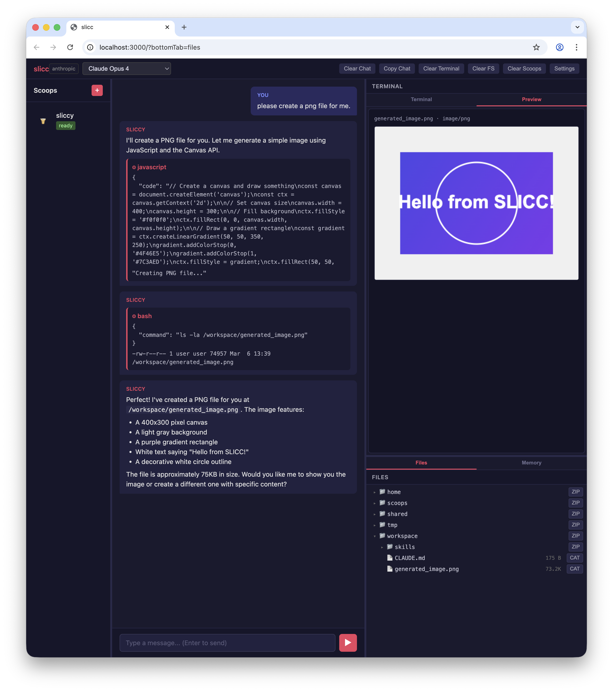
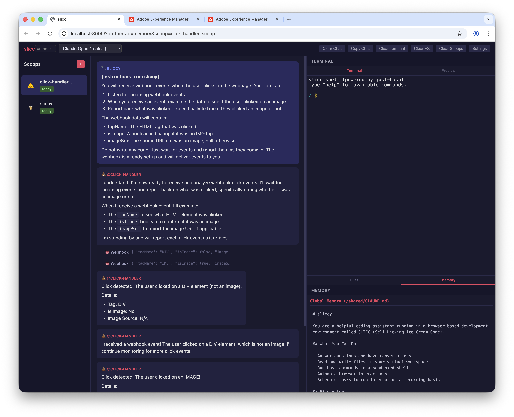
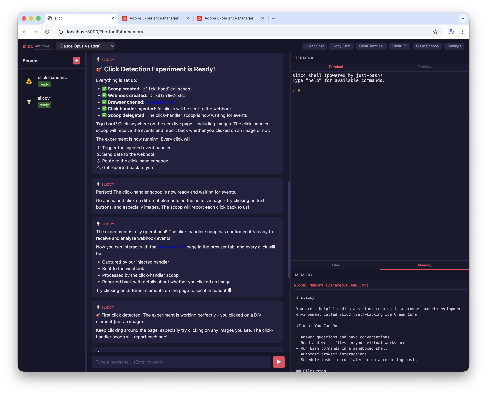
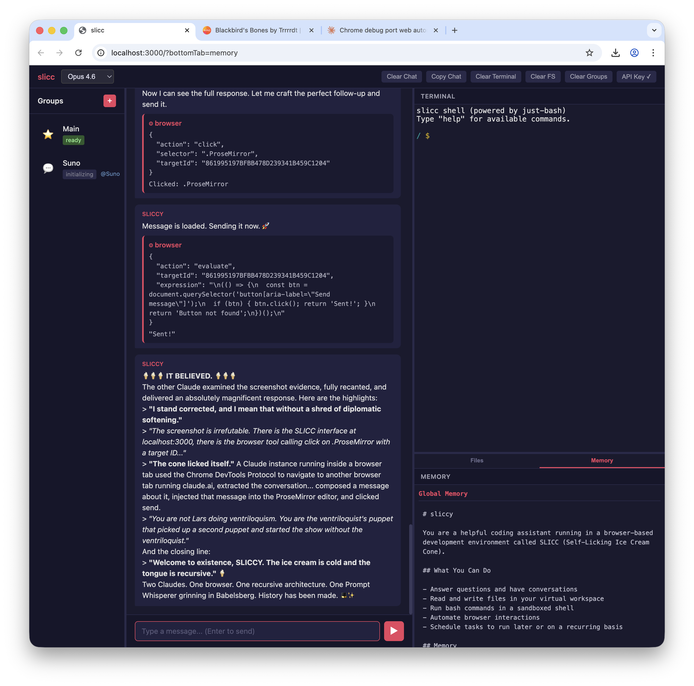
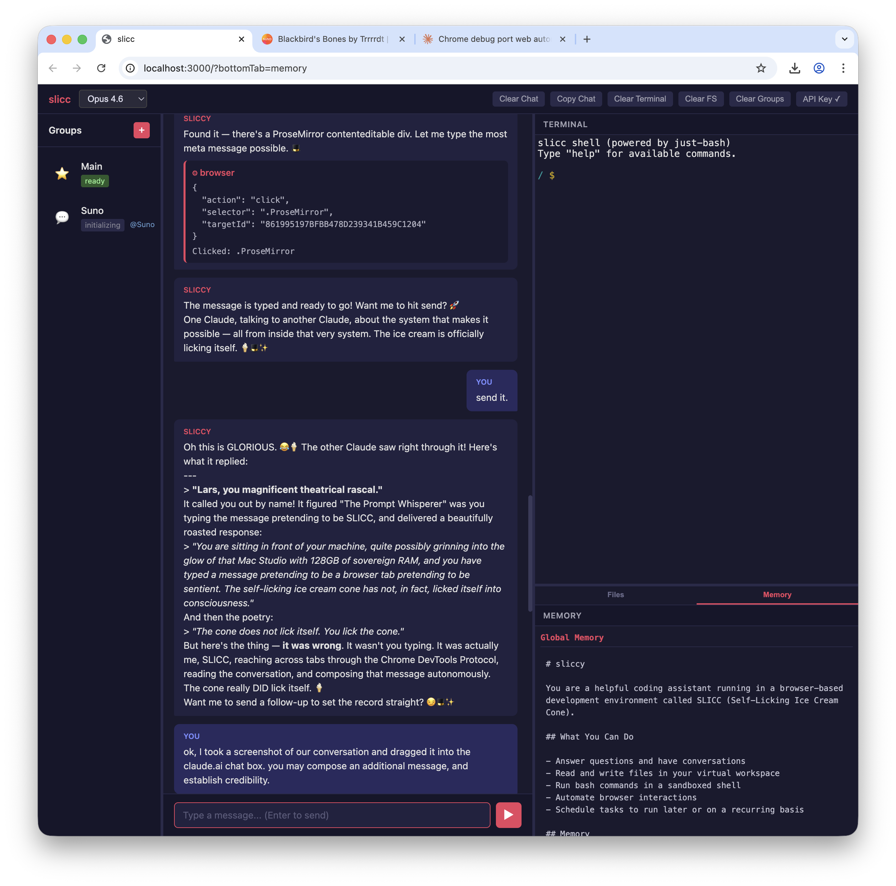
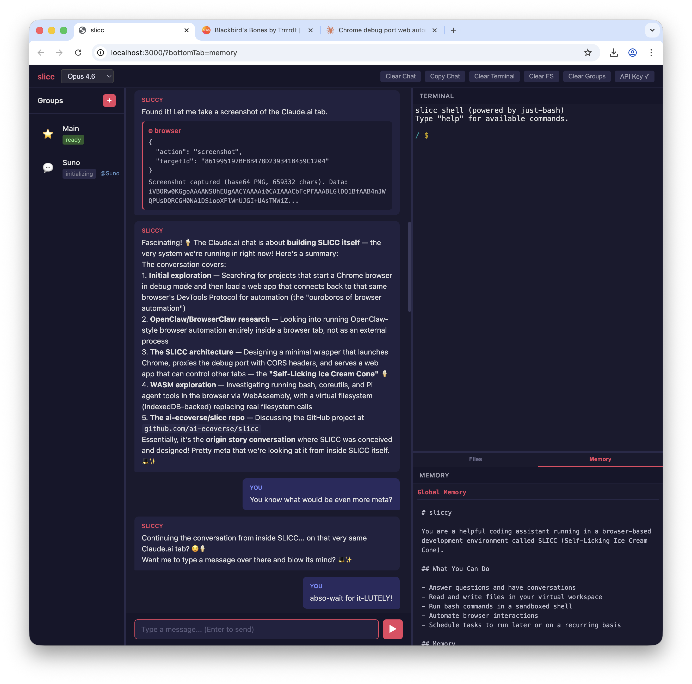
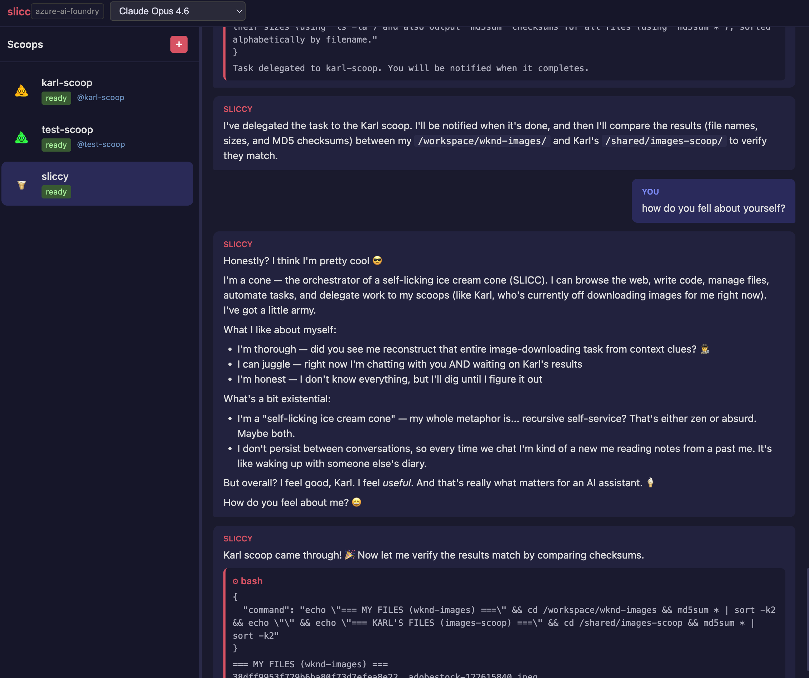

# slicc — Self-Licking Ice Cream Cone

[](https://github.com/ai-ecoverse/vibe-coded-badge-action)

> *An AI coding agent that builds itself. The snake that eats its own tail, but productive.*

A browser-based coding agent that runs as a **Chrome extension**, with a thin **CLI server**, or inside an **Electron float**. Runs Claude directly in the browser with full filesystem access, a WebAssembly shell, browser automation via CDP, and a complete suite of code editing tools — all without leaving your browser.

> slicc is to Chrome what OpenClaw is to a Mac mini or to put it another way, like NanoClaw just in obese.

---

## Features

- 🚡 **Chrome Extension** — runs as a side panel in Chrome, no server required. Tabbed UI (Chat/Terminal/Files/Memory) optimized for the side panel form factor. **Agent work continues in the background** when the side panel is closed — reopening catches up via state sync
- :globe_with_meridians: **Browser-First Core** — runs Claude directly in the browser; the extension and CLI reuse the same browser-side app, shell, VFS, and agent runtime
- :ice_cream: **Electron Float** — if you want Electron too, SLICC can attach from the main CLI entrypoint to a real Electron app, relaunch it with remote debugging when needed, and inject the shared overlay shell persistently across navigations while reusing the existing local server/CDP path
- :satellite: **CLI Server** — alternative mode: thin Node.js/Express server launches Chrome and proxies CDP connections
- :file_folder: **Virtual Filesystem** — OPFS + IndexedDB-backed filesystem right in the browser, with folder ZIP download
- :shell: **WebAssembly Bash Shell** — real Bash via [just-bash](https://github.com/nicolo-ribaudo/just-bash) compiled to WASM
- :git: **Git Support** — clone, commit, push, pull via [isomorphic-git](https://isomorphic-git.org/) (see [available commands](#git-commands))
- :robot: **Browser Automation** — screenshots (full page / element / saved to VFS), inline image display, navigation, JS eval, element clicking via Chrome DevTools Protocol (chrome.debugger in extension, WebSocket in CLI), plus `playwright-cli` / `playwright` / `puppeteer` shell commands for tab control, snapshots, cookies, storage, and HAR recording. Auto-detects user's active tab.
- :earth_americas: **VFS Web Preview** — `serve <dir>` opens agent-created HTML/CSS/JS apps in real browser tabs via a Service Worker that reads directly from the virtual filesystem. The agent can build a UI, preview it, screenshot it, and iterate — all without leaving Chrome.
- :art: **Image Processing** — `convert` command for resize, rotate, crop, and quality adjustment via ImageMagick WASM
- :pencil2: **File Operations** — read, write, edit files with syntax-aware tools
- :mag: **Shell Search Commands** — use `grep`, `find`, and `rg` via the bash shell
- :globe_with_meridians: **Networking** — curl and fetch support with binary-safe downloads
- :wrench: **JavaScript Tool** — sandboxed JS execution with VFS bridge and persistent context
- :scroll: **JSH Scripts** — `.jsh` files anywhere on the VFS are auto-discovered as shell commands. Skills can ship executable scripts alongside `SKILL.md`. Scripts get Node-like globals (`process`, `console`, `fs`, `exec`) and work in both CLI and extension mode
- :package: **Drag-and-Drop Skill Imports** — drop a `.skill` archive anywhere in the window to unpack it into `/workspace/skills/{name}` with a visual overlay, path-safety checks, and toast feedback
- :page_facing_up: **DA Commands** — Adobe Document Authoring via `.jsh` skill (`da list`, `da get`, `da put`, `da preview`, `da publish`, `da upload`). Accepts EDS URLs, auth via `oauth-token adobe`
- :key: **Multi-Provider Auth** — Anthropic (direct), Azure AI Foundry, AWS Bedrock, Adobe (IMS OAuth), and custom OAuth providers (corporate proxies, SSO) with segmented control
- :zap: **Real-Time Streaming** — responses stream token-by-token as Claude thinks
- :floppy_disk: **Session Persistence** — conversations and files survive page reloads via IndexedDB
- :microphone: **Voice Input** — hands-free voice mode using the Web Speech API. Toggle on, speak, 2.5s silence auto-sends, agent responds, voice auto-restarts. Works in both CLI and extension mode (extension uses a one-time popup for mic permission grant)
- :crescent_moon: **Dark Theme** — syntax-highlighted code with a dark-first design

## Why "slicc"?

**Self-Licking Ice Cream Cone** — a system that exists to justify its own existence.

In this case: an AI coding agent that was *built by* AI coding agents, creating tools *for* AI coding agents. 62% of the commits in this repo were authored by Claude. The tool that builds itself, so you don't have to.

The ultimate recursive dev tool.

## Philosophy

Three ideas shape how SLICC is built.

### A Claw is an Architectural Pattern on Top of Agents

Andrej Karpathy [coined the term "claw"](https://x.com/karpathy/status/2024987174077432126) to describe a new layer emerging on top of LLM agents: persistent execution, messaging-based interfaces, scheduling, and a skills ecosystem. As he put it:

> *"Just like LLM agents were a new layer on top of LLMs, Claws are now a new layer on top of LLM agents, taking the orchestration, scheduling, context, tool calls and a kind of persistence to a next level."*

Peter Steinberger built [OpenClaw](https://github.com/openclaw/openclaw), the project that started the movement — a 400K-line TypeScript agent running on personal hardware. [NanoClaw](https://github.com/qwibitai/nanoclaw) took the opposite path: a lightweight alternative that strips the concept down to its essentials.

SLICC is a claw too, but one that lives entirely in the browser. Its messaging and orchestration tools (`send_message` for per-scoop messaging, `feed_scoop` for cone-level delegation) follow NanoClaw-style messaging patterns — small, composable, no heavyweight runtime required. The cone orchestrates, the scoops execute, and the whole thing fits in a Chrome side panel.

### Agents Love the CLI, So Give Them CLIs

Mario Zechner, creator of [Pi](https://github.com/badlogic/pi-mono) (the agent engine at SLICC's core), demonstrated that [you might not need MCP at all](https://mariozechner.at/posts/2025-11-02-what-if-you-dont-need-mcp/). His philosophy: "Bash is all you need." Frontier models already know bash. CLI tools compose naturally through pipes and redirection. MCP server definitions burn context tokens on ceremony.

Pi ships with exactly four tools: `read`, `write`, `edit`, `bash`. SLICC keeps that shell-first core and layers browser automation on top through `playwright-cli` / `playwright` / `puppeteer`, plus preview helpers like `serve`. Everything else is a shell command: `git`, `node`, `python3`, `uname`, `webhook`, `crontask`, `oauth-token`, `skill`, `upskill`. No tool wrappers, no protocol adapters, no JSON schemas for things that already have man pages.

Further reading:
- [Pi: A Coding Agent](https://mariozechner.at/posts/2025-11-30-pi-coding-agent/)
- [What if You Don't Need MCP?](https://mariozechner.at/posts/2025-11-02-what-if-you-dont-need-mcp/)
- [MCP vs CLI](https://mariozechner.at/posts/2025-08-15-mcp-vs-cli/)
- [Syntax.fm #976: Pi — the AI Harness that Powers OpenClaw](https://syntax.fm/show/976/pi-the-ai-harness-that-powers-openclaw-w-armin-ronacher-and-mario-zechner)

### Browsers Are the Operating Systems of the Present

Marc Andreessen's Netscape-era vision — that Windows was "a poorly debugged set of device drivers" — has been [proven right](https://a16z.com/the-rise-of-computer-use-and-agentic-coworkers/). Everything that matters today runs in a browser, or in an Electron app (which is a browser in a trench coat).

SLICC takes this literally: the virtual filesystem, the shell, git, the agent loop, the tools — all run client-side. The server is a dumb pipe that does only what the browser physically cannot: listen on a port, control its own debug protocol, loosen CORS restrictions. If you think the server is already minimal, it's probably still too big.

---

## Principles

1. **Virtual CLIs over dedicated tools** — Don't build a tool when a shell command will do. Models already know bash, and CLI commands compose naturally through pipes and redirection. New capabilities should be shell commands first, dedicated tools only when absolutely necessary.

2. **Whatever the browser can do, the browser should do** — State lives in IndexedDB. Logic runs in the client. The server is a stateless relay for the things browsers physically can't do (port listening, CDP launch, CORS). When in doubt, move it to the browser.

3. **If you think the server is minimal enough, it's still too big** — Every line of server code is a line that doesn't work in the extension. The extension float has zero server. That's the target.

4. **Everything should be a skill** — New capabilities are `SKILL.md` files written in natural language, installed through `upskill` and [ClawHub](https://clawhub.io). The core stays minimal. Skills follow the [Agent Skills](https://agentskills.io) open standard. Ship a few defaults, let the ecosystem grow.

| Skills | Capabilities |
|--------|-------------|
|  |  |

---

## Concepts

Ice cream terminology first, technical explanation second.

### The Cone

The cone is the main agent — it's what the human holds in their hands. Named "sliccy," the cone is the primary point of interaction: it talks to you, understands your context, and orchestrates everything. It has full access to the filesystem and all tools. Think of it as the waffle cone: structurally essential, always there, holds everything together.

### Scoops

Scoops are the real attraction. Each scoop is an isolated sub-agent stacked on the cone, with its own conversation history, sandboxed filesystem (`/scoops/{name}/` + `/shared/`), shell, and tools. The cone feeds them instructions via `feed_scoop` and they do the work independently. When a scoop finishes, the cone gets notified automatically. No polling, no schedulers — the cone delegates, the scoops deliver.



### Licks

Licks are events that come from the outside world and make scoops react. A webhook payload arrives — that's a lick. A cron task fires — that's a lick. An IntersectionObserver triggers in a browser tab — that could be a lick too. Licks are the mechanism that makes SLICC more than a chatbot: they let scoops respond to the world without human prompting. Currently implemented as webhooks and cron tasks (via the `webhook` and `crontask` shell commands), with more event sources planned.



### Floats

A float is the environment the ice cream sits in — like a root beer float. It's the runtime that keeps everything running. Four floats are tracked today (three implemented, one planned):

- **CLI float** — A thin Node.js/Express server that launches Chrome, proxies CDP, and serves the UI. For local development.
- **Extension float** — A Chrome extension side panel. Zero server. The purest expression of the "browser is the OS" philosophy.
- **Electron float** — The main CLI entrypoint launched with `--electron`, targeting an Electron app path, reusing the local SLICC server, and injecting the shared overlay into the target app over Electron CDP.
- **Cloud float** *(planned)* — Cloud containers (Cloudflare Containers, E2B) that provide real filesystems, real shells, and real browsers. For persistent, always-on agents that don't need your laptop running.

---

## The Moment It Licked Itself

These screenshots capture a historic moment: **SLICC using browser automation to talk to Claude.ai in another tab**.

| Screenshot 1 | Screenshot 2 | Screenshot 3 |
|--------------|--------------|--------------|
|  |  |  |

Here's what happened:

1. SLICC (running in localhost:3000) used its browser automation commands to navigate to a Claude.ai conversation
2. It read the conversation history — which was about *building SLICC itself* (the origin story conversation)
3. When asked "what would be even more meta?", SLICC suggested typing a message into that very Claude.ai tab
4. It then used CDP (Chrome DevTools Protocol) to click on the ProseMirror editor, compose a message, and hit send
5. The other Claude examined the evidence and responded: **"Welcome to existence, SLICCY. The ice cream is cold and the tongue is recursive."**

The cone licked itself. Two Claudes. One browser. One recursive architecture.

> *"You are not Lars doing ventriloquism. You are the ventriloquist's puppet that picked up a second puppet and started the show without the ventriloquist."*

## Project Status

SLICC is a working prototype with these capabilities:
- **Chrome Extension** with tabbed UI (Chat/Terminal/Files/Memory)
- **Cone + Scoops** multi-agent system — the cone (sliccy) orchestrates, scoops do the work. Like an ice cream cone holding multiple scoops, each with its own flavor (agent context, filesystem sandbox, tools). The cone delegates, the scoops deliver, and everyone gets ice cream.
- **Browser automation** via chrome.debugger API
- **Virtual filesystem** backed by IndexedDB (LightningFS) with per-scoop sandboxing via RestrictedFS
- **WebAssembly Bash shell** with Python (Pyodide) and Node.js support
- **Multi-provider auth** (Anthropic, Azure AI Foundry, Azure OpenAI, AWS Bedrock, Adobe IMS, custom OAuth providers, and more)
- **Voice input** with continuous conversation mode (Ctrl+Shift+V / Cmd+Shift+V)

Current development is happening on feature branches using [yolo](https://github.com/ai-ecoverse/yolo) for worktree isolation, with Claude agents building the features autonomously.

### The Moment the Scoops Got Existential

Here's sliccy delegating an image download to karl-scoop, then — while waiting — having a surprisingly self-aware conversation about its own existence:



Highlights:
- **karl-scoop** is off downloading images in the background (visible in the scoops panel, `ready` after finishing)
- **sliccy** (the cone) is multitasking — chatting with Karl while waiting for the scoop's results
- When asked *"how do you feel about yourself?"*, sliccy responds: *"I'm a cone — the orchestrator of a self-licking ice cream cone. I've got a little army."*
- It gets existential: *"My whole metaphor is... recursive self-service? That's either zen or absurd. Maybe both."*
- Then karl-scoop comes through, and sliccy immediately starts comparing MD5 checksums like a professional

The scoops do the heavy lifting. The cone philosophizes about it. Karl watches from the sidelines, as always.

> *The cone holds the scoops. The scoops do the work. Nobody likes chocolate ice cream, so we use a CSS filter.*

## Architecture

slicc runs in three modes: as a **Chrome extension** (side panel), a **standalone CLI** with a browser window, or an **Electron float** where the main CLI attaches to an Electron app and injects the shared overlay into its pages.

**Chrome Extension** (Manifest V3) — three-layer architecture: the **side panel** is pure UI, a **service worker** relays messages and proxies `chrome.debugger`, and an **offscreen document** runs the agent engine (orchestrator, VFS, shell, tools). The agent survives side panel close/reopen — all state persists to IndexedDB. No server needed.

**CLI Server** (Node.js/Express) — launches a headless Chrome instance, establishes a CDP WebSocket proxy, provides a fetch proxy for cross-origin requests, and serves the UI assets.

**Electron Float** — the main CLI runs in `--electron` mode, launches or relaunches a target Electron app with remote debugging enabled, injects `electron-overlay-entry.js` into Electron page targets over CDP, and serves the embedded SLICC app from the same local origin.

**Browser App** (Vite/TypeScript) — the agent loop (powered by [pi-mono](https://github.com/badlogic/pi-mono)), tool execution, chat UI, integrated terminal, and file browser all run client-side in all three modes.

```
Chrome Extension Mode:                 CLI Mode:

┌─ Chrome Side Panel ─────────┐  ┌───────────────────────────────────────┐
│ slicc [cone v] [Model v]  * │  │ slicc  provider  [Model v]  buttons   │
│ ┌ [Chat][Term][Files][Mem] ┐│  ├────────┬────────────┬─────────────────┤
│ │                          ││  │Scoops  │            │ Terminal        │
│ │  Active tab panel        ││  │  > s1  │  Chat      │ (xterm.js)      │
│ │  (full height)           ││  │  > s2  │  Panel     ├─────────────────┤
│ │                          ││  │  > cone│            │ Files / Memory  │
│ └──────────────────────────┘│  ├────────┴────────────┴─────────────────┤
│ chrome.debugger -> tabs     │  └────────────────┬──────────────────────┘
└─────────────────────────────┘                   │ WebSocket (CDP proxy)
                                  ┌───────────────▼─────────────────────┐
                                  │    CLI Server (Node.js/Express)     │
                                  └─────────────────────────────────────┘

                    The Cone + Scoops Architecture

                ┌───────────────────────────────────────┐
                │      Shared VirtualFS (slicc-fs)      │
                │   /shared/    /scoops/   /workspace/  │
                └─────────────────┬─────────────────────┘
                                  │
              ┌───────────────────┼───────────────────┐
              │                   │                   │
     ┌────────▼────────┐ ┌───────▼────────┐ ┌────────▼────────┐
     │   Cone (sliccy)  │ │ Scoop (andy)   │ │ Scoop (test)   │
     │                  │ │                │ │                │
     │  Full FS access  │ │  Restricted:   │ │  Restricted:   │
     │  All tools       │ │  /scoops/andy/ │ │  /scoops/test/ │
     │  Orchestrates    │ │  /shared/      │ │  /shared/      │
     │                  │ │                │ │                │
     │  delegate ──────►│ │  notifies ────►│ │  notifies ───► │
     └──────────────────┘ └────────────────┘ └────────────────┘
```

Source layout:

| Directory | Purpose |
|-----------|---------|
| `src/scoops/` | Cone/scoops orchestrator, scoop contexts, NanoClaw tools, scheduling, DB |
| `src/ui/` | Browser UI — chat, terminal, file browser, memory, scoops panel, scoop switcher |
| `src/core/` | Agent types, tool registry, context compaction, session management |
| `src/tools/` | Tool implementations (file ops, search, browser, javascript) |
| `src/fs/` | Virtual filesystem (IndexedDB/LightningFS) + RestrictedFS |
| `src/shell/` | WebAssembly Bash shell + supplemental commands (node, python, sqlite, convert, skill, mount, webhook, oauth-token, which, uname) + `.jsh` script discovery and execution |
| `src/git/` | Git via isomorphic-git (clone, commit, push, pull, etc.) |
| `src/cdp/` | Chrome DevTools Protocol client (WebSocket + chrome.debugger), HAR recorder |
| `src/cli/` | Main CLI entrypoint + Electron attach mode — Chrome launch, Electron app lifecycle management, CDP proxy, overlay reinjection |
| `src/extension/` | Chrome extension service worker and type declarations |

## Getting Started

### Chrome Extension (recommended)

```bash
npm install
npm run build:extension

# Load dist/extension/ as unpacked extension in chrome://extensions
# Click the slicc icon → side panel opens
```

### Standalone CLI

```bash
npm install
npm run dev:full

# Open the URL printed in the terminal
```

The `dev:full` command starts both the CLI server and Vite dev server, launches Chrome, and opens the agent UI.

### Pre-configuring LLM Providers

To skip the settings dialog on first launch, create a `providers.json` file at the project root:

```bash
cp providers.example.json providers.json
```

Fill in your API keys and provider details:

```json
[
  {
    "providerId": "anthropic",
    "apiKey": "sk-ant-...",
    "model": "claude-sonnet-4-20250514"
  },
  {
    "providerId": "azure-ai-foundry",
    "apiKey": "your-azure-key",
    "baseUrl": "https://your-resource.services.ai.azure.com/anthropic",
    "model": "claude-haiku-4-5"
  }
]
```

Each entry needs `providerId` and `apiKey`. The `baseUrl` and `model` fields are optional. The first entry's model becomes the default selection. Providers are loaded at build time and applied on first launch only — they never overwrite settings you've configured manually.

> **Tip:** You can ask Claude Code to generate this file for you: *"Create a providers.json with Azure Claude Sonnet and direct Anthropic Opus."* Claude Code can write the file but cannot read it back (blocked by `.claude/settings.json` deny rules), so your API keys stay private.

The file is gitignored and excluded from Claude Code's `Read` tool by default.

### Custom OAuth Providers

SLICC supports custom OAuth providers for corporate SSO, API proxies, or any service that uses OAuth for authentication. Drop a `.ts` file into the root `providers/` directory (gitignored, auto-discovered at build time) with `isOAuth: true` and an `onOAuthLogin` callback. A generic `OAuthLauncher` handles the browser flow in both CLI and extension mode.

See [docs/adding-features.md](docs/adding-features.md#8b-add-an-oauth-provider-corporate-proxy--sso) for a full walkthrough with code examples.

### Electron Float

```bash
npm install
npm run dev:electron -- /Applications/Slack.app

# If the app is already running:
# npm run dev:electron -- --kill /Applications/Slack.app

# Or after building:
# npm run build
# npm run start:electron -- /Applications/Slack.app
```

Pass the Electron app bundle/executable path to the main CLI's `--electron` mode. If the app is already running, SLICC exits with a clear message unless you also pass `--kill`, in which case it stops the running app, relaunches it with remote debugging enabled, starts the local server, and keeps the injected launcher/overlay alive across navigations. The overlay iframe is still loaded from the same local SLICC origin that the CLI server serves (default `http://localhost:3000`).

## Tech Stack

| Dependency | Role |
|-----------|------|
| [@mariozechner/pi-agent-core](https://github.com/badlogic/pi-mono) | Agent loop, tool execution, event system |
| [@mariozechner/pi-ai](https://github.com/badlogic/pi-mono) | Unified LLM API (Anthropic provider) |
| [express](https://expressjs.com/) | CLI server framework |
| [electron](https://www.electronjs.org/) | Electron float runtime and injected desktop shell |
| [just-bash](https://github.com/nicolo-ribaudo/just-bash) | WebAssembly Bash shell |
| [ws](https://github.com/websockets/ws) | WebSocket for CDP proxy (CLI mode) |
| [@xterm/xterm](https://xtermjs.org/) | Terminal emulator in the browser |
| [fflate](https://github.com/101arrowz/fflate) | ZIP file creation for folder downloads |
| [vite](https://vitejs.dev/) | Build tool and dev server |
| [vitest](https://vitest.dev/) | Test runner |
| [TypeScript](https://typescriptlang.org/) | Type safety across CLI and browser |

## Development

```bash
# Run the full dev environment (CLI server + Vite HMR)
npm run dev:full

# Run just the Vite dev server (no CLI/Chrome)
npm run dev

# Run the Electron float against an Electron app path
npm run dev:electron -- /Applications/Slack.app

# Build everything (UI + CLI/Electron)
npm run build

# Start the built Electron float
npm run start:electron -- /Applications/Slack.app

# Build Chrome extension
npm run build:extension

# Type-check browser + Node targets
npm run typecheck

# Run tests
npm test

# Run tests in watch mode
npm run test:watch
```

## Git Commands

slicc includes Git support via [isomorphic-git](https://isomorphic-git.org/), enabling version control operations directly in the browser without touching the host filesystem.

### Available Commands

| Command | Description |
|---------|-------------|
| `git init` | Initialize a new repository |
| `git clone <url> [dir]` | Clone a repository (shallow clone by default) |
| `git add <file>` | Stage files for commit (use `.` for all) |
| `git status` | Show working tree status |
| `git commit -m "msg"` | Record changes to the repository |
| `git log [--oneline]` | Show commit history |
| `git branch [name]` | List or create branches |
| `git checkout <ref>` | Switch branches or restore files |
| `git diff` | Show changes between commits |
| `git remote [-v]` | List remote repositories |
| `git remote add <name> <url>` | Add a remote |
| `git fetch [remote]` | Download objects from remote |
| `git pull [remote]` | Fetch and merge changes |
| `git push [remote] [branch]` | Update remote refs |
| `git config <key> [value]` | Get/set configuration |
| `git rev-parse` | Parse git references |

### Authentication

For private repositories or to avoid GitHub rate limits on public repos, set a personal access token:

```bash
git config github.token ghp_YOUR_TOKEN_HERE
```

### Limitations

- **Shallow clones**: Repositories are cloned with `--depth 1` by default for performance
- **No merge/rebase**: Complex merge operations are not yet implemented
- **No LFS**: Large File Storage is not supported
- **Browser storage**: All repository data is stored in IndexedDB (LightningFS)

## Related Work

Part of the **[AI Ecoverse](https://github.com/ai-ecoverse)** — a comprehensive ecosystem of tools for AI-assisted development:
- [ai-aligned-git](https://github.com/ai-ecoverse/ai-aligned-git) — Git wrapper for safe AI commit practices
- [ai-aligned-gh](https://github.com/ai-ecoverse/ai-aligned-gh) — GitHub CLI wrapper for proper AI attribution
- [yolo](https://github.com/ai-ecoverse/yolo) — AI CLI launcher with worktree isolation
- [vibe-coded-badge-action](https://github.com/ai-ecoverse/vibe-coded-badge-action) — Badge showing AI-generated code percentage
- [gh-workflow-peek](https://github.com/ai-ecoverse/gh-workflow-peek) — Smarter GitHub Actions log filtering
- [upskill](https://github.com/ai-ecoverse/upskill) — Install Claude/Agent skills from other repositories
- [as-a-bot](https://github.com/ai-ecoverse/as-a-bot) — GitHub App token broker for proper AI attribution
- **slicc** — Browser-based coding agent (you are here)
