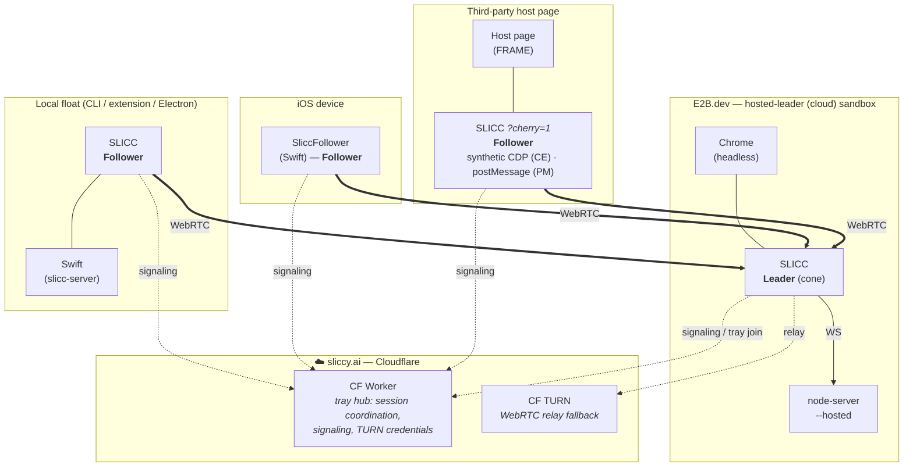
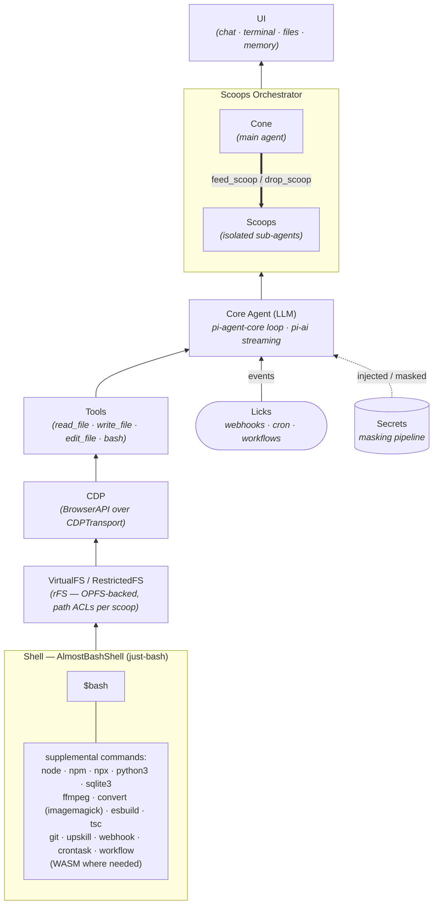

# Architecture Diagrams

## Diagram 1 — Floats & Tray Topology

How the runtime environments ("floats") connect: leaders own the cone, followers
lend a browser target, all coordinated by the Cloudflare worker (signaling +
TURN credentials) and relayed over WebRTC (with `CF TURN` as fallback relay).

**Legend**

- **Leader** — owns the cone (the main agent). The hosted-leader float runs the
  whole webapp + headless Chrome + `node-server --hosted` inside an E2B.dev
  sandbox.
- **Follower** — lends its browser to a leader as a CDP target. Followers shown:
  a local float, the native **iOS** app (`SliccFollower`), and **Cherry** (the
  webapp embedded in a third-party page's iframe via `?cherry=1`, exposing a
  capability-limited **synthetic CDP** target over postMessage).
- **Solid double arrows** = WebRTC media/data plane. **Dotted arrows** = control
  plane (signaling, tray join) through the Cloudflare worker; `CF TURN` is the
  relay fallback when a direct peer connection can't be established.

---

## Diagram 2 — Layer Stack (webapp internals)

How a turn flows through the webapp, from the shell at the bottom up to the
cone/scoops orchestrator. Supplemental shell commands sit on top of `$bash`;
external events ("licks") feed the core agent; secrets are injected on the way.

**Legend**

- Bottom-to-top flow mirrors the layer stack in
  [`docs/architecture.md`](architecture.md): **Shell → VirtualFS →
  CDP → Tools → Core Agent → Scoops Orchestrator → UI**.
- `rFS` on the whiteboard = `RestrictedFS` wrapping the OPFS-backed `VirtualFS`
  with per-scoop path ACLs.
- **Licks** are external triggers (webhooks, cron tasks, workflow completions)
  that drive the agent loop.
- **Secrets** flow through the `@slicc/shared-ts` masking pipeline so the agent
  never holds raw credentials in context.
