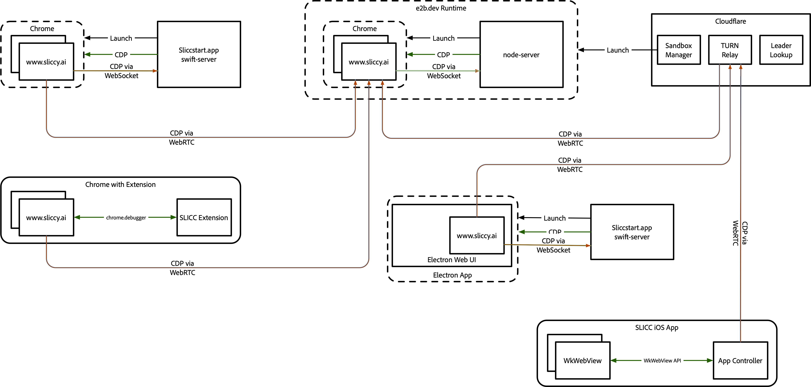

# Architecture



## Deployment Floats

SLICC runs in multiple runtime environments ("floats"):

- **Chrome extension** (Manifest V3): **Thin CDP bridge + on-demand side-panel cockpit.** The webapp UI and agent engine are NOT bundled — they load from the pinned hosted leader tab (`https://www.sliccy.ai/?slicc=leader`, or `http://localhost:8787/?slicc=leader` when built with `SLICC_EXT_DEV=1`). The extension is two pieces: a service worker that pins the leader tab, pass-through-proxies `chrome.debugger` via an `externally_connectable` Port (`bridge-sw.ts`), and opens **an on-demand Chrome side-panel cockpit** on action-click (`sidepanel.html` iframes the hosted `?cherry=1&ui-only=1` follower). The panel follower is a UI-only cherry controlled via real `chrome.debugger` CDP + the active-tab marker. The `leader.join-url` bridge-Port message caches the tray joinUrl in the service worker, and the `cherry-panel` Port forwards it to the side panel so the follower can connect. See `packages/chrome-extension/CLAUDE.md` for the leader-tab lifecycle and side-panel details; see the **Thin-Bridge Architecture** section below for the cross-float origin model.
- **Standalone CLI**: Express server launches Chrome and proxies CDP, but serves no UI — Chrome opens the hosted webapp (`https://www.sliccy.ai`, or the local wrangler on `http://localhost:8787`) with `?bridge=…&bridgeToken=…`, and the page dials back to the local `/cdp` bridge.
- **Electron float**: node-server in `--electron` mode launches the target Electron app, mints a per-launch bridge token, and points each Electron page at the hosted leader URL (`/electron?bridge=ws://localhost:<port>/cdp&bridgeToken=<token>&role=leader|follower`). The launched Electron pages run the webapp from the hosted origin and connect their CDP back through the local node-server bridge (no bundled overlay shell ships in the extension anymore).
- **Hosted-leader (cloud)**: node-server `--hosted` + headless Chromium + the webapp boot in a remote e2b sandbox, started by `slicc --cloud start`. The webapp inside the sandbox is the cone + tray leader, identical to standalone CLI but with:
  - `runtime=hosted-leader` URL query → `slicc-hosted-leader` tray attach runtime
  - `kind: 'hosted'` in `POST /tray` body (worker reclaim TTL → 30 days)
  - Unconditional leader auto-start in `main.ts` (does not depend on stored localStorage)
  - `onLeaderReady` callback POSTs join info to localhost `/api/cloud-status`
  - `/api/leader-restart` recovers a stuck leader via CDP `Page.reload()`
  - `SLICC_TRAY_WORKER_BASE_URL` env drives `/api/runtime-config`
  - Substrate abstraction: `SandboxSubstrate` interface lives in `@slicc/cloud-core` (`packages/cloud-core/src/substrate.ts`); MVP impl at `packages/cloud-core/src/substrates/e2b.ts`. Node-server and the worker both consume cloud-core; `packages/node-server/src/cloud/` is thin adapter glue.
  - Template: `packages/dev-tools/e2b-template/` — `template.ts` (e2b TypeScript template definition), `start.sh`, `scripts/build-template.sh`, `scripts/verify-template.sh`, `runtime-package.json`, and `README.md`.
- **Cherry (embedded follower garnish)**: a third-party host page embeds the `@ai-ecoverse/cherry` SDK (`mountSlicc`), which mounts the webapp in an iframe with `?cherry=1` (`runtime=cherry` in `runtime-mode.ts`). That follower lends the host page to a remote cloud-cone leader as a capability-limited browser target over cooperative, postMessage-backed **synthetic CDP** — the leader can navigate / screenshot / open-url on the host page but never drive raw `Network.*`. The follower iframe uses `CherryHostTransport` (the third `CDPTransport`). The SDK **embeds only**: the host (or its backend) supplies a ready tray join URL as the required `joinToken`, and the follower embeds against that already-provisioned leader. Creating/provisioning a cloud cone from the SDK is out of scope (future work). See `packages/cherry/CLAUDE.md` and the synthetic-CDP matrix below.

## Thin-Bridge Architecture

Across floats, SLICC now follows a uniform **thin bridge + hosted webapp** model: a local process owns OS-level capabilities (CDP attach, OAuth callback, credential signing, mount picker), the webapp is served from a single hosted origin (`https://www.sliccy.ai`, or `http://localhost:8787` for the wrangler dev harness), and the page connects back to the local bridge over a small token-gated surface.

### Origins

| Origin                                 | Serves                                                                      | Owns                                                                  |
| -------------------------------------- | --------------------------------------------------------------------------- | --------------------------------------------------------------------- |
| `https://www.sliccy.ai`                | Webapp UI, kernel-worker bundle, preview SW (production)                    | All UI + agent state                                                  |
| `http://localhost:8787`                | Wrangler dev harness (mirrors prod)                                         | Same as prod, for dev                                                 |
| `http://localhost:5710` (or peer port) | node-server / swift-server `/api/*` + `/cdp` + `/licks-ws`                  | Local CDP, OAuth callback, secret-aware fetch-proxy, sign-and-forward |
| `chrome-extension://<id>`              | Service worker + content script + secrets options + picker / capture popups | `chrome.debugger` pass-through, `chrome.storage.local` secrets        |

### Float-to-bridge mapping

- **Standalone CLI**: webapp URL is `http://localhost:<uiPort>/?bridge=ws://localhost:<cdpPort>/cdp&bridgeToken=<token>`. The page-side `setLocalApiBaseUrl` rewrites every `/api/*` fetch to the bridge origin and attaches `X-Bridge-Token`. The webapp's `CDPClient` connects to `/cdp` with the `slicc.bridge.v1.<token>` Sec-WebSocket-Protocol.
- **Electron (node-server `--electron`)**: launched Electron pages get `/electron?bridge=ws://localhost:<cdpPort>/cdp&bridgeToken=<token>&role=leader|follower` (the first target is `role=leader`; the rest are followers). `electron-controller.ts` re-elects the leader if it disappears. The bridge token is minted per launch and forwarded via `SLICC_BRIDGE_TOKEN` env to the child.
- **Hosted-leader (`slicc --cloud start`)**: an e2b sandbox runs `node-server --hosted` with headless Chromium against `?runtime=hosted-leader`. The sandbox itself is the local bridge; the laptop reaches it through the cloud-core operations API.
- **Chrome extension (thin)**: the service worker pins `https://www.sliccy.ai/?slicc=leader&ext=<id>` (or the `:5710` variant in dev; `ext=<id>` is the extension's runtime id, appended so the page can open the bridge Port back). The leader tab opens a long-lived `chrome.runtime.connect({ name: 'slicc.cdp-bridge' })` Port to the SW's `bridge-sw.ts`, which pass-through-proxies CDP to `chrome.debugger`. **On-demand side-panel cockpit** opens via `chrome.action.onClicked` → `chrome.sidePanel.open` (Chrome-native toggle). `sidepanel.html` iframes the hosted `?cherry=1&ui-only=1` follower. The panel opens a `cherry-panel` Port to the SW to receive the leader's tray joinUrl; the follower is a UI-only cherry controlled via real CDP + the active-tab marker.
- **swift-server**: same shape as node-server. `CDPProxy.swift` echoes the `slicc.bridge.v1.<token>` subprotocol per RFC 6455; the launch URL shape (`/electron?bridge=…&bridgeToken=…&role=…`) is byte-for-byte parity.

### Token gate (`X-Bridge-Token`)

In `THIN_BRIDGE_MODE` the local bridge gates every cross-origin `/api/*` call on `X-Bridge-Token` (via `crypto.timingSafeEqual`, with length and null guards). Same-origin loopback/dev/electron/serve-only/hosted requests are unchanged. OPTIONS preflight short-circuits before the gate so CORS / PNA headers remain intact. The webapp sends the token from BOTH realms — page-side via `setup-standalone-prelude.ts` and worker-side via `spawn.ts` → `kernel-worker.ts` — and stamps it on the `/cdp` WebSocket subprotocol; the same token is included in the `Sec-WebSocket-Protocol` echo on upgrade.

### Permissions surface

Every gesture-gated picker (camera / microphone / USB / HID / serial / FS / screen-share) and folder-drop mount routes through ONE in-tab `<slicc-permissions>` web component mounted in the leader tab. Workers reach it over the `permission-request` panel-RPC op. In the extension, the surface receives injectable `providers` seams that drive popup windows (`picker-popup.html`, `capture-popup.html`) because the hosted leader tab cannot host every chooser reliably under TCC. See [`docs/approvals.md`](./approvals.md) for the authoritative permission-surface description.

## Layer Stack Table

| Layer                       | Directory                              | Responsibility                                                                  | Key File                                   | Test File (in `packages/*/tests/`)                                                                    |
| --------------------------- | -------------------------------------- | ------------------------------------------------------------------------------- | ------------------------------------------ | ----------------------------------------------------------------------------------------------------- |
| Shims                       | `packages/webapp/src/shims/`           | Node.js polyfills for browser bundle                                            | `empty.ts`, `buffer-polyfill.ts`           | N/A                                                                                                   |
| Virtual Filesystem          | `packages/webapp/src/fs/`              | POSIX-like FS (ZenFS `WebAccessFS` / OPFS; in-memory in Node tests)             | `virtual-fs.ts`                            | `virtual-fs.test.ts`                                                                                  |
| Shell                       | `packages/webapp/src/shell/`           | just-bash (pure-TypeScript bash interpreter); the terminal view is kernel-side  | `almost-bash-shell-headless.ts`            | `almost-bash-shell.test.ts`                                                                           |
| Git                         | `packages/webapp/src/git/`             | isomorphic-git wrapper                                                          | `git-commands.ts`                          | N/A                                                                                                   |
| Skills                      | `packages/webapp/src/skills/`          | Skill package manager                                                           | `apply.ts`                                 | N/A                                                                                                   |
| CDP                         | `packages/webapp/src/cdp/`             | Chrome DevTools Protocol                                                        | `browser-api.ts`                           | `browser-api.test.ts`                                                                                 |
| Tools                       | `packages/webapp/src/tools/`           | Tool factories; active scoop surface is file + bash                             | `bash-tool.ts`                             | `bash-tool.test.ts`                                                                                   |
| Core Agent                  | `packages/webapp/src/core/`            | pi-mono agent loop + streaming                                                  | `index.ts`                                 | `agent.test.ts`                                                                                       |
| Scoops Orchestrator         | `packages/webapp/src/scoops/`          | Multi-agent system (cone + scoops)                                              | `orchestrator.ts`                          | N/A                                                                                                   |
| UI                          | `packages/webapp/src/ui/`              | Chat, Terminal, Files, Memory panels                                            | `main.ts`                                  | `types.test.ts`                                                                                       |
| CLI / Electron Node Runtime | `packages/node-server/src/`            | Express server, Chrome launcher, Electron float entrypoint                      | `index.ts`                                 | `electron-runtime.test.ts`                                                                            |
| Extension                   | `packages/chrome-extension/src/`       | Chrome Manifest V3 entry point                                                  | `service-worker.ts`                        | N/A                                                                                                   |
| Cloud Tray Hub              | `packages/cloudflare-worker/src/`      | Cloudflare Worker + Durable Object control-plane skeleton + deployed smoke test | `index.ts`                                 | `packages/cloudflare-worker/tests/index.test.ts`, `packages/cloudflare-worker/tests/deployed.test.ts` |
| Providers                   | `packages/webapp/src/providers/`       | Provider types, OAuth service, auto-discovery, build-time filtering             | `types.ts`, `oauth-service.ts`, `index.ts` | `index.test.ts`, `oauth-service.test.ts`                                                              |
| Sprinkles                   | `packages/webapp/src/ui/sprinkle-*.ts` | Composable `.shtml` panels: discovery, rendering, bridge API, picker UI         | `sprinkle-manager.ts`                      | `sprinkle-manager.test.ts`                                                                            |
| Defaults                    | `packages/vfs-root/`                   | Bundled VFS content: agent instructions, skills, sprinkles                      | N/A                                        | N/A                                                                                                   |
| Types                       | `packages/webapp/src/types/`           | Type declarations for external submodules                                       | `pi-coding-agent-compaction.d.ts`          | N/A                                                                                                   |

## Source File Tree

### packages/webapp/src/cdp/ — Chrome DevTools Protocol

| File                              | Purpose                                                                                                                                                                                                                                                                                                          |
| --------------------------------- | ---------------------------------------------------------------------------------------------------------------------------------------------------------------------------------------------------------------------------------------------------------------------------------------------------------------- |
| `browser-api.ts`                  | High-level Playwright-inspired API (listPages, navigate, screenshot, evaluate, click, type, waitForSelector, getAccessibilityTree); used by the `playwright-cli` shell command path and related browser automation commands                                                                                      |
| `cdp-client.ts`                   | WebSocket-based CDP client (CLI mode, connects to `ws://localhost:5710/cdp`)                                                                                                                                                                                                                                     |
| `har-recorder.ts`                 | HAR 1.2 recorder for network traffic; saves snapshots to VFS on navigation                                                                                                                                                                                                                                       |
| `transport.ts`                    | CDPTransport interface (abstracts CDP/debugger implementations)                                                                                                                                                                                                                                                  |
| `normalize-accessibility-text.ts` | Accessibility tree text normalization utilities                                                                                                                                                                                                                                                                  |
| `index.ts`                        | Re-exports + auto-selects transport based on extension detection                                                                                                                                                                                                                                                 |
| `types.ts`                        | TargetInfo, PageInfo, EvaluateOptions, AccessibilityNode, etc.                                                                                                                                                                                                                                                   |
| `cherry-host-transport.ts`        | **Third** CDPTransport — synthetic CDP over postMessage to the `@ai-ecoverse/cherry` host SDK (`window.parent`). Runs in the `?cherry=1` follower iframe. Synthesizes session lifecycle locally; synthetic ids `cherry-target`/`cherry-session`/`cherry-frame`/`cherry-loader`. See the translation matrix below |
| `cherry-host-protocol.ts`         | Canonical cherry envelope contract + three-factor `acceptEnvelope` gate (origin allowlist + source identity + `channelId` nonce). `packages/cherry/src/protocol.ts` is a structural mirror kept in sync                                                                                                          |

### packages/webapp/src/kernel/ — Kernel Host (worker-resident agent engine)

The kernel host is the off-main-thread home for the agent engine. It runs in a `DedicatedWorker` in every float that hosts the cone — standalone CLI, Electron, hosted-leader (cloud), and the hosted leader tab the thin Chrome extension pins. The "kernel" name is by analogy: the page ↔ kernel-worker boundary is the user/kernel split.

| File                           | Purpose                                                                                                                                                                                                                                                                                                                                                                                                                                                                                                                                                                                                                                                                                                                                                                                                                                                                                                                                                                                                                                                                                                                                                                                                                                                                                                                                                  |
| ------------------------------ | -------------------------------------------------------------------------------------------------------------------------------------------------------------------------------------------------------------------------------------------------------------------------------------------------------------------------------------------------------------------------------------------------------------------------------------------------------------------------------------------------------------------------------------------------------------------------------------------------------------------------------------------------------------------------------------------------------------------------------------------------------------------------------------------------------------------------------------------------------------------------------------------------------------------------------------------------------------------------------------------------------------------------------------------------------------------------------------------------------------------------------------------------------------------------------------------------------------------------------------------------------------------------------------------------------------------------------------------------------- |
| `host.ts`                      | `createKernelHost(config)` factory. Single boot sequence shared by every float that hosts the cone (standalone CLI, Electron, hosted-leader, and the hosted leader tab the thin Chrome extension pins) and by tests: orchestrator + lick-manager + agent-bridge + tray subs + cone bootstrap + BshWatchdog + `mountInternal('/proc', …)`. Returns `{ orchestrator, browser, bridge, lickManager, sharedFs, processManager, dispose }`.                                                                                                                                                                                                                                                                                                                                                                                                                                                                                                                                                                                                                                                                                                                                                                                                                                                                                                                   |
| `kernel-worker.ts`             | DedicatedWorker entry. Receives `{ kernelPort, cdpPort, localStorageSeed }` over `MessagePort` transfer; constructs `Bridge` + `WorkerCdpProxy` + `BrowserAPI`; calls `createKernelHost`; stands up `TerminalSessionHost`. Posts `kernel-worker-ready` once boot completes. Worker-safety guard via `tsconfig.webapp-worker.json`.                                                                                                                                                                                                                                                                                                                                                                                                                                                                                                                                                                                                                                                                                                                                                                                                                                                                                                                                                                                                                       |
| `spawn.ts`                     | `spawnKernelWorker(opts)` — production wrapper around `new Worker(new URL('./kernel-worker.ts', import.meta.url), { type: 'module' })`. `bootstrapKernelWorker(opts)` is the testable inner loop that takes a `WorkerLike`. Returns `{ client, ready, dispose }`.                                                                                                                                                                                                                                                                                                                                                                                                                                                                                                                                                                                                                                                                                                                                                                                                                                                                                                                                                                                                                                                                                        |
| `transport.ts`                 | `KernelTransport<S, R>` — typed message interface. `Bridge` and `OffscreenClient` both implement against this; the chrome.runtime adapter and `MessageChannel` adapter are interchangeable.                                                                                                                                                                                                                                                                                                                                                                                                                                                                                                                                                                                                                                                                                                                                                                                                                                                                                                                                                                                                                                                                                                                                                              |
| `transport-message-channel.ts` | `MessagePort`-backed transport with implicit `port.start()` on first subscribe. `createPanelMessageChannelTransport` / `createBridgeMessageChannelTransport` add the source-tagged envelope wrapper.                                                                                                                                                                                                                                                                                                                                                                                                                                                                                                                                                                                                                                                                                                                                                                                                                                                                                                                                                                                                                                                                                                                                                     |
| `transport-chrome-runtime.ts`  | chrome.runtime.sendMessage / onMessage adapter. Kept as cross-package helper for callers that still need a chrome.runtime transport; no longer wired into the thin extension.                                                                                                                                                                                                                                                                                                                                                                                                                                                                                                                                                                                                                                                                                                                                                                                                                                                                                                                                                                                                                                                                                                                                                                            |
| `cdp-bridge.ts`                | `CdpTransportBridge` shared base. State (in-flight commands, listener counts, retain refcounts) is identical across the two existing proxies; wire shape and inbound filter pluggable via `CdpBridgeOptions`. `cdp-worker-proxy.ts` extends it.                                                                                                                                                                                                                                                                                                                                                                                                                                                                                                                                                                                                                                                                                                                                                                                                                                                                                                                                                                                                                                                                                                          |
| `cdp-worker-proxy.ts`          | `WorkerCdpProxy` — kernel-side CDP transport over a MessagePort. Pre-subscribe protocol (`cdp-subscribe` / `cdp-unsubscribe`) so the page-side `startPageCdpForwarder` only allocates `chrome.debugger` listeners while the worker is interested.                                                                                                                                                                                                                                                                                                                                                                                                                                                                                                                                                                                                                                                                                                                                                                                                                                                                                                                                                                                                                                                                                                        |
| `process-manager.ts`           | `ProcessManager` — single source of truth for every running async unit. `Process` record carries pid (uint32, monotonic from 1024+), ppid, kind (`scoop-turn` / `tool` / `shell` / `jsh` / `py` / `net`), argv, cwd, env, owner, AbortController, `Gate` (pause/resume), status, exitCode, terminatedBy, finishedAt. `signal(pid, sig)` for SIGINT/TERM/KILL/STOP/CONT; `onSignal` for kill-handler subscriptions.                                                                                                                                                                                                                                                                                                                                                                                                                                                                                                                                                                                                                                                                                                                                                                                                                                                                                                                                       |
| `proc-mount.ts`                | `ProcMountBackend` — read-only `procfs`-shaped view of the manager. Mounted at `/proc` via `vfs.mountInternal` (scoop-invisible). `/proc/<pid>/{status,cmdline,cwd,stat}` plus a synthesized `pid 1` kernel-host anchor.                                                                                                                                                                                                                                                                                                                                                                                                                                                                                                                                                                                                                                                                                                                                                                                                                                                                                                                                                                                                                                                                                                                                 |
| `realm/`                       | Generalized hard-killable runner for `node` / `.jsh` / `python`. `runInRealm({ kind: 'js' \| 'py', … })` spawns a per-task `DedicatedWorker` (standalone JS + both-mode Python) or sandbox iframe (extension JS); SIGKILL → `worker.terminate()` / `iframe.remove()` (uncatchable, exit 137). Kernel-side `realm-host` proxies `vfs` / `exec` / `fetch` RPC over the realm's port so realm code stays sandboxed and `ctx.fetch`'s SecureFetch substitution still applies. **Workflow executor** (`workflow run`) reuses this substrate: `executeJsCode` → `runInRealm({ kind: 'js' })` with a prelude defining orchestration API (`agent` / `parallel` / `pipeline` / `phase` / `log` / `budget` / `args` / `workflow`) + determinism guards (shadowed `Date` / `Math` / `crypto` / `performance` / timers) + global suppression. `agent(prompt, opts)` shells out to the existing `agent` shell command via captured `exec.spawn`; `--schema-b64` injects a `StructuredOutput` tool enforced via `afterToolCall` capture + ≤2 nudges. Per-run scratch cwd at `/shared/workflow-runs/<runId>/scratch/`; script body wrapped in `async () => {...}()` and result emitted via random sentinel so user `console.log` can't spoof it. See `shell/supplemental-commands/workflow-{command,prelude,script}.ts` and `docs/shell-reference.md` workflow section. |
| `terminal-session-host.ts`     | Worker-side endpoint for the terminal RPC. Per-session `AlmostBashShellHeadless`. `terminal-exec` registers `kind:'shell'` process and runs the command; `terminal-signal` routes through `pm.signal`. Output gated by `proc.gate.wait()`.                                                                                                                                                                                                                                                                                                                                                                                                                                                                                                                                                                                                                                                                                                                                                                                                                                                                                                                                                                                                                                                                                                               |
| `terminal-session-client.ts`   | Page-side counterpart. Per-call `execId` matching against `terminal-exit` events; subscription stays alive across `close()` so the closed-status event surfaces.                                                                                                                                                                                                                                                                                                                                                                                                                                                                                                                                                                                                                                                                                                                                                                                                                                                                                                                                                                                                                                                                                                                                                                                         |
| `remote-terminal-view.ts`      | `RemoteTerminalView` — page-side xterm view. Line editing via the `xterm-readline` addon (`read()` prompt loop): typing, ←/→ ↑/↓ Home/End, Backspace/Delete, Enter, Ctrl+C → SIGINT — navigation is **wrap-aware** across input that spans multiple visual rows (the previous hand-rolled editor moved the cursor with column-relative escapes that stopped at row 0). Tab completion is a second `onData` tap that feeds resolved text back via `terminal.input()`; readline's localStorage history persistence is neutralized (SLICC keeps history in-memory). Pre-intercepts `mount /<path>` and `<usb\|serial\|hid> request` typed lines: runs the picker in the microtask that the committing Enter keystroke resolves `read()` on (transient activation still live), stashes the handle in IDB, lets the worker's command adopt it. See [`docs/approvals.md` — Device & gesture gates](approvals.md#device--gesture-gates).                                                                                                                                                                                                                                                                                                                                                                                                                        |
| `page-storage-sync.ts`         | `installPageStorageSync` — page side hook. Monkey-patches `window.localStorage.setItem/removeItem/clear` per-instance (not Storage.prototype, to avoid clobbering sessionStorage); forwards writes over the kernel transport so the worker's localStorage shim stays in sync.                                                                                                                                                                                                                                                                                                                                                                                                                                                                                                                                                                                                                                                                                                                                                                                                                                                                                                                                                                                                                                                                            |
| `local-vfs-client.ts`          | `LocalVfsClient` — read-only structural facade for the file-browser, memory-panel, and preview-VFS responder on the page side. `VirtualFS` satisfies the interface naturally; the narrowing prevents accidental writes from the page realm (writes flow through the kernel transport).                                                                                                                                                                                                                                                                                                                                                                                                                                                                                                                                                                                                                                                                                                                                                                                                                                                                                                                                                                                                                                                                   |
| `types.ts`                     | `KernelFacade` / `KernelClientFacade` typed interfaces. `Bridge` implements `KernelFacade`; `OffscreenClient` implements `KernelClientFacade`. Decouples the wire shape from the implementation.                                                                                                                                                                                                                                                                                                                                                                                                                                                                                                                                                                                                                                                                                                                                                                                                                                                                                                                                                                                                                                                                                                                                                         |

### packages/node-server/src/ — CLI + Electron Runtimes

| File                     | Purpose                                                                                                                                                                                                           |
| ------------------------ | ----------------------------------------------------------------------------------------------------------------------------------------------------------------------------------------------------------------- |
| `index.ts`               | Main CLI entrypoint: launches Chrome by default, or in `--electron` mode launches/relaunches a target Electron app, proxies WebSocket CDP traffic as a thin /cdp bridge, and provides `/api/fetch-proxy` for CORS |
| `runtime-flags.ts`       | Shared CLI/runtime flag parsing for `--serve-only`, `--cdp-port`, `--electron`, `--electron-app`, `--profile`, `--lead`, `--join`, `--log-level`, `--log-dir`, and `--kill`                                       |
| `chrome-launch.ts`       | Chrome/Chrome-for-Testing discovery, QA profile resolution, launch-arg construction, and `.qa/chrome/*` scaffold seeding                                                                                          |
| `qa-setup.ts`            | CLI helper for `npm run qa:setup`; validates Chrome + `dist/extension` and scaffolds the dedicated QA Chrome profiles                                                                                             |
| `electron-main.ts`       | Electron process entry point: spawns CLI server in `--serve-only` mode, creates BrowserWindow, injects overlay, strips host-page CSP                                                                              |
| `electron-runtime.ts`    | Pure Electron helpers for target app path resolution, overlay URLs/bootstrap scripts, dist paths, and injectable-target filtering                                                                                 |
| `electron-controller.ts` | Electron app lifecycle management: detect running app processes, enforce `--kill`, launch with remote debugging, and inject/reinject the overlay across navigations                                               |

### packages/webapp/src/core/ — Agent Core

| File                    | Purpose                                                                                                                                                                                                                                 |
| ----------------------- | --------------------------------------------------------------------------------------------------------------------------------------------------------------------------------------------------------------------------------------- |
| `index.ts`              | Re-exports from pi-mono (Agent, AgentTool, AgentEvent, streaming, model utilities)                                                                                                                                                      |
| `types.ts`              | Legacy AgentConfig, SessionData (tool-contract ToolDefinition/ToolResult/ToolInputSchema live in `tools/types.ts`)                                                                                                                      |
| `tool-adapter.ts`       | Wraps legacy ToolDefinition as pi-compatible AgentTool                                                                                                                                                                                  |
| `tool-registry.ts`      | Registry of active tools with lookup by name                                                                                                                                                                                            |
| `context-compaction.ts` | LLM-summarized context compaction (pi-mono aligned) with naive-drop fallback; `onBeforeCompaction` snapshot hook + transcript pointer, `trigger` (threshold / overflow / idle)                                                          |
| `image-processor.ts`    | Image validation and preprocessing; checks base64 size (5MB), dimensions (8000px max, 1568px optimal), and format before agent processing. Parses PNG/GIF/JPEG headers for dimensions without full decode. Resizes via ImageMagick WASM |
| `logger.ts`             | Back-compat re-export shim; the createLogger factory lives in `base/logger.ts` (level filtering: DEBUG dev, ERROR prod)                                                                                                                 |
| `session.ts`            | IndexedDB session storage (`agent-sessions` DB)                                                                                                                                                                                         |
| `mime-types.ts`         | MIME type mappings (html, css, js, json, image, etc.)                                                                                                                                                                                   |

### packages/chrome-extension/src/ — Chrome Extension (thin bridge)

The extension is a thin CDP pass-through + bootstrapper. The webapp UI and agent engine load from the hosted leader tab (`https://www.sliccy.ai/?slicc=leader`); no UI or agent engine ships in `dist/extension/`. See `packages/chrome-extension/CLAUDE.md` for the leader-tab lifecycle, CSP workarounds, picker popups, and dev-watch loop.

| File                                         | Purpose                                                                                                                                                                                                                                                                                                                                                                                              |
| -------------------------------------------- | ---------------------------------------------------------------------------------------------------------------------------------------------------------------------------------------------------------------------------------------------------------------------------------------------------------------------------------------------------------------------------------------------------- |
| `service-worker.ts`                          | Manifest V3 service worker; pins the hosted leader tab, opens the on-demand side-panel cockpit on action-click, hosts the secret-aware fetch proxy + S3/DA sign-and-forward, surfaces SLICC handoff notifications via `webRequest`, and runs the `discovery` observer (ai-catalog/llms.txt; gated by the persisted `slicc_discovery_enabled` setting — see [`link-discovery.md`](link-discovery.md)) |
| `bridge-sw.ts`                               | `externally_connectable` Port handler that pass-through-proxies CDP to `chrome.debugger` for the hosted leader tab (three-factor pin: origin allowlist + `sender.tab.id` + `sender.frameId === 0`)                                                                                                                                                                                                   |
| `sidepanel-entry.ts`                         | Side-panel entry (`sidepanel.html`); opens a `cherry-panel` Port to the SW to receive the tray joinUrl, manages tri-state UI (loading / connected / disconnected), iframes the hosted `?cherry=1&ui-only=1` follower when connected                                                                                                                                                                  |
| `cherry-panel-protocol.ts`                   | Shared `cherry-panel` Port name, panel↔SW message types, and the `SIDE_PANEL_FEATURES` follower feature set                                                                                                                                                                                                                                                                                          |
| `cherry-panel-sw.ts`                         | SW-side `cherry-panel` Port handler: tri-state joinUrl store, ensure-leader-on-connect, broadcast to panel ports                                                                                                                                                                                                                                                                                     |
| _(moved to `webapp/src/kernel/messages.ts`)_ | Wire-protocol message types relocated in #1443; the extension imports them from the webapp kernel module                                                                                                                                                                                                                                                                                             |
| `chrome.d.ts`                                | Typed declarations for chrome.debugger, chrome.tabs, chrome.tabGroups, chrome.runtime, chrome.storage, etc.                                                                                                                                                                                                                                                                                          |
| `secrets-entry.ts`                           | Options-page entry (`secrets.html`); user-facing CRUD over `chrome.storage.local` for the SW's fetch-proxy + sign-and-forward credentials                                                                                                                                                                                                                                                            |
| `secrets-storage.ts`                         | Pure logic for the secrets options page (testable; bundled into `secrets.js`)                                                                                                                                                                                                                                                                                                                        |
| `fetch-proxy-shared.ts`                      | Shared fetch-proxy helpers used by the SW's `fetch-proxy.fetch` Port                                                                                                                                                                                                                                                                                                                                 |

### packages/webapp/src/fs/ — Virtual Filesystem

| File                   | Purpose                                                                                                                                                                                                                                                                                                                                                                                                                                                                                                                                                                                                                                                                                                                                                                                                                                                                                                                                                                                                                      |
| ---------------------- | ---------------------------------------------------------------------------------------------------------------------------------------------------------------------------------------------------------------------------------------------------------------------------------------------------------------------------------------------------------------------------------------------------------------------------------------------------------------------------------------------------------------------------------------------------------------------------------------------------------------------------------------------------------------------------------------------------------------------------------------------------------------------------------------------------------------------------------------------------------------------------------------------------------------------------------------------------------------------------------------------------------------------------- |
| `virtual-fs.ts`        | POSIX-like FS facade over `@zenfs/core` (`WebAccessFS` rooted at an OPFS subdirectory in browsers; `InMemory` in Node/Vitest); all paths absolute/normalized; bounded symlink resolution (`MAX_SYMLINK_DEPTH = 10`)                                                                                                                                                                                                                                                                                                                                                                                                                                                                                                                                                                                                                                                                                                                                                                                                          |
| `restricted-fs.ts`     | RestrictedFS wrapper with path ACL (enforces scoop sandboxes: `/scoops/{name}/` + `/shared/`)                                                                                                                                                                                                                                                                                                                                                                                                                                                                                                                                                                                                                                                                                                                                                                                                                                                                                                                                |
| `types.ts`             | FsError (POSIX codes), DirEntry, Stats, read/write/mkdir options                                                                                                                                                                                                                                                                                                                                                                                                                                                                                                                                                                                                                                                                                                                                                                                                                                                                                                                                                             |
| `path-utils.ts`        | normalizePath, splitPath, relativePath utilities                                                                                                                                                                                                                                                                                                                                                                                                                                                                                                                                                                                                                                                                                                                                                                                                                                                                                                                                                                             |
| `mount-commands.ts`    | `mount` dispatcher (parses `--source`/`--profile`/`--no-probe`/`--max-body-mb` flags, routes to local/S3/DA backend factories by URL scheme)                                                                                                                                                                                                                                                                                                                                                                                                                                                                                                                                                                                                                                                                                                                                                                                                                                                                                 |
| `mount-table-store.ts` | IDB persistence layer; `MountTableEntry` + `BackendDescriptor` (discriminated union: local/s3/da) survives session restart                                                                                                                                                                                                                                                                                                                                                                                                                                                                                                                                                                                                                                                                                                                                                                                                                                                                                                   |
| `mount-recovery.ts`    | On session restore, reconstructs backends per `descriptor.kind`; surfaces unrestorable mounts as a `session-reload` lick                                                                                                                                                                                                                                                                                                                                                                                                                                                                                                                                                                                                                                                                                                                                                                                                                                                                                                     |
| `mount-index.ts`       | Fast directory walk index for local mounts (remote backends use `RemoteMountCache` instead)                                                                                                                                                                                                                                                                                                                                                                                                                                                                                                                                                                                                                                                                                                                                                                                                                                                                                                                                  |
| `mount/`               | Backend abstraction. `backend.ts` (`MountBackend` interface), `backend-local.ts` (FS Access), `backend-s3.ts` and `backend-da.ts` are **signing-naive** — they hand logical requests (`{bucket, key, method, ...}` for S3; `{path, method, ...}` for DA) to an injected `SignedFetch*` transport. `signed-fetch.ts` builds the production transport (`makeSignedFetchS3` / `makeSignedFetchDa`) which routes to `/api/s3-sign-and-forward` (CLI) or a `chrome.runtime` message to the SW (extension). `sign-and-forward-shared.ts` holds the shared orchestrator consumed by the SW handler (and node-server has its own mirrored copy). `remote-cache.ts` (TTL + ETag, IDB-backed), `signing-s3.ts` (pure SigV4 v4 via Web Crypto — used server-side / SW-side, NOT in the browser bundle's hot path), `fetch-with-budget.ts` (timeout + retry + abort), `profile.ts` (legacy resolver still used by tests; `getDefaultImsClient()` reads the Adobe LLM provider's IMS token for DA mounts), `mount-id.ts` (UUID generator) |
| `index.ts`             | Re-exports                                                                                                                                                                                                                                                                                                                                                                                                                                                                                                                                                                                                                                                                                                                                                                                                                                                                                                                                                                                                                   |

### packages/webapp/src/git/ — Git Integration

| File              | Purpose                                                                                                                                                 |
| ----------------- | ------------------------------------------------------------------------------------------------------------------------------------------------------- |
| `git-commands.ts` | CLI-like interface for isomorphic-git (init, clone, add, commit, status, log, branch, checkout, diff, remote, fetch, pull, push, config, rev-parse)     |
| `git-http.ts`     | CORS proxy integration for git HTTP operations; routes through `createProxiedFetch()` (CLI: `/api/fetch-proxy`, extension: `fetch-proxy.fetch` SW Port) |
| `diff.ts`         | Unified diff + stat formatting utilities                                                                                                                |
| `index.ts`        | GitCommands factory                                                                                                                                     |

### packages/webapp/src/providers/ — API Providers

| File                           | Purpose                                                                                                                                                                                                                                |
| ------------------------------ | -------------------------------------------------------------------------------------------------------------------------------------------------------------------------------------------------------------------------------------- |
| `types.ts`                     | `ProviderConfig` interface (id, name, isOAuth, onOAuthLogin, onOAuthLogout, getModelIds, modelOverrides), `ModelMetadata` interface (api, context_window, max_tokens, reasoning, input — snake_case wire format), `OAuthLauncher` type |
| `index.ts`                     | Provider auto-discovery: pi-ai providers filtered by `packages/dev-tools/providers.build.json`, built-in extensions via glob, external `/packages/webapp/providers/*.ts` always included                                               |
| `oauth-service.ts`             | Generic `OAuthLauncher` factory: CLI mode (popup → `/auth/callback` → postMessage) and extension mode (service worker → `chrome.identity.launchWebAuthFlow`)                                                                           |
| `built-in/bedrock-camp.ts`     | AWS Bedrock CAMP provider — custom stream function via `register()` (only built-in that needs a file; pure-config providers use pi-ai auto-discovery)                                                                                  |
| `built-in/azure-ai-foundry.ts` | Azure AI Foundry provider configuration (Claude on Azure)                                                                                                                                                                              |

### packages/webapp/src/shell/ — Shell & Terminal

| File                            | Purpose                                                                                                                                                                                                                                                                                                                                                                                                                                                            |
| ------------------------------- | ------------------------------------------------------------------------------------------------------------------------------------------------------------------------------------------------------------------------------------------------------------------------------------------------------------------------------------------------------------------------------------------------------------------------------------------------------------------ |
| `almost-bash-shell-headless.ts` | AlmostBashShellHeadless class; just-bash interpreter + command registration (VfsAdapter bridges to VirtualFS). The xterm view lives in `kernel/remote-terminal-view.ts`, page-side                                                                                                                                                                                                                                                                                 |
| `vfs-adapter.ts`                | Implements just-bash IFileSystem interface, bridges just-bash ↔ VirtualFS                                                                                                                                                                                                                                                                                                                                                                                          |
| `binary-cache.ts`               | Caches binary responses (Uint8Array) to preserve byte fidelity through VFS writes                                                                                                                                                                                                                                                                                                                                                                                  |
| `script-catalog.ts`             | Shared `.jsh`/`.bsh` discovery cache keyed per `$PATH` root set; invalidated by `FsWatcher`, bypasses caching only for root sets a mount overlaps (external edits there are invisible to the watcher). Also discovers `*.workflow.js` files under `/workspace/.workflows/` (bare names) and `/workspace/skills/*/.workflows/` (`<skill>:<name>`) as commands routed through the workflow runner, with dispatch-time precedence `built-in > .jsh > saved-workflow`. |
| `jsh-discovery.ts`              | Scans the `$PATH` search roots (recursively; earlier root wins) for `*.jsh` files; returns `Map<name, path>`. No full-VFS walk (#2085)                                                                                                                                                                                                                                                                                                                             |
| `bsh-discovery.ts`              | Scans `/workspace` and `/shared` for `*.bsh` browser helpers and parses hostname / `@match` metadata                                                                                                                                                                                                                                                                                                                                                               |
| `jsh-executor.ts`               | Executes `.jsh` files with Node-like globals (process, console, fs bridge); dual-mode (AsyncFunction CLI, sandbox iframe extension)                                                                                                                                                                                                                                                                                                                                |
| `parse-shell-args.ts`           | Shell-like argument parser (double/single quotes, backslash escapes)                                                                                                                                                                                                                                                                                                                                                                                               |
| `supplemental-commands.ts`      | Re-exports all supplemental command factories                                                                                                                                                                                                                                                                                                                                                                                                                      |

### packages/webapp/src/shell/supplemental-commands/ — Custom Shell Commands

| File                                              | Purpose                                                                                                                                                                     |
| ------------------------------------------------- | --------------------------------------------------------------------------------------------------------------------------------------------------------------------------- |
| `index.ts`                                        | Factory for all supplemental commands                                                                                                                                       |
| `help-command.ts`                                 | `commands` — list all available commands                                                                                                                                    |
| `convert-command.ts`                              | `convert` — ImageMagick-style transforms, nested append composition, and text annotation via magick-wasm                                                                    |
| `crontask-command.ts`                             | `crontask` — schedule cron jobs (dispatches licks to scoops); backed by node-cron                                                                                           |
| `imgcat-command.ts`                               | `imgcat` — display images inline in terminal                                                                                                                                |
| `node-command.ts`                                 | `node -e` — execute JavaScript (CLI: AsyncFunction, extension: sandbox iframe)                                                                                              |
| `open-command.ts`                                 | `open <path\|url>` — serve VFS files via preview SW or open URLs in browser tab; `--download` / `-d` forces download; `--view` / `-v` returns image inline for agent vision |
| `pdftk-command.ts`                                | `pdftk` — PDF manipulation (concat, split, rotate, burst, uncompress/compress)                                                                                              |
| `pdftotext-command.ts`                            | `pdftotext` — extract a PDF's text layer, with poppler's `-layout` / page-range flags (pdf.js)                                                                              |
| `pdftoppm-command.ts`                             | `pdftoppm` / `pdftocairo` — rasterize PDF pages to PNG/JPEG (pdf.js + OffscreenCanvas)                                                                                      |
| `python-command.ts`                               | `python3/python -c` — execute Python via Pyodide (~13MB bundled, loaded from `chrome.runtime.getURL('pyodide/')`)                                                           |
| `shared.ts`                                       | Shared utilities: `toPreviewUrl()` (dual-mode preview SW URL), `isLikelyUrl()`, `basename()`, `dirname()`, NodeExitError, nodeRuntimeState, formatConsoleArg                |
| `sqlite-command.ts`                               | `sqlite3` — SQLite database operations (in-memory or VFS-backed)                                                                                                            |
| `unzip-command.ts`                                | `unzip` — extract archives                                                                                                                                                  |
| `upskill-command.ts`                              | `upskill` — install skills from GitHub, the Tessl registry, or browse.sh; `upskill tabs` suggests skills for open browser tabs                                              |
| `uname-command.ts`                                | `uname` — SLICC identity: `-r` version, `-n` tray role, `-o` user agent, `-a` all                                                                                           |
| `webhook-command.ts`                              | `webhook` — manage webhooks for event-driven automation                                                                                                                     |
| `which-command.ts`                                | `which` — resolve command to path (built-ins: `/usr/bin/<name>`, `.jsh` scripts: actual VFS path)                                                                           |
| `zip-command.ts`                                  | `zip` — create archives                                                                                                                                                     |
| `serve-command.ts`                                | `serve` — open a VFS app directory in a browser tab via preview service worker with optional `--entry` override                                                             |
| `oauth-token-command.ts` (+ `oauth-token/run.ts`) | `oauth-token` — retrieve OAuth access tokens for configured providers with auto-login; the stub registers, `run.ts` loads on first use                                      |
| `playwright-command.ts`                           | `playwright-cli` / `playwright` / `puppeteer` — browser automation shell commands (navigate, snapshot, click, screenshot, cookies, HAR recording)                           |
| `sprinkle-command.ts`                             | `sprinkle` — list, open, close, and refresh `.shtml` sprinkle panels from the agent                                                                                         |
| `magick-wasm.ts`                                  | Shared ImageMagick WASM initialization module for dual-mode (CLI/browser CDN vs extension bundled) image processing                                                         |

### packages/webapp/src/skills/ — Skill Discovery

| File                   | Purpose                                                                                                                                                                                                                          |
| ---------------------- | -------------------------------------------------------------------------------------------------------------------------------------------------------------------------------------------------------------------------------- |
| `discover.ts`          | discoverSkills: scans native `/workspace/skills/` plus accessible `.agents/skills/*/SKILL.md` and `.claude/skills/*/SKILL.md` roots in the reachable VFS; getSkillInfo/readSkillInstructions expose the winning discovered skill |
| `catalog.ts`           | discoverSkillCandidates: low-level walker shared by discovery, `which`, etc.; resolveSkillNameCollisions: precedence + shadowed-path bookkeeping                                                                                 |
| `install-from-drop.ts` | installSkillFromDrop: validates and unpacks dropped `.skill` ZIP archives into `/workspace/skills/{name}` (must contain a SKILL.md)                                                                                              |
| `constants.ts`         | SKILLS_DIR, SKILL_FILE, archive size limits, etc.                                                                                                                                                                                |
| `types.ts`             | DiscoveredSkill, SkillDiscoverySource interfaces                                                                                                                                                                                 |
| `index.ts`             | Re-exports                                                                                                                                                                                                                       |

All skills (native and compatibility) are read-only — the slicc-specific `manifest.yaml` install/uninstall machinery has been removed. `upskill` writes new skills into `/workspace/skills/` directly; users edit or delete those directories with regular VFS commands.

### packages/webapp/src/scoops/ — Multi-Agent Orchestration

| File                        | Purpose                                                                                                                                                                                                                                                                                                                                                                                                                                                                                                                                                                                                                                                                                                   |
| --------------------------- | --------------------------------------------------------------------------------------------------------------------------------------------------------------------------------------------------------------------------------------------------------------------------------------------------------------------------------------------------------------------------------------------------------------------------------------------------------------------------------------------------------------------------------------------------------------------------------------------------------------------------------------------------------------------------------------------------------- |
| `orchestrator.ts`           | Manages scoop contexts, routes messages, handles responses, owns shared VirtualFS                                                                                                                                                                                                                                                                                                                                                                                                                                                                                                                                                                                                                         |
| `scoop-context.ts`          | Per-scoop agent instance (RestrictedFS, AlmostBashShell, Agent, skills, scoop-management tools); wires file tools + `bash` only. Search, browser automation, and code intelligence all flow through shell commands (`grep`/`rg`/`find` via just-bash, `playwright-cli`, `tsc`, `biome`, `esbuild`, etc.). Since #2334 it is a coordinator: one module per responsibility under `scoops/scoop-context/` (assembly, turn loop, run bounds, recovery, persistence, event routing). Overflow recovery (`scoop-context/overflow-recovery.ts`) drops the trailing error, delegates reduction to context compaction, and resumes with deferred `continue()`; terminal failures escalate to the cone              |
| `scoop-management-tools.ts` | Scoop tools: `send_message`; child-management tools gated on policy (`canCreateChildren` → `scoop_scoop`; `canManageChildren` → `list_scoops` / `feed_scoop` / `drop_scoop`; `canWriteSharedMemory` → `update_global_memory`). Roots hold every flag; a nested-delegation grant turns the first two on for a child.                                                                                                                                                                                                                                                                                                                                                                                       |
| `db.ts`                     | IndexedDB (`slicc-groups` DB v3): scoops, messages, sessions, tasks, state, webhooks, crontasks stores                                                                                                                                                                                                                                                                                                                                                                                                                                                                                                                                                                                                    |
| `lick-manager.ts`           | Browser-side lick management (webhooks + crontasks); all state in IndexedDB                                                                                                                                                                                                                                                                                                                                                                                                                                                                                                                                                                                                                               |
| `scheduler.ts`              | TaskScheduler for internal task scheduling (used by orchestrator)                                                                                                                                                                                                                                                                                                                                                                                                                                                                                                                                                                                                                                         |
| `heartbeat.ts`              | Heartbeat monitoring (detects when scoop contexts are idle)                                                                                                                                                                                                                                                                                                                                                                                                                                                                                                                                                                                                                                               |
| `skills.ts`                 | loadSkills, formatSkillsForPrompt: load SKILL.md files into agent system prompt; createDefaultSkills: bundled defaults                                                                                                                                                                                                                                                                                                                                                                                                                                                                                                                                                                                    |
| `tray-sync-protocol.ts`     | Typed `LeaderToFollowerMessage` / `FollowerToLeaderMessage` unions + chunked snapshot/CDP/sprinkle helpers. Canonical wire format — the iOS follower's `SyncProtocol.swift` mirrors a **subset**: iOS receives leader-initiated `cdp.request` / `tab.open` and sends `cdp.response` / `cdp.event` / `tab.opened` back. What's TS-only: federated `fs.*` request-side from web followers, follower-originated `tab.open`, the leader→follower `cdp.event`/`tab.opened` reply path, and `tab.open.error` send-side (iOS originates `fs.request` and — for tab previews — `cdp.request`, consuming the chunked `cdp.response` reply). See `Multi-Browser Sync (Tray) Architecture` below for the full matrix |
| `tray-leader-sync.ts`       | Leader-side public façade: constructs tray-leader collaborators, delegates its stable API, and owns follower connection lifecycle                                                                                                                                                                                                                                                                                                                                                                                                                                                                                                                                                                         |
| `tray-leader/*.ts`          | Focused leader collaborators: shared context, follower registry/dispatch, broadcasts, CDP/FS/tab/exec routing, transcript export, preview bridge, Cherry routing, and teleport target selection                                                                                                                                                                                                                                                                                                                                                                                                                                                                                                           |
| `tray-follower-sync.ts`     | Follower-side `FollowerSyncManager` (TS — used by every page-side follower: the standalone browser follower and Cherry-host followers). Implements `AgentHandle`, receives agent events / snapshots / sprinkle messages from leader, advertises local browser targets, forwards CDP+FS for federated targets. Handles `scoops.list` and exposes `selectScoop()` for the TS switcher in `wc-follower.ts`                                                                                                                                                                                                                                                                                                   |
| `tray-leader.ts`            | `LeaderTrayManager`: WebSocket liaison with the cloudflare-worker tray hub; control-message dispatch                                                                                                                                                                                                                                                                                                                                                                                                                                                                                                                                                                                                      |
| `tray-follower.ts`          | Follower-side tray signaling helpers: `attachTrayFollower`, `pollTrayFollowerBootstrap`, `sendTrayFollowerAnswer`, `sendTrayFollowerIceCandidate`                                                                                                                                                                                                                                                                                                                                                                                                                                                                                                                                                         |
| `tray-webrtc.ts`            | `TrayDataChannelLike` interface and shared WebRTC helpers used by both sides                                                                                                                                                                                                                                                                                                                                                                                                                                                                                                                                                                                                                              |
| `tray-fs-handler.ts`        | Handles inbound `fs.request` messages by running them against the local VFS and chunking large file responses                                                                                                                                                                                                                                                                                                                                                                                                                                                                                                                                                                                             |
| `tray-target-registry.ts`   | Leader-side merged registry of CDP targets across all connected runtimes (leader + followers)                                                                                                                                                                                                                                                                                                                                                                                                                                                                                                                                                                                                             |
| `tray-runtime-config.ts`    | `resolveTrayRuntimeConfig`: derives `{ joinUrl, workerBaseUrl }` from URL + storage; determines leader vs follower role                                                                                                                                                                                                                                                                                                                                                                                                                                                                                                                                                                                   |
| `tray-follower-status.ts`   | Observable status surface for the follower runtime (`connecting`/`connected`/`error`); used by UI                                                                                                                                                                                                                                                                                                                                                                                                                                                                                                                                                                                                         |
| `workflow-run-manager.ts`   | `WorkflowRunManager` — manages background workflow runs. Exposed on `globalThis.__slicc_workflows` in the kernel worker (the durable realm in every float). Wraps `ctx.exec` to tap progress (`__wf_progress` command + agent starts/completions), writes full results to `/shared/workflow-runs/<id>.json`, delivers completion as a `'workflow'` lick to the cone for cone-initiated runs.                                                                                                                                                                                                                                                                                                              |
| `types.ts`                  | RegisteredScoop, ChannelMessage, ScoopTabState, ScheduledTask, WebhookEntry, CronTaskEntry                                                                                                                                                                                                                                                                                                                                                                                                                                                                                                                                                                                                                |
| `index.ts`                  | Re-exports                                                                                                                                                                                                                                                                                                                                                                                                                                                                                                                                                                                                                                                                                                |

### packages/webapp/src/work-unit/ — WorkUnit Runtime (#1666)

| File            | Purpose                                                                                                                                                                           |
| --------------- | --------------------------------------------------------------------------------------------------------------------------------------------------------------------------------- |
| `types.ts`      | `WorkUnitDescriptor`, `WorkUnitPolicy`, `CompletionPolicy`, lifecycle `WorkUnitStatus`, events                                                                                    |
| `policy.ts`     | Root/child presets, `derivePolicy`, `isRootUnit` (`parentJid === null` — the only root test), `isPolicySubset`, `childrenOf`, `rootsOf`                                           |
| `descriptor.ts` | Pure projection of a `RegisteredScoop` + tab state onto a descriptor; `workspaceFor` computes cwd / memory / scratch paths                                                        |
| `runtime.ts`    | `WorkUnitRuntime` contract + the `WorkUnitHost` slice (`getScoop`, `ensureLiveUnit`) a manager resolves units through                                                             |
| `live-unit.ts`  | `LiveWorkUnit` — owning runtime per scoop (context, tab, observers); legal-transition table; `close()` single teardown. `ScoopLifecycleManager` hosts these                       |
| `record.ts`     | `normalizeScoopRecord` (strips the pre-#2279 `isCone`/`type`, sanitizes a root), `legacyRecordIsCone` for the restore backfill; session-id / process-owner / source-label helpers |
| `manager.ts`    | `WorkUnitManager` (`Orchestrator.getWorkUnits()`): hierarchy queries (`getParent`, `getChildren`, `roots`, `resolveDefaultRoot`) replacing the global cone lookup                 |

Cone and scoop are roles over this one runtime; see [`docs/work-unit.md`](./work-unit.md) for the decision record and migration phases.

### packages/webapp/src/tools/ — Agent Tools

| File            | Purpose                                                                                                                                                                                                   |
| --------------- | --------------------------------------------------------------------------------------------------------------------------------------------------------------------------------------------------------- |
| `bash-tool.ts`  | `bash` tool: execute shell commands via AlmostBashShell; each run is a `kind:'shell'` pid, bounded by `background_after` (detach + later `bash` lick) and `timeout` (SIGKILL, fans out to realm children) |
| `file-tools.ts` | `read_file`, `write_file`, `edit_file` tools for VirtualFS operations                                                                                                                                     |
| `index.ts`      | Tool factory functions (createBashTool, createFileTools)                                                                                                                                                  |

### packages/webapp/src/ui/ — User Interface

| File                        | Purpose                                                                                                                                                                                                                                                                                                           |
| --------------------------- | ----------------------------------------------------------------------------------------------------------------------------------------------------------------------------------------------------------------------------------------------------------------------------------------------------------------- |
| `main.ts`                   | Entry point: `main()` boots the WC shell for standalone CLI / Electron / hosted-leader / cherry / the pinned hosted leader tab the thin extension opens. `mainExtension()` survives for legacy extension-detached entry points; the thin extension itself loads the same `main()` path through the hosted webapp. |
| `offscreen-client.ts`       | `OffscreenClient` / `Bridge` page-side interface to the kernel-worker engine over `MessagePort`. Provides AgentHandle + Orchestrator-compatible facade.                                                                                                                                                           |
| `layout.ts`                 | Legacy split-pane layout helper retained as cross-package import; the active UI is the WC shell in `wc/wc-live.ts`.                                                                                                                                                                                               |
| `overlay-shell-state.ts`    | Legacy state-transition helper for the historic injected Electron overlay shell; retained for callers that still depend on its pure transitions.                                                                                                                                                                  |
| `electron-overlay.ts`       | Legacy browser-side custom elements for the historic injected Electron overlay shell. The thin-bridge release stopped injecting this shell — Electron pages now load the hosted webapp directly via `/electron?bridge=…&bridgeToken=…&role=leader\|follower`.                                                     |
| `electron-overlay-entry.ts` | Legacy standalone injected-bundle entry (`window.__SLICC_ELECTRON_OVERLAY__.inject()` / `remove()`). Retained for any historical reinjection caller; not used by the new node-server Electron launch path.                                                                                                        |
| `chat-panel.ts`             | Message list + input with streaming support; voice input (Web Speech API); connects to AgentHandle                                                                                                                                                                                                                |
| `terminal-panel.ts`         | xterm.js terminal UI; exposes AlmostBashShell output                                                                                                                                                                                                                                                              |
| `file-browser-panel.ts`     | File tree browser; download files/ZIP folders; navigate filesystem                                                                                                                                                                                                                                                |
| `memory-panel.ts`           | Global memory editor (IndexedDB-backed; shared across all scoops)                                                                                                                                                                                                                                                 |
| `scoops-panel.ts`           | Scoop list (CLI mode left sidebar); create/delete/view scoops                                                                                                                                                                                                                                                     |
| `scoop-switcher.ts`         | Dropdown menu for scoop selection (extension mode)                                                                                                                                                                                                                                                                |
| `message-renderer.ts`       | Renders user messages, assistant messages, tool calls, tool results as HTML                                                                                                                                                                                                                                       |
| `preview-sw.ts`             | Service Worker that intercepts `/preview/*` and serves VFS content (enables in-browser app previews)                                                                                                                                                                                                              |
| `session-store.ts`          | IndexedDB session storage (`browser-coding-agent` DB): conversation history per session                                                                                                                                                                                                                           |
| `provider-settings.ts`      | API provider + model selection; stores settings in localStorage                                                                                                                                                                                                                                                   |
| `theme.ts`                  | Theme toggle (System/Light/Dark)                                                                                                                                                                                                                                                                                  |
| `types.ts`                  | AgentHandle, AgentEvent, ChatMessage, ToolCall, UIMessage interfaces                                                                                                                                                                                                                                              |
| `runtime-mode.ts`           | `UiRuntimeMode` detection (`'standalone' \| 'extension' \| 'electron-overlay' \| 'extension-detached' \| 'hosted-leader' \| 'connect' \| 'cherry'`) — `resolveUiRuntimeMode()` inspects `window.location.href` and the extension flag to pick the boot path in `main.ts`                                          |
| `tab-zone.ts`               | Generic reusable tab bar + content area manager for a single zone                                                                                                                                                                                                                                                 |
| `sprinkle-manager.ts`       | Registry of available and open `.shtml` sprinkle panels with placement and lifecycle management                                                                                                                                                                                                                   |
| `sprinkle-discovery.ts`     | Scans VirtualFS for `.shtml` sprinkle files and builds a map of names to metadata (path, title)                                                                                                                                                                                                                   |
| `sprinkle-renderer.ts`      | Loads `.shtml` content from VFS and renders into DOM. CLI: direct DOM injection (fragments) or srcdoc iframe (full docs). Extension: renders via this same standalone path in the hosted `?cherry=1` follower iframe on the `sliccy.ai` origin (no extension sandbox)                                             |
| `dip.ts`                    | Hydrates ` ```shtml ` code blocks in chat into sandboxed iframes. CLI: direct srcdoc. Extension: same standalone srcdoc path in the hosted leader tab / `?cherry=1` follower                                                                                                                                      |
| `sprinkle-bridge.ts`        | API available to `.shtml` sprinkle scripts for communicating with the agent via lick events and state persistence                                                                                                                                                                                                 |
| `index.ts`                  | Re-exports                                                                                                                                                                                                                                                                                                        |

### packages/webapp/src/shims/ — Node.js Polyfills

| File                                           | Purpose                                                          |
| ---------------------------------------------- | ---------------------------------------------------------------- |
| `empty.ts`                                     | Stubs out node:zlib and node:module (just-bash references these) |
| `buffer-polyfill.ts`                           | Polyfills Buffer for browser (isomorphic-git requirement)        |
| `http.ts`, `http2.ts`, `https.ts`, `stream.ts` | Node module stubs (imported by dependencies, no-op in browser)   |

### packages/webapp/src/types/ — Type Declarations

| File                              | Purpose                                                                                                     |
| --------------------------------- | ----------------------------------------------------------------------------------------------------------- |
| `pi-coding-agent-compaction.d.ts` | Type declarations for pi-coding-agent compaction submodule (estimateTokens, shouldCompact, generateSummary) |

### packages/vfs-root/ — Bundled VFS Content

Default files bundled into the VFS at startup via `import.meta.glob`:

| Path                | VFS Target           | Purpose                                                        |
| ------------------- | -------------------- | -------------------------------------------------------------- |
| `shared/CLAUDE.md`  | `/shared/CLAUDE.md`  | Agent system-level instructions (loaded into sliccy's context) |
| `workspace/skills/` | `/workspace/skills/` | Default skill packages (playwright-cli, sprinkles, etc.)       |
| `shared/sprinkles/` | `/shared/sprinkles/` | Default sprinkle panels (welcome)                              |

### packages/webapp/src/ — Root

| File           | Purpose                                |
| -------------- | -------------------------------------- |
| `globals.d.ts` | TypeScript globals (\_\_DEV\_\_, etc.) |

## Build Targets Table

| Target                     | tsconfig                                           | Input                              | Output                        | Module Resolution |
| -------------------------- | -------------------------------------------------- | ---------------------------------- | ----------------------------- | ----------------- |
| Browser bundle             | `packages/webapp/vite.config.ts` + `tsconfig.json` | `packages/webapp/`                 | `dist/ui/` (via Vite)         | bundler           |
| CLI + Electron Node target | `tsconfig.cli.json`                                | `packages/node-server/src/`        | `dist/node-server/` (via TSC) | NodeNext          |
| Extension                  | `packages/chrome-extension/vite.config.ts`         | Browser bundle + extension entries | `dist/extension/`             | bundler           |

### Special Build Artifacts

- **preview-sw.ts**: Built as standalone IIFE via esbuild (not rollup) from `packages/webapp/vite.config.ts` during the production webapp build.
- **electron-overlay-entry.ts**: Built as standalone IIFE alongside `dist/ui/electron-overlay-entry.js` from `packages/webapp/vite.config.ts`. Retained for legacy reinjection callers; the breaking thin-bridge release no longer injects this shell into Electron pages (they load the hosted webapp directly).
- **Extension assets**: `sidepanel.html` (cherry cockpit), `secrets.html`, `capture-popup.html`/`capture-popup.js`, `picker-popup.html`/`picker-popup.js`, `preview-sw.js`, and toolbar icons/fonts copied to `dist/extension/` by `packages/chrome-extension/vite.config.ts`. The thin extension no longer ships `offscreen.html` / `index.html`, the sandbox pages (`sandbox.html` / `sprinkle-sandbox.html` / `tool-ui-sandbox.html`), or bundled WASM (`magick.wasm` / `pyodide/` / `vendor/ffmpeg-core.js`); the UI, sprinkles, JS realms, and WASM all run in the hosted leader tab the SW pins.
- **Node shims**: `packages/webapp/src/shims/` provide no-op implementations for Node modules (just-bash references them).

## Extension Thin-Bridge Architecture

The Chrome extension is a CDP pass-through + bootstrapper — no bundled UI, no offscreen agent engine. The webapp and the agent both load from the pinned hosted leader tab (`https://www.sliccy.ai/?slicc=leader&ext=<id>`, or `http://localhost:8787/?slicc=leader&ext=<id>` when built with `SLICC_EXT_DEV=1`; `ext=<id>` is the extension's runtime id).

```
┌──────────────────────────────────────────────────────────────────┐
│ Hosted leader tab (https://www.sliccy.ai/?slicc=leader&ext=<id>)          │
│  Webapp UI + kernel worker + orchestrator + VFS + agent shell    │
│  Persists chat to: browser-coding-agent IndexedDB                │
│  Drives CDP via:   chrome.runtime.connect({ name: 'slicc.cdp-bridge' })│
└─────────────────────────┬────────────────────────────────────────┘
                          │ externally_connectable Port
┌─────────────────────────▼────────────────────────────────────────┐
│ Service Worker bridge (service-worker.ts + bridge-sw.ts)         │
│  CDP pass-through to chrome.debugger                             │
│  Secret-aware fetch-proxy + S3/DA sign-and-forward + handoffs    │
│  Pins the leader tab; opens the side panel on action-click       │
│  via setPanelBehavior({ openPanelOnActionClick: true })          │
└─────────────────────────┬────────────────────────────────────────┘
                          │ cherry-panel Port (internal onConnect)
┌─────────────────────────▼────────────────────────────────────────┐
│ Side-panel cockpit (sidepanel.html + sidepanel-entry.ts)         │
│  Iframes the hosted ui-only follower (?cherry=1&ui-only=1),      │
│  connected to the leader over the tray; no CDP target            │
└──────────────────────────────────────────────────────────────────┘
```

**Leader-tab lifecycle:** the service worker keeps exactly one pinned leader tab. `reconcileLeaderTabOnBoot()` runs at top-level + `onStartup` + `onInstalled`, persists the tab id in `chrome.storage.session`, and re-creates the tab if it was closed. Chrome opens the side panel natively on action-click (`setPanelBehavior({ openPanelOnActionClick: true })`); the leader is ensured when the panel's `cherry-panel` Port connects (creating the pinned tab if missing, without focusing it). `tabs.onRemoved` clears the stored id; the next panel connect re-creates it.

**On-demand side-panel cockpit:** clicking the toolbar icon opens a window-level Chrome side panel (`sidepanel.html`) — no page injection. `sidepanel-entry.ts` opens a `cherry-panel` Port to the SW, which ensures the leader tab and pushes the tray `joinUrl` as a tri-state message (`booting` / `ready` / `disconnected`); on `ready` the panel iframes the hosted webapp with `?cherry=1&ui-only=1` and `mountSlicc(...)` connects it to the leader over the tray. The follower advertises **no** CDP target — the agent drives the active tab via real `chrome.debugger` CDP plus the active-tab marker. Framing works because the worker sets a CSP `frame-ancestors` that names the extension origin (a bare `*` does not authorize a `chrome-extension://` ancestor); there is no `scripting` permission and no DNR framing rule. See `packages/chrome-extension/CLAUDE.md` for the full flow.

**Bridge token:** the page-side `CDPTransport` opens the `slicc.cdp-bridge` Port and is gated by a three-factor pin in `bridge-sw.ts` — origin allowlist + `sender.tab.id === storedLeaderTabId` + `sender.frameId === 0` (top-level only). A `channelId` is stamped post-hello but is not a connection gate.

**IndexedDB persistence (in the hosted origin):**

- `slicc-work-units` DB: the CANONICAL conversation record per work unit (#2275), keyed `<workspaceRoot>::<jid>`, plus the migration cursor. Pi history, the chat projection, transcripts and child summaries are derived from it (`work-unit/conversation/derive.ts`)
- `browser-coding-agent` DB: Chat display messages, written by the page-side `Bridge`. Still written and still the read fallback while the #2275 read-old/write-new window is open
- `agent-sessions` DB: Agent LLM conversation history (restored by ScoopContext on restart; canonical record first, this store as the fallback)
- `slicc-groups` DB: Orchestrator routing data (scoops, tasks, webhooks, crontasks)

The legacy `chrome-extension://<id>` origin no longer holds chat or VFS state; only `chrome.storage.local` secrets and OAuth replicas live there.

## Multi-Browser Sync (Tray) Architecture

SLICC instances can connect to one another over WebRTC data channels to form a **tray** — one **leader** owning the agent runtime and any number of **followers** mirroring its state. The cloudflare-worker is the signaling hub; once the data channel is open, all sync traffic is peer-to-peer.

### Roles

- **Leader**: owns the orchestrator, agent loop, scoops, sprinkles, and lick router. Broadcasts state changes; responds to follower requests (snapshot, sprinkle.fetch, sprinkle.lick, scoops.select, federated CDP/FS).
- **Follower**: presents the leader's chat + sprinkles to a local user, forwards user input back to the leader. Owns no agent runtime — its `ChatPanel` is wired to the follower sync as its `AgentHandle`.

### Model and thinking controls (protocol v5)

Protocol v5 adds `models.list` and `model.state` from leader to follower, plus
`models.request`, `model.select`, and `thinking.set` from follower to leader. The
model catalog is credential-free by construction: each entry contains only the
provider display name, provider-qualified model ID, model name, and reasoning
flag — never keys, tokens, account identities, or other provider credentials.
Followers can only select from providers already authenticated on the leader;
they cannot add or authenticate a provider. Cherry followers expose the entire
surface only when `CherryFeatureSet.modelPicker` is enabled.
`ui/wc/wc-follower-model-surface.ts` is the shared implementation. Both the
dedicated follower mount in `wc-follower.ts` and the `slicc:tray-join`
role-switch path through `wc-tray.ts`'s `buildFollowerOptions` consume it.

Model selection is **per cone** (#2310): a follower's pick names the unit it is
viewing (`model.select.scoopJid`; a scoop resolves to the cone that owns it) and
changes that cone's record and nothing else — not the cone the leader is working
in, and not the scoops that cone already spawned. A follower older than the field
omits it and the leader falls back to that follower's own `scoops.select`.
`model.state.activeModelId` is likewise the named cone's model, so an older
follower simply shows the right cone's instead of a global one. Thinking level is
**per-scoop**: `thinking.set` changes only its target scoop. The wire has no
`max` thinking level. The UI's `max` choice MUST travel as
`thinkingLevel: 'xhigh'` together with `effortOverride: 'max'`; omitting the
override silently changes the meaning to ordinary `xhigh`.

**Liveness (stall ≠ death).** Both ends run `DataChannelKeepalive` (10 s ping, `data-channel-keepalive.ts`) on the same thread that serves the agent, so a peer that is merely CPU-starved stops answering long before its transport dies — most visibly on the hosted-leader float, where Chromium, the kernel worker, and node-server share one sandbox. Missing 3 pongs therefore reports a **stall**: the peer is logged as unresponsive and probing continues, but nothing tears down while `isTransportOpen()` still holds. Teardown (`handleDisconnect` on the follower, `removeFollower` on the leader — both of which **close the data channel**) happens only when the channel itself is gone or after the hard deadline of 30 consecutive misses (~5 min). Before this split, an ordinary busy turn on a small sandbox produced a self-inflicted disconnect and a full ICE/DTLS renegotiation.

A stall is surfaced, not swallowed: the follower sets `stalled` on its runtime status (an overlay — the state stays `connected`, because the channel never dropped) and calls `onLeaderStalled`, which the mount renders as a transient "leader is busy" composer state. That is deliberately not `onConnectionChange`, so a cherry host never sees `slicc.follower.disconnected` for a peer that is merely working.

**Remote-CDP driving (worker → page).** Every float runs the agent's `BrowserAPI` in the kernel worker while the tray's `LeaderSyncManager` and the WebRTC data channels live on the page. The worker can't own an `RTCDataChannel`, so it drives federated tray/cherry targets through a panel-RPC bridge: the worker `BrowserAPI` gets a `TrayTargetProvider` (`createPanelRpcTrayProvider`) whose `createRemoteTransport()` returns a `PanelRpcCdpTransport` (modeled on `RemoteCDPTransport`: starts `'connected'`, no-op `connect()`, lazy page-side session on first `send`). Each CDP op is a `remote-cdp-send` panel-RPC call; the page-side `remote-cdp-*` handlers (backed by `createRemoteCdpPageBridge`) own the real `RemoteCDPTransport` via `pageLeaderTray.sync` and relay both directions. CDP events flow back over a `panel-rpc-push` / `remote-cdp-event` envelope on the same instance-scoped channel. Listing stays separate (the `list-remote-targets` supplement); this bridge is for _driving_.

### Implementations

| Float                       | Code                                                                                                                                                                       | Notes                                                                                                                                                                                                                                                                                                                                                                                  |
| --------------------------- | -------------------------------------------------------------------------------------------------------------------------------------------------------------------------- | -------------------------------------------------------------------------------------------------------------------------------------------------------------------------------------------------------------------------------------------------------------------------------------------------------------------------------------------------------------------------------------- |
| Standalone browser leader   | `packages/webapp/src/ui/page-leader-tray.ts` + `packages/webapp/src/scoops/tray-leader-sync.ts`                                                                            | Wired in `main.ts` when no join URL is present and a worker base URL is configured                                                                                                                                                                                                                                                                                                     |
| Standalone browser follower | `packages/webapp/src/ui/page-follower-tray.ts` + `packages/webapp/src/scoops/tray-follower-sync.ts`                                                                        | Wired in `main.ts` when a join URL is stored. Drives the page's chat panel via the follower sync's `AgentHandle`. **No kernel worker** — runs `wc/wc-follower.ts` mount. `SprinkleFollowerController` with `onOpen` hook guards local-path opens (no VFS responder). Navigate-lick forwarding via `follower-navigate-watcher.ts`. `/licks-ws` HTTP injection unavailable in this mode. |
| Extension leader            | The hosted leader tab the SW pins (`https://www.sliccy.ai/?slicc=leader`) runs the standard page-side `LeaderSyncManager` via `packages/webapp/src/ui/page-leader-tray.ts` | The extension is **not** in the tray data path; the hosted leader tab behaves exactly like a standalone leader (extra browsers join via the same worker URL the leader publishes).                                                                                                                                                                                                     |
| Extension follower          | The on-demand side-panel cockpit (`sidepanel.html`) iframes the hosted `?cherry=1&ui-only=1` follower, connected to the leader via the tray                                | UI-only cherry follower; no per-page content-script injection (the `<slicc-launcher>` content script is dormant and not registered in `manifest.json`). No `offscreen.ts` branch survives.                                                                                                                                                                                             |
| iOS follower (native)       | `packages/ios-app/SliccFollower/`                                                                                                                                          | Standalone Swift implementation. `packages/swift-trayfollower/Sources/SliccTrayFollower/Models/SyncProtocol.swift` mirrors a **subset** of the TS wire — the table below marks which messages each side handles. Its Terminal tab uses libghostty as a frontend for commands executed in the leader's virtual shell. See `packages/ios-app/CLAUDE.md`                                  |

### Protocol

`packages/shared-ts/src/tray-sync-protocol.ts` is the canonical wire format (message unions + payload types; `packages/webapp/src/scoops/tray-sync-protocol.ts` re-exports them and holds the channel runtime). `TRAY_SYNC_PROTOCOL_VERSION` is **6**; its Swift mirror (`traySyncProtocolVersion` in `packages/swift-trayfollower/Sources/SliccTrayFollower/Models/SyncProtocol.swift`) and Go mirror (`TraySyncProtocolVersion` in `slicc-cli/internal/protocol/protocol.go`) must move in the same change. The iOS follower's Swift file mirrors a **subset**:

- iOS implements: chat (snapshot/snapshot_chunk/agent_event/user_message_echo), control (status/error/ping/pong), scoops list, full sprinkle round-trip, leader-initiated federated CDP/tabs (receives `cdp.request` + `tab.open` from leader and replies with `cdp.response` / `cdp.event` / `tab.opened`), `targets.advertise` — with explicit `kind: 'browser'` and `capabilities { navigate, network, screenshot }`, all true — and the complete `exec.*` mirror used by its leader-backed Terminal tab. A leader-opened tab is brought to the front (`AppState.leaderOpenedTabId` → the chat shell switches to the browser surface), because a leader opens a tab here for a human to act on.
- TS-only: follower-initiated `tab.open` against another runtime; the `cdp.event` / `tab.opened` / `tab.open.error` legs of the leader→follower reply path (iOS DOES originate `cdp.request` for tab previews and consumes the `cdp.response` leg, chunk-reassembled); the delegated-OAuth pair (`oauth.popup.request` / `.response` — iOS has no popup model and never advertises `capabilities.oauthPopup`). iOS DOES originate `tab.teleport.request` from its tab carousel. `tab.open.error` is now reachable on iOS for an unusable URL; a navigation that fails after the target is created still acks `.tabOpened` (the leader attaches by target id immediately) and surfaces the failure through `cdp.response.error`.
- iOS `LeaderToFollowerMessage.init(from:)` has an `.unknown` fallback so the app silently drops messages it doesn't recognize. iOS `FollowerToLeaderMessage.init(from:)` throws on unknown types. The doc-comment headers above each enum's `// MARK: -` boundary in `SyncProtocol.swift` declare this asymmetry explicitly.

The TypeScript receive paths are exhaustive switches with `never` checks in
`scoops/tray-follower-sync.ts` and `scoops/tray-leader/follower-dispatch.ts`.
Adding a union variant therefore requires updating both the sender/receiver
behavior and the parity machinery below; a types-only protocol edit does not
compile.

#### Transport chunk framing

Beneath the message unions sits one transport frame, `__chunk` (`TrayChunkFrame`). A sender whose serialized message exceeds the SCTP `maxMessageSize` splits it into frames; the receiver reassembles them and only then decodes the union. All three runtimes intercept ahead of their type switch — `TraySyncChannel` (TS), `Conn.dispatch` (Go), `handleMessage` (Swift) — so handlers never see framing and **every** message type is covered, including ones added later.

Because a frame is not a union variant it has no matrix row and no corpus fixture. Bounds (`packages/shared-ts/src/tray-sync-protocol.ts`, mirrored in Go and Swift):

| Bound                            | Value | Meaning                                                                                                                                    |
| -------------------------------- | ----- | ------------------------------------------------------------------------------------------------------------------------------------------ |
| `TRAY_DEFAULT_MAX_MESSAGE_BYTES` | 65536 | Frame size when the transport reports no limit — the RFC 8831 §6.6 floor. Chrome 152 reports 262144 via `RTCSctpTransport.maxMessageSize`. |
| `TRAY_MAX_MESSAGE_BYTES`         | 8 MiB | Hard cap. Larger messages are refused loudly rather than chunked.                                                                          |
| `TRAY_SEND_HIGH_WATER_BYTES`     | 8 MiB | Chunked sends are refused above this much queued data. Small messages still go out, so keepalive survives congestion.                      |

A refused `agent_event` is retried as a marker event (`degradeOversizeAgentEvent`) so the follower's transcript shows the gap instead of hiding it. The four older per-type chunkers (`snapshot_chunk`, `cdp.response`, `sprinkle.content`, `fs.response`) still chunk at their own 64 KB thresholds; they now sit under this transport limit rather than being the only paths that respected any limit.

The "Followers" column below answers which followers handle each message today. When adding a new message, decide which followers must learn it: a follower-side feature that only matters to the browser (federated FS) can stay TS-only; a chat/sprinkle/scoop feature should land in both. **This table is CI-checked** — `packages/webapp/tests/scoops/tray-sync-doc-matrix.test.ts` asserts set-equality against the corpus; adding or removing a union variant without updating the table fails the build.

### Tray protocol corpus (mechanical parity enforcement)

Every variant of both tray unions has a fixture and an explicit iOS expectation
in `packages/webapp/src/scoops/tray-sync-protocol-corpus.ts`. These are mapped
types, so a new variant fails typecheck until it has both. The derived JSON at
`packages/ios-app/SliccFollower/Tests/SliccFollowerTests/Fixtures/tray-sync-corpus.json`
is consumed by **three** suites: TypeScript's `tray-sync-corpus.test.ts` guards
JSON ↔ the TS module, Swift's `SyncProtocolCorpusTests.swift` guards JSON ↔ the
iOS decoder, and Go's `slicc-cli/internal/protocol/corpus_test.go` guards the Go
mirror and protocol version. Regenerate it with
`npx tsx packages/dev-tools/tools/generate-tray-sync-corpus.ts`.

`tray-sync-doc-matrix.test.ts` closes the loop on the table below: every corpus
variant needs a row, every row must name a real variant, and the **Followers**
column must agree with the corpus about iOS support — so a message gaining or
losing an iOS mirror cannot leave a stale claim in this table.

#### iOS mirror of the cherry (embedded follower) surface

iOS mirrors the cherry-target wire surface even though it cannot _host_ a cherry page:

- `SliccTrayFollower/Models/SyncProtocol.swift` defines `CherryCapabilities { navigate, network, screenshot }` and `RemoteTargetInfo.kind` / `.capabilities`, mirroring `RemoteTargetInfo` from `tray-sync-protocol.ts`. `network` gates whether the leader may drive `Network.*`; for a cherry target it is always `false`.
- `cherry.slicc_event` decodes to `.cherrySliccEvent(targetId, name, detail)`. iOS has **no cherry page surface**, so `AppState.handleDataChannelMessage` logs and ignores it — a **documented no-op** that keeps the decode switch exhaustive.

<!-- tray-sync-matrix:start -->

| Direction       | Message                                                      | Followers         | Used for                                                                                                                                                                                                                                                                                                                                                                                                                                                                                                                                                                                                                                                                                                                                                                                                                                                                                                                                                                                                                                                                                                                                                                                                                                                                                                                                                                                                                                         |
| --------------- | ------------------------------------------------------------ | ----------------- | ------------------------------------------------------------------------------------------------------------------------------------------------------------------------------------------------------------------------------------------------------------------------------------------------------------------------------------------------------------------------------------------------------------------------------------------------------------------------------------------------------------------------------------------------------------------------------------------------------------------------------------------------------------------------------------------------------------------------------------------------------------------------------------------------------------------------------------------------------------------------------------------------------------------------------------------------------------------------------------------------------------------------------------------------------------------------------------------------------------------------------------------------------------------------------------------------------------------------------------------------------------------------------------------------------------------------------------------------------------------------------------------------------------------------------------------------ |
| Leader→Follower | `snapshot`, `snapshot_chunk`                                 | TS + iOS          | Full chat replacement (chunked above 64 KB)                                                                                                                                                                                                                                                                                                                                                                                                                                                                                                                                                                                                                                                                                                                                                                                                                                                                                                                                                                                                                                                                                                                                                                                                                                                                                                                                                                                                      |
| Leader→Follower | `agent_event`                                                | TS + iOS          | Streaming agent events (`content_delta`, `tool_use_start`, etc.)                                                                                                                                                                                                                                                                                                                                                                                                                                                                                                                                                                                                                                                                                                                                                                                                                                                                                                                                                                                                                                                                                                                                                                                                                                                                                                                                                                                 |
| Leader→Follower | `user_message_echo`                                          | TS + iOS          | Mirrors any user message (local or from any follower), including `attachments`                                                                                                                                                                                                                                                                                                                                                                                                                                                                                                                                                                                                                                                                                                                                                                                                                                                                                                                                                                                                                                                                                                                                                                                                                                                                                                                                                                   |
| Leader→Follower | `status`, `error`, `ping`, `pong`                            | TS + iOS          | Liveness + scoop processing state. `status` carries the required leader-emitted `scoopJid`; followers accept its omission from legacy leaders as unscoped.                                                                                                                                                                                                                                                                                                                                                                                                                                                                                                                                                                                                                                                                                                                                                                                                                                                                                                                                                                                                                                                                                                                                                                                                                                                                                       |
| Leader→Follower | `biscotto.message.state`                                     | TS only           | Where a **biscotto**'s (guest seat's) message got to: `pending` while it waits on the review gate, then `approved` / `rejected` / `unanswered`. Sent only to the seat that authored it. `rejected` (a human refused) and `unanswered` (nobody ever looked — timeout, no approval surface, broker error) are distinct so a guest is not told it was refused when the owner was simply away. iOS never holds a seat, so it decodes this to `.unknown`.                                                                                                                                                                                                                                                                                                                                                                                                                                                                                                                                                                                                                                                                                                                                                                                                                                                                                                                                                                                             |
| Leader→Follower | `scoops.list`                                                | TS + iOS          | Multi-scoop awareness — list + active scoop JID, plus each scoop's `parentId` (ownership edge: `null` for a cone; absent from older leaders), `state`, context `fill`, and the optional `activity` refinement. `state` stays a CLOSED four-value vocabulary (`working`/`idle`/`broken`/`initializing`) because shipped followers switch on it without normalizing what they cannot parse; the avatar's expression grammar rides `activity` (`thinking` / `tool` / `awaiting`), which older followers never read — so enriching the face cannot change how a build in the wild renders a tab. An unrecognised `activity` MUST be ignored in favour of `state` alone. TS follower renders a scoop switcher in `wc-follower.ts`; iOS uses swipe navigation                                                                                                                                                                                                                                                                                                                                                                                                                                                                                                                                                                                                                                                                                          |
| Leader→Follower | `models.list`                                                | TS + iOS          | Credential-free catalog of selectable models: provider display name, provider-qualified model ID, model name, and reasoning capability                                                                                                                                                                                                                                                                                                                                                                                                                                                                                                                                                                                                                                                                                                                                                                                                                                                                                                                                                                                                                                                                                                                                                                                                                                                                                                           |
| Leader→Follower | `model.state`                                                | TS + iOS          | Leader's active global model plus the selected scoop's thinking level and optional effort override                                                                                                                                                                                                                                                                                                                                                                                                                                                                                                                                                                                                                                                                                                                                                                                                                                                                                                                                                                                                                                                                                                                                                                                                                                                                                                                                               |
| Leader→Follower | `sprinkles.list`, `sprinkle.content`, `sprinkle.update`      | TS + iOS          | Sprinkle list + on-demand .shtml content (chunked) + agent → sprinkle updates                                                                                                                                                                                                                                                                                                                                                                                                                                                                                                                                                                                                                                                                                                                                                                                                                                                                                                                                                                                                                                                                                                                                                                                                                                                                                                                                                                    |
| Leader→Follower | `targets.registry`, `cdp.request`, `tab.open`                | TS + iOS          | Federated CDP / tab.open from leader to a follower that hosts the target                                                                                                                                                                                                                                                                                                                                                                                                                                                                                                                                                                                                                                                                                                                                                                                                                                                                                                                                                                                                                                                                                                                                                                                                                                                                                                                                                                         |
| Leader→Follower | `cdp.response`                                               | TS + iOS          | Reply to a follower-originated `cdp.request`; iOS consumes it (chunk-reassembled) for browser-tab preview captures against leader targets                                                                                                                                                                                                                                                                                                                                                                                                                                                                                                                                                                                                                                                                                                                                                                                                                                                                                                                                                                                                                                                                                                                                                                                                                                                                                                        |
| Leader→Follower | `cdp.event`, `tab.opened`, `tab.open.error`                  | TS only           | Remaining reply path back to a follower that _originated_ a federated request; iOS does not consume these                                                                                                                                                                                                                                                                                                                                                                                                                                                                                                                                                                                                                                                                                                                                                                                                                                                                                                                                                                                                                                                                                                                                                                                                                                                                                                                                        |
| Leader→Follower | `fs.request`, `fs.response`                                  | TS + iOS          | Federated FS (read/write/stat/walk against a follower's local VFS). iOS decodes both: it federates no VFS, so a leader-originated `fs.request` is answered with an `ENOTSUP` error rather than dropped (the leader sets no timeout), and `fs.response` feeds its requester                                                                                                                                                                                                                                                                                                                                                                                                                                                                                                                                                                                                                                                                                                                                                                                                                                                                                                                                                                                                                                                                                                                                                                       |
| Leader→Follower | `sprinkle.reloaded`                                          | TS + iOS          | Notifies followers that a sprinkle was reloaded (name changed or content refreshed)                                                                                                                                                                                                                                                                                                                                                                                                                                                                                                                                                                                                                                                                                                                                                                                                                                                                                                                                                                                                                                                                                                                                                                                                                                                                                                                                                              |
| Leader→Follower | `preview.open`                                               | TS + iOS          | Leader asks a follower to open a preview URL (request-id correlated)                                                                                                                                                                                                                                                                                                                                                                                                                                                                                                                                                                                                                                                                                                                                                                                                                                                                                                                                                                                                                                                                                                                                                                                                                                                                                                                                                                             |
| Leader→Follower | `theme.apply`                                                | TS + iOS          | Push the leader's active theme to followers (JSON or `null` for system default). The TS follower applies it; iOS derives a native palette from `base` + `tokens` (raw `css` and per-component overrides deliberately ignored), themes sprinkle WKWebViews via injected CSS variables, and follows the system scheme when unthemed or reset                                                                                                                                                                                                                                                                                                                                                                                                                                                                                                                                                                                                                                                                                                                                                                                                                                                                                                                                                                                                                                                                                                       |
| Leader→Follower | `cherry.slicc_event`                                         | TS + iOS†         | Cone → Cherry host-page event fan-out. † iOS logs and ignores (no Cherry host page)                                                                                                                                                                                                                                                                                                                                                                                                                                                                                                                                                                                                                                                                                                                                                                                                                                                                                                                                                                                                                                                                                                                                                                                                                                                                                                                                                              |
| Leader→Follower | `transcript.export.pending`, `transcript.export.denied`      | TS only           | Approval state: pending = leader received request (approval dialog open); denied = user denied or export unavailable. No transcript metadata is ever included in denied.                                                                                                                                                                                                                                                                                                                                                                                                                                                                                                                                                                                                                                                                                                                                                                                                                                                                                                                                                                                                                                                                                                                                                                                                                                                                         |
| Leader→Follower | `sudo.approve.request`, `sudo.approve.cancel`                | TS + iOS          | Delegated sudo prompt (v7, #2062) — the transcript-export approval folded into the general sudo gate. Sent when the leader is headless (hosted/cloud float) or its human last spoke from a follower; every `sudoApproval`-capable follower gets the same prompt (kind, concrete detail, editable "Always" pattern, scoop label, `expiresAt`), the first verdict wins and the rest receive `cancel`. A headless leader with nobody connected parks the prompt, asks the hub to push-wake registered phones, and delivers it on the first capable `hello`. iOS renders a card behind Face ID / passcode; the web follower renders `<slicc-dialog>` without "Always".                                                                                                                                                                                                                                                                                                                                                                                                                                                                                                                                                                                                                                                                                                                                                                               |
| Leader→Follower | `transcript.export.start`                                    | TS only           | Transfer begins: carries `filename` only. `estimatedBytes` is optional. Sent only after approval and only before chunks.                                                                                                                                                                                                                                                                                                                                                                                                                                                                                                                                                                                                                                                                                                                                                                                                                                                                                                                                                                                                                                                                                                                                                                                                                                                                                                                         |
| Leader→Follower | `transcript.export.chunk`                                    | TS only           | One base64-encoded slice ≤32 KiB. `index` is zero-based. Follower rejects duplicates or gaps immediately.                                                                                                                                                                                                                                                                                                                                                                                                                                                                                                                                                                                                                                                                                                                                                                                                                                                                                                                                                                                                                                                                                                                                                                                                                                                                                                                                        |
| Leader→Follower | `transcript.export.complete`                                 | TS only           | Authoritative receipt: `chunks` count, `byteLength`, and `sha256` hex. Follower verifies all three before exposing the Blob.                                                                                                                                                                                                                                                                                                                                                                                                                                                                                                                                                                                                                                                                                                                                                                                                                                                                                                                                                                                                                                                                                                                                                                                                                                                                                                                     |
| Leader→Follower | `transcript.export.error`                                    | TS only           | Terminal error from leader: `code` is a `TranscriptExportErrorCode`. iOS decodes all six export variants to `.unknown` — they do not tear down the tray session. (The v4 `transcript.export.approve.*` pair was retired in v7; the gate is `sudo.approve.*` now.)                                                                                                                                                                                                                                                                                                                                                                                                                                                                                                                                                                                                                                                                                                                                                                                                                                                                                                                                                                                                                                                                                                                                                                                |
| Bidirectional   | `hello`                                                      | TS + iOS          | Additive protocol-version handshake; both sides send on channel open. Carries `protocolVersion` + optional `runtime` tag + optional `capabilities` (`exec`, `browser`, `oauthPopup`, and since v7 `sudoApproval` + `biometric`) + optional `motd` one-liner surfaced by `ssh --list`. A leader with its virtual shell wired advertises `exec: true`, which gates the iOS Terminal; omission by an old leader and explicit false both leave it unavailable. iOS advertises `exec: true` for its restricted, non-shell `open` verb and names that restriction in its MOTD; it also advertises `sudoApproval: true` and `biometric: true` when `LAContext` can authenticate the device owner                                                                                                                                                                                                                                                                                                                                                                                                                                                                                                                                                                                                                                                                                                                                                        |
| Bidirectional   | `exec.request`, `exec.chunk`, `exec.response`, `exec.signal` | TS + iOS + Go CLI | Streaming remote command execution. `exec.request` carries `command` plus optional `cwd`, `env`, and base64-encoded `stdin` (same encoding as `exec.chunk` `data`; the `ssh` command forwards piped shell stdin to CLI followers in per-command `follow` mode; `slicc … exec` forwards piped stdin to the leader virtual shell; `follow --eval` rejects requests with stdin). Leader→CLI-follower is the `ssh` command run on the follower's real OS (`slicc … follow` mode); CLI/iOS-follower→leader runs in the leader's in-browser virtual shell. iOS accepts only `open [--universal\|--x-callback] <url>`, validates raw hierarchical and opaque path segments against traversal and recursively encoded delimiters before deriving scope, gates that scope through on-device approval, then launches through `UIApplication.open` (`universalLinksOnly` when requested). App-owned x-callback URLs correlate a process-local nonce and return one bounded ordered `{status,parameters}` JSON line via `exec.chunk` before exit 0/1/130; unknown, wrong-nonce, replayed, and post-restoration callbacks are consumed silently. Failed terminal deliveries retry after reconnect, flushing deliverable entries before bounded FIFO eviction. `exec.response` is terminal and `exec.signal` cancels. A peer advertises `hello.capabilities.exec` when it accepts requests; the iOS Terminal separately gates on the leader's advertised value |
| Follower→Leader | `user_message`, `abort`                                      | TS + iOS          | Forward chat input (incl. composer attachments — photo / screenshot / upload, staged inline so no leader VFS path is required; `steer` interrupts the running turn instead of queueing) + cancellation                                                                                                                                                                                                                                                                                                                                                                                                                                                                                                                                                                                                                                                                                                                                                                                                                                                                                                                                                                                                                                                                                                                                                                                                                                           |
| Follower→Leader | `new_session`                                                | TS + iOS          | Follower's freezer new-chat action (`save` / `skip` / `erase`); the leader runs its own `runNewSession` (archive + `clearAllMessages`) and broadcasts the cleared snapshot back so every follower drops the stale chat. iOS sends it from the Past Sessions sheet's New button (erase double-confirms; the cleared snapshot — not local optimism — resets the phone)                                                                                                                                                                                                                                                                                                                                                                                                                                                                                                                                                                                                                                                                                                                                                                                                                                                                                                                                                                                                                                                                             |
| Follower→Leader | `ping`, `pong`                                               | TS + iOS          | Liveness — symmetric with leader→follower                                                                                                                                                                                                                                                                                                                                                                                                                                                                                                                                                                                                                                                                                                                                                                                                                                                                                                                                                                                                                                                                                                                                                                                                                                                                                                                                                                                                        |
| Follower→Leader | `request_snapshot`                                           | TS + iOS          | Request a fresh snapshot (optionally for a specific scoop via `request_snapshot.scoopJid` — the path iOS actually uses today)                                                                                                                                                                                                                                                                                                                                                                                                                                                                                                                                                                                                                                                                                                                                                                                                                                                                                                                                                                                                                                                                                                                                                                                                                                                                                                                    |
| Follower→Leader | `scoops.select`                                              | TS + iOS          | Follower tells the leader to switch scoop view. TS follower sends on switcher selection (`tray-follower-sync.ts`); iOS sends via `request_snapshot.scoopJid`                                                                                                                                                                                                                                                                                                                                                                                                                                                                                                                                                                                                                                                                                                                                                                                                                                                                                                                                                                                                                                                                                                                                                                                                                                                                                     |
| Follower→Leader | `models.request`                                             | TS + iOS          | Request the leader's current credential-free model catalog                                                                                                                                                                                                                                                                                                                                                                                                                                                                                                                                                                                                                                                                                                                                                                                                                                                                                                                                                                                                                                                                                                                                                                                                                                                                                                                                                                                       |
| Follower→Leader | `model.select`                                               | TS + iOS          | Set the model of the cone this follower is viewing (`scoopJid`, optional)                                                                                                                                                                                                                                                                                                                                                                                                                                                                                                                                                                                                                                                                                                                                                                                                                                                                                                                                                                                                                                                                                                                                                                                                                                                                                                                                                                        |
| Follower→Leader | `thinking.set`                                               | TS + iOS          | Set a scoop's thinking level and optional provider-specific effort override                                                                                                                                                                                                                                                                                                                                                                                                                                                                                                                                                                                                                                                                                                                                                                                                                                                                                                                                                                                                                                                                                                                                                                                                                                                                                                                                                                      |
| Follower→Leader | `sprinkles.refresh`, `sprinkle.fetch`, `sprinkle.lick`       | TS + iOS          | Re-request sprinkle list; fetch .shtml content by name; forward a lick from a follower-rendered sprinkle to the leader's lick router                                                                                                                                                                                                                                                                                                                                                                                                                                                                                                                                                                                                                                                                                                                                                                                                                                                                                                                                                                                                                                                                                                                                                                                                                                                                                                             |
| Follower→Leader | `sprinkle.instances`                                         | TS only           | The sprinkles this follower currently has RENDERED, re-sent on every open/close/dispose. The leader keeps the latest report per follower (`FollowerRegistry.setSprinkleInstances`) so `sprinkle list` can print one `instance:` line per live document instead of one line per sprinkle — one store can back several documents, and without the report an owner cannot tell "hydrated" from "push vanished" (issue #2166). Reported, never inferred from the leader's own open set: a follower that failed to render is absent rather than counted. iOS renders sprinkles but does not report yet, so its documents are simply missing from the listing                                                                                                                                                                                                                                                                                                                                                                                                                                                                                                                                                                                                                                                                                                                                                                                          |
| Leader→Follower | `oauth.popup.request`                                        | TS only           | Delegate the INTERACTIVE half of an OAuth login to a follower whose human can click it (#1915: `oauth-token` on a headless or follower-driven leader used to prompt where nobody could answer). Carries the provider authorize URL only. The leader keeps nonce validation, the code exchange, and account persistence; access/refresh tokens never cross the tray. Routed to the follower that sent the most recent user message, else the most recently active `capabilities.oauthPopup` follower. iOS has no permissions surface or popup model, never advertises the capability, and decodes this to `.unknown`                                                                                                                                                                                                                                                                                                                                                                                                                                                                                                                                                                                                                                                                                                                                                                                                                              |
| Follower→Leader | `targets.advertise`                                          | TS + iOS          | Advertise a follower's locally hosted CDP targets to the leader                                                                                                                                                                                                                                                                                                                                                                                                                                                                                                                                                                                                                                                                                                                                                                                                                                                                                                                                                                                                                                                                                                                                                                                                                                                                                                                                                                                  |
| Follower→Leader | `cdp.response`, `cdp.event`, `tab.opened`                    | TS + iOS          | Reply path back to leader after the follower fulfills a leader-initiated `cdp.request` / `tab.open`                                                                                                                                                                                                                                                                                                                                                                                                                                                                                                                                                                                                                                                                                                                                                                                                                                                                                                                                                                                                                                                                                                                                                                                                                                                                                                                                              |
| Follower→Leader | `cdp.request`                                                | TS + iOS          | Follower-initiated CDP via the leader (`targetRuntimeId: "leader"` runs on its browser transport); iOS drives Target.attachToTarget + Page.captureScreenshot for tab previews                                                                                                                                                                                                                                                                                                                                                                                                                                                                                                                                                                                                                                                                                                                                                                                                                                                                                                                                                                                                                                                                                                                                                                                                                                                                    |
| Follower→Leader | `tab.open`                                                   | TS only           | Follower-initiated tab open in another runtime (iOS does not originate)                                                                                                                                                                                                                                                                                                                                                                                                                                                                                                                                                                                                                                                                                                                                                                                                                                                                                                                                                                                                                                                                                                                                                                                                                                                                                                                                                                          |
| Follower→Leader | `tab.teleport.request`                                       | TS + iOS          | "Teleport that tab to me": the follower names a tray target from its browser rail and the leader opens a foreground copy on the REQUESTING follower carrying the source tab's cookies + web storage. The destination is derived from the channel identity, never the payload, so one follower cannot push tabs into another. The leader replies on the existing `tab.opened` / `tab.open.error` legs. iOS originates it from its tab carousel against a v6+ leader (older leaders keep the bare-URL copy), and its `Network` domain is real (`WKHTTPCookieStore`), so cookies actually travel                                                                                                                                                                                                                                                                                                                                                                                                                                                                                                                                                                                                                                                                                                                                                                                                                                                    |
| Follower→Leader | `tab.open.error`                                             | TS + iOS          | Declared in the union for symmetry with the leader→follower error reply. iOS's `CDPBridge.handleTabOpen` issues `.tabOpened` synchronously after kicking off the async navigation, so navigation failures never surface here. The TS follower's `executeLocalTabOpen` sends this in three cases: missing browser transport, `Target.createTarget` returning no usable targetId, or transport rejection                                                                                                                                                                                                                                                                                                                                                                                                                                                                                                                                                                                                                                                                                                                                                                                                                                                                                                                                                                                                                                           |
| Follower→Leader | `oauth.popup.response`                                       | TS only           | Terminal result of a delegated login: the callback URL the follower captured (carrying `?code=` + nonce) — never a token. Absent `redirectUrl` with no `error` means the human cancelled. The follower captures it from the worker relay's same-origin `BroadcastChannel` (COOP-proof: GitHub serves `same-origin`, which severs `window.opener`) plus the classic opener `postMessage`; the leader's `/api/oauth-result` poll is loopback-only and unreachable from another machine. iOS never originates this                                                                                                                                                                                                                                                                                                                                                                                                                                                                                                                                                                                                                                                                                                                                                                                                                                                                                                                                  |
| Follower→Leader | `fs.request`, `fs.response`                                  | TS + iOS          | Federated FS. Authenticated followers can read and mutate the leader VFS except `/proc`; direct and normalized `/proc` requests return `EACCES`. This intentionally includes raw `/etc/sudoers*` writes, bypassing the agent-facing approval wrapper. iOS originates `fs.request` with `targetRuntimeId: 'leader'`, and sends `fs.response` only to refuse a leader-originated request                                                                                                                                                                                                                                                                                                                                                                                                                                                                                                                                                                                                                                                                                                                                                                                                                                                                                                                                                                                                                                                           |
| Follower→Leader | `lick`                                                       | TS + iOS          | Generic lick forwarding from follower to leader's agent. The leader validates the `lick.event.type` against `FORWARDABLE_TO_LEADER` (`navigate` and `discovery`), scrubs any follower-sent `originFollowerId` / `originLabel`, and stamps them with the follower's bootstrap ID and label (via `labelForFollower(floatType, runtime)`). Standalone worker↔page bridge messages: `set-follower-forwarding` (page→worker, toggles the worker forwarder), `forward-lick` (worker→page, relays a to-be-forwarded lick from the worker LickManager), `inject-forwarded-lick` (page→worker, leader injects a forwarded lick into the worker's LickManager). These bridge types live in `webapp/src/kernel/messages.ts` as a `ForwardedLickEvent` structural mirror (can't import the real `LickEvent` without breaking a tsconfig boundary). iOS sends `navigate` licks for handoff `Link` headers seen on main-frame navigations in its hosted CDP targets; its `Network` domain covers cookies only (`WKHTTPCookieStore`, see `CDPNetworkDomain.swift`) with no request/response stream, so `CDPTarget` reads the header off `WKNavigationResponse` instead of `Network.responseReceived`. `sprinkle.lick` stays on its own message because `sprinkle` is **not** in `FORWARDABLE_TO_LEADER` — routing it through this envelope would get it dropped with a warning.                                                                                 |
| Follower→Leader | `transcript.export.request`                                  | TS only           | Follower requests a transcript export. `requestId` is unique per request; `selector` is `{kind:'active'}` or `{kind:'frozen',sessionId}`. Leader sends `pending` immediately, then approval dialog, then `denied` or the chunk sequence. iOS never originates this.                                                                                                                                                                                                                                                                                                                                                                                                                                                                                                                                                                                                                                                                                                                                                                                                                                                                                                                                                                                                                                                                                                                                                                              |
| Follower→Leader | `transcript.export.cancel`                                   | TS only           | Follower cancels an in-flight export (before complete). Leader aborts the ZIP stream and discards state. iOS never originates this.                                                                                                                                                                                                                                                                                                                                                                                                                                                                                                                                                                                                                                                                                                                                                                                                                                                                                                                                                                                                                                                                                                                                                                                                                                                                                                              |
| Follower→Leader | `transcript.export.ack`                                      | TS only           | Sent after each chunk is durably appended to the follower spool (OPFS in production). The leader's bounded in-flight window (one chunk) awaits this before sending the next chunk — application-level backpressure. Owner-scoped via `requestId`; acks from other followers are ignored. iOS never originates this (requires protocol v3+).                                                                                                                                                                                                                                                                                                                                                                                                                                                                                                                                                                                                                                                                                                                                                                                                                                                                                                                                                                                                                                                                                                      |
| Follower→Leader | `sudo.approve.response`                                      | TS + iOS          | Verdict for a delegated `sudo.approve.request` (v7). `decision` ∈ allow / deny / always, `pattern` with `always`, `attestation` ∈ biometric / passcode / none. The leader accepts `always` only from a follower that advertised `capabilities.biometric` (anyone else's is downgraded to a one-shot allow), ignores verdicts from followers it never prompted, and treats a missing, late, or malformed reply — and a disconnect or the 5-minute timeout — as a denial.                                                                                                                                                                                                                                                                                                                                                                                                                                                                                                                                                                                                                                                                                                                                                                                                                                                                                                                                                                          |
| Follower→Leader | `push.register`                                              | TS + iOS          | Register this device's APNs token with the tray (v7, #2062). The leader validates the shape, stamps the channel-derived bootstrap id, and forwards it to the hub over its controller socket (`push.register`); the tray DO stores ≤16 tokens per tray and fans `push.send` (`turn_end`, time-sensitive `sudo_request`; metadata only, never command text or transcript) out to them, forgetting tokens APNs reports dead. iOS sends it on every connect once a token exists; browser followers never do.                                                                                                                                                                                                                                                                                                                                                                                                                                                                                                                                                                                                                                                                                                                                                                                                                                                                                                                                         |
| Follower→Leader | `cherry.host_event`                                          | TS only           | Cherry host-page → cone event (user interactions forwarded from the embedded page to the leader's agent)                                                                                                                                                                                                                                                                                                                                                                                                                                                                                                                                                                                                                                                                                                                                                                                                                                                                                                                                                                                                                                                                                                                                                                                                                                                                                                                                         |

<!-- tray-sync-matrix:end -->

### Sprinkle Sync Specifics

Sprinkle .shtml files live in the **leader's** VFS only — followers see them via three messages:

- The leader sends `sprinkles.list` on follower attach and on every refresh broadcast (default 5 s; the interval is configurable via the `_refreshIntervalMs` hook in `page-leader-tray.ts`).
- The follower opens a sprinkle by sending `sprinkle.fetch` with a request ID; the leader replies with one or more `sprinkle.content` messages (chunked above 64 KB) containing the raw .shtml.
- The follower renders the content and forwards any `sprinkle.lick` events back to the leader with **no** `targetScoop` — the follower has no route table, so the leader is the route authority. `KernelFacade.routeSprinkleLick` resolves `getSprinkleRoute(name)` for any lick that arrives unstamped, which is what makes `sprinkle route` apply to follower-mounted panels as well as leader-mounted ones (issue #2166; before that resolution, forwarded licks always landed on the cone).
- When the leader's `SprinkleManager.sendToSprinkle(name, data, target?)` runs, `LeaderSyncManager.broadcastSprinkleUpdate(name, data, target?)` mirrors the payload to followers as `sprinkle.update` — to every follower by default, or to one runtime when `sprinkle send --runtime <id>` named it. The call reports which runtimes it reached, and an unresolvable runtime id comes back as `unknownRuntime` rather than degrading into a broadcast. The broadcast fires even when the sprinkle is closed on the leader: a follower can still be rendering it.
- The follower reports its rendered set back with `sprinkle.instances`; `sprinkle list` reads it (mirrored into the worker via `slicc.leaderSprinkleInstances`) to show one line per document.

The follower's rendered sprinkle has **no VFS access** to the leader. Both follower implementations stub the file-IO bridge methods — `readFile`, `writeFile`, `readDir`, `stat`, `mkdir`, `rm`, and `screenshot` reject with descriptive errors; `exists` returns `Promise.resolve(false)` so feature-detection paths don't throw. See `SprinkleFollowerController.createBridge` (TS) and `SprinkleWebView.bridgeJS` (iOS). Sprinkles that rely on file IO should feature-detect via `exists` and degrade.

### Lick Forwarding Specifics

Followers can forward licks to the leader's agent instead of handling them locally. Mechanics:

- `LickManager.setForwarder(fn | null)` installs a hook; `LickManager.dispatch()` is the private chokepoint all emit sites route through.
- When a forwarder is set AND the lick type is in `FORWARDABLE_TO_LEADER` (currently just `navigate`), the lick is forwarded instead of handled locally.
- `LickEvent` gained optional `originFollowerId` / `originLabel`, set only by the leader. `formatLickEventForCone` prefixes `_Forwarded from <originLabel>._` when present.
- **Wire**: the follower sends the generic `lick` message; the leader's `onForwardedLick` callback validates/scrubs/stamps and emits via the leader's `lickManager.emitEvent`.
- **Every float (including the thin extension's hosted leader tab)**: the kernel WORKER owns the lick manager while the PAGE owns the sync managers, so a worker↔page bridge is needed. Three bridge messages in `webapp/src/kernel/messages.ts`: `set-follower-forwarding` (page→worker, toggles the worker forwarder), `forward-lick` (worker→page, relays a lick from the worker LickManager to the page's follower sync), `inject-forwarded-lick` (page→worker, leader injects a forwarded lick into the worker lick manager). These use a `ForwardedLickEvent` structural mirror (can't import the real `LickEvent` without breaking a tsconfig boundary).
- **iOS follower**: the native iOS follower's sprinkle licks now display their origin label in the leader's cone via leader-side origin stamping (no iOS change needed). Migrating iOS from the legacy `sprinkle.lick` envelope to the generic `lick` envelope remains a documented follow-up.

## Cherry (Embedded Follower) Synthetic-CDP Architecture

A third-party host page embeds `@ai-ecoverse/cherry`'s `mountSlicc`, which mounts the webapp in an iframe (`?cherry=1`). The follower in that iframe lends the host page to a remote cloud-cone leader as a **capability-limited browser target** over cooperative, postMessage-backed **synthetic CDP**. There is no WebSocket and no `chrome.debugger`; the iframe-side `CherryHostTransport` is a third `CDPTransport`.

### Topology

```text
[ third-party host page ] ──@ai-ecoverse/cherry SDK── postMessage ──> [ ?cherry=1 follower iframe ]
   createCdpHostHandler        (cherry envelope         CherryHostTransport (CDPTransport)
   (host-realm execution)       protocol + 3-factor      → BrowserAPI → tray follower
                                acceptEnvelope gate)      → remote cloud-cone LEADER drives it
```

- **Handshake**: the iframe sends `handshake.hello` with a `cherry-<uuid>` `channelId`; the host SDK replies `handshake.welcome` carrying the ready `joinUrl` the host supplied via the required `joinToken`. The follower embeds against that already-provisioned leader.
- **Embedding only**: cone creation/provisioning from the SDK is out of scope (future work). The host (or its backend) is responsible for obtaining the tray join URL; the SDK never calls `/api/cloud/*` (that would be a cross-origin third-party `Authorization` header, and a third-party IMS token fails the cloud proxy's `validateBearer`).
- **Three-factor gate** (`acceptEnvelope`): every inbound message must pass (1) origin allowlist, (2) `MessageEvent.source` identity, (3) `channelId` nonce, before any synthetic CDP is acted on.
- **Two-tier capability gating**: the host's `capabilities` (`navigate` / `screenshot` / `openUrl`) gate side effects that escape the page sandbox and fail closed in `createCdpHostHandler`; DOM read/query + `Input` (within the page) are the baseline driveable contract, authorized upstream per-domain by `onPermissionRequest` at the mount layer.

### CDP translation matrix

CDP methods fall into three buckets. **Synthesized in-transport** are answered locally by `CherryHostTransport.handleSynthetic` (never cross postMessage). **Host-realm** are forwarded to the host SDK and run via `createCdpHostHandler` on the host page. **Rejected** throw `CherryUnsupportedError` (CDP error code `-32601`); domain permission denials use the same `-32601`.

| CDP method                                                                  | Where it runs                | Notes                                                                                                                        |
| --------------------------------------------------------------------------- | ---------------------------- | ---------------------------------------------------------------------------------------------------------------------------- |
| `Target.getTargets` / `attachToTarget` / `detachFromTarget` / `closeTarget` | Synthesized in-transport     | One synthetic page target `cherry-target`; attach returns session `cherry-session`                                           |
| `Page.enable` / `Runtime.enable` / `DOM.enable` / `Page.bringToFront`       | Synthesized in-transport     | Resolve `{}` to satisfy `BrowserAPI` session setup                                                                           |
| `Page.getFrameTree`                                                         | Synthesized in-transport     | Synthetic frame `cherry-frame` / loader `cherry-loader` at the host origin                                                   |
| `Runtime.createIsolatedWorld`                                               | Synthesized in-transport     | Returns `executionContextId: 1`                                                                                              |
| `Page.frameNavigated` / `Page.loadEventFired`                               | Emitted in-transport (event) | Synthesized after a `Page.navigate` resolves so `BrowserAPI.navigate()` doesn't hang                                         |
| `Runtime.evaluate`                                                          | Host realm                   | Indirect `eval` in the host page global; governed by the **host page's CSP** (throws → `exceptionDetails`)                   |
| `DOM.getDocument` / `DOM.querySelector` / `DOM.getBoxModel`                 | Host realm                   | Node ids minted host-side; `getBoxModel` throws unsupported when the node has no rect                                        |
| `Input.dispatchMouseEvent` / `Input.dispatchKeyEvent`                       | Host realm                   | Baseline driveable contract (clicks/keys within the page)                                                                    |
| `Page.captureScreenshot`                                                    | Host realm                   | Only under the `'html2canvas'` strategy (best-effort DOM raster, lazily imported); `'none'` → rejected `-32601`              |
| `Page.navigate`                                                             | Host realm (capability)      | Only when `capabilities.navigate`; else rejected. Returns `{ frameId: 'cherry-frame', loaderId: 'cherry-loader' }`           |
| `Target.createTarget`                                                       | Host realm (capability)      | Only when `capabilities.openUrl`; calls the host `onOpenUrl` hook and returns `{ targetId: 'cherry-opened' }`; else rejected |
| `Network.*`                                                                 | Rejected (`-32601`)          | **Never available on a cherry target.** No network domain exists; the advertised `network` capability is always `false`      |
| Any other method                                                            | Rejected (`-32601`)          | `CherryUnsupportedError` — Cherry implements no escape hatch                                                                 |

Because a cherry target has no `Network.*` domain, it can never serve a cookie/storage **teleport**. Both teleport selection paths exclude it: auto-selection via `getBestFollowerForTeleport` (`canRuntimeServeTeleport`) and the explicit `teleport --runtime <id>` path, which is gated at arm time in `playwright/handlers/teleport.ts` — a runtime advertising `CHERRY_RUNTIME_TAG` is rejected before any watcher is created.

The iOS follower cannot host a cherry page; it mirrors the cherry target's `kind`/`capabilities` on `RemoteTargetInfo` and treats the `cherry.slicc_event` leader message as a documented no-op (logs and ignores). See `packages/ios-app/CLAUDE.md`.

## Preview Bridge (Driveable Preview) Synthetic-CDP Architecture

`serve --bridge <dir>` makes a worker-relayed preview tab driveable. Visitor tabs connect via a WebSocket to the same Cloudflare Durable Object that manages the leader's controller WS. The leader drives each tab as a synthetic-CDP target (target id: `preview:<previewToken>:<connId>`). There is no WebRTC and no `chrome.debugger`; `PreviewBridgeCdpTransport` (page-side, extends `SyntheticCdpTransport`) forwards `bridge.cdp.request` over the tray controller WS and receives `bridge.cdp.response`. The injected bootstrap runs with **full-drive** capabilities (`navigate` / `screenshot` / `openUrl` all enabled), so the leader can navigate and screenshot the visitor tab, not just read the DOM.

```
[ visitor tab: https://<token>.sliccy.now/… ]     LEADER (cone, any float)
  preview-bridge.js (injected into <head>)          LeaderTrayManager owns the controller WS
  │ opens wss://<token>.sliccy.now/__slicc/bridge    │
  │ runs createCdpHostHandler on its OWN document    │
  └──────────► preview-worker.ts ──► TRAY_HUB DO ◄──── controller WS
               (forwards Upgrade)    SessionTrayDO:      │  PreviewBridgeCdpTransport
                                     relays bridge.*     │  (same backhaul as Cherry, different wire)
                                     between bridge WS   │
                                     and controller WS   ▼
                                                         kernel-worker BrowserAPI
                                                         drives via panel-RPC → remote-cdp-page-bridge
```

- **Opt-in only**: `serve --bridge` explicitly; never implied by `allowLive` or Cherry follower attachment. Security posture: cross-subdomain cookie risk accepted and documented (host-only cookies isolated; only `Domain=.sliccy.now` cookies readable across previews). Opt-in per serve.
- **Target surfacing**: `kind: 'preview'`, `id: preview:<previewToken>:<connId>`. Excluded from teleport pools (no `Network.*` domain).
- **Visitor page API**: `window.slicc` is installed synchronously at bootstrap (so inline page scripts and an over-cap/rejected tab still see a working `emit`). `window.slicc.emit(name, detail?)` → sent over the bridge WS so the DO **attributes** it to the originating tab — the webhook lick is stamped with `x-slicc-preview-conn` / `x-slicc-preview-token` headers and renders as a **Preview Event** tied to `preview:<token>:<connId>` (distinct from a plain webhook). Attribution integrity: the DO **strips** any caller-supplied `x-slicc-preview-*` header on the plain `/webhook/*` route, so only the DO's own WS emit path can produce an attributed event. Untrusted emits are size- and rate-limited before reaching the cone. A same-origin `/__slicc/emit` beacon is the unattributed page-unload fallback. `window.slicc.on(name, cb)` → subscribes to `CustomEvent`s the agent dispatches via `Runtime.evaluate`.
- **Hibernation**: bridge WebSockets accepted via `state.acceptWebSocket` with `setWebSocketAutoResponse('ping','pong')` so idle tabs are billed zero. Per-connection state (`connId`, token, origin, UA) lives in `serializeAttachment`, recovered on wake via `deserializeAttachment`. The bootstrap skips the literal `pong` frame before JSON-parsing, so the keepalive doesn't spam the visitor console.
- **Lifecycle licks**: `'preview'` type (connect/disconnect), rate-limited per (token, lifecycle) so a quick visit's disconnect is never swallowed by its connect, suppressed by `--quiet`.
- **`--max-tabs <N>`**: per-preview cap (default 20); DO rejects bridge upgrades when cap reached.
- **`--stop <token>`**: revokes preview, closes bridge sockets (and proactively sends `bridge.disconnected` — a server-initiated close doesn't re-fire the DO's `webSocketClose`), deletes the auto-provisioned webhook (warns, never silently, if the lick manager is unreachable). `Target.closeTarget` on a single preview target sends `bridge.close` to really tear that tab down.

The method matrix is identical to Cherry (same `SyntheticCdpTransport` base; same `createCdpHostHandler` running on the page's `document`). The only difference is the backhaul: Cherry uses postMessage to `window.parent`, preview bridge uses WebSocket `bridge.*` control messages relayed through the Durable Object. See `packages/cloudflare-worker/CLAUDE.md` for DO bridge WS role and `packages/cherry/src/preview-bootstrap.ts` for the injected bootstrap.

## Data Flow Diagrams

### User Message Flow (standalone — kernel-worker mode, default)

```
[Page]                                        [DedicatedWorker]
ChatPanel.sendMessage()
  → OffscreenClient.sendUserMessage()
    → KernelTransport (MessagePort) ─────────→ Bridge.handleMessage()
                                                 → Orchestrator.handleMessage()
                                                   → routeToScoop()
                                                   → processScoopQueue()
                                                     → ScoopContext.prompt()
                                                       → pm.spawn({ kind:'scoop-turn', … })
                                                       → pi-agent-core loop
                                                         → LLM API call (worker fetch
                                                           with x-bypass-llm-proxy)
                                                         → AgentEvent stream
                                                       → Tool calls (kind:'tool', kind:'shell',
                                                         kind:'jsh', kind:'py')
                                                         → RestrictedFS / AlmostBashShellHeadless /
                                                           BrowserAPI (CDP via WorkerCdpProxy
                                                           ↔ startPageCdpForwarder)
                                                       → pm.exit on completion
                                                     → callbacks fire wire-side events
                                            ←────── KernelTransport stream of
agent-events (text_delta, tool_use_start,
                                                   tool_result, scoop-status, …)
ChatPanel DOM update (streaming)
```

The kernel-worker runs on its own thread; a runaway bash loop or LLM stream can't freeze the page. Page main thread keeps `setInterval(…, 100)` ticking with sub-millisecond jitter while the worker is busy.

### User Message Flow (thin extension)

The thin Chrome extension uses the **same** page + worker flow as the standalone leader — the extension pins the hosted leader tab and CDP rides through the SW bridge:

```
[Hosted leader tab (sliccy.ai)]                       [SW bridge]                 [chrome.debugger]
ChatPanel.sendMessage()
  → kernel worker (same Orchestrator path as above)
                                                                     ┌── slicc.cdp-bridge Port ──┐
                                                                     │                     │
    Worker BrowserAPI → CDPTransport ────────────────────────────────┴──→ chrome.debugger ─┴───→ target
```

`createKernelHost(...)` from `kernel/host.ts` runs once in the kernel worker for every float — standalone, hosted-leader, the pinned hosted leader tab — wiring orchestrator, lick manager, agent bridge, process manager, and `/proc` mount. The only difference for the extension path is that CDP traffic exits the page via `chrome.runtime.connect({ name: 'slicc.cdp-bridge' })` instead of a local WebSocket.

### Scoop Delegation

```
Cone executes feed_scoop tool
  → Orchestrator.delegateToScoop()
    → ScoopContext.prompt() [receives full context from cone]
      → pi-agent-core loop
        → Tool calls
        → Scoop processes independently
    → Scoop completes
      → Orchestrator writes full output to /shared/scoop-notifications/
      → Orchestrator notification (path + preview + line count)
        → Cone's message queue
        → Cone decides whether to read the file or act on the preview
```

### Lick (Event) Flow

```
External webhook POST / scheduled cron task / fswatch change fires
  → LickManager receives event in IndexedDB
    → dispatch() routes the external lick channel to ScoopMessageRouter
      → Per-scoop coalescing window (1 s trailing debounce, capped at 3 s)
        → Router drains all messages since the persisted watermark as one batch
          ├─ Scoop busy + pure-lick batch
          │    → Keep queue and watermark unchanged
          │    → flushOnIdle() probes IndexedDB on the next ready transition
          │    → createTab() fallback starts the same probe fire-and-forget
          │    → After 60 s deferred, emit one log warning + onError notification
          └─ Scoop idle, or batch contains a user message
               → ScoopContext processes one formatted prompt
                 → Agent reacts to the batched events
                 → No human in the loop
```

Only external lick channels use the coalescing window. User-typed `web` messages remain immediate, awaited, and error-propagating; one arriving during an open window drains the accumulated licks with it, and a batch containing one is never busy-deferred. The unchanged 2 s poll remains an in-memory safety net for ready scoops, but skips JIDs with an active coalescing window so it cannot split a burst. Idle probes query IndexedDB even when the in-memory queue is empty, preserving deferred delivery across reloads. The `createTab()` fallback does not block startup: it starts the probe fire-and-forget and catches a rejection for logging.

**Topology note:** Lick legs (webhook, crontask, the `/licks-ws` bridge) are `node-rest`-only (standalone thin-bridge, electron, hosted/cloud). Extension-delegate leaders run `crontask` on the in-tab worker `LickManager` (tab-lifetime) and get `webhook` URLs from the connected tray worker. Followers forward `navigate` licks (including SLICC handoffs) to the leader instead of handling them locally. Float discriminator: `resolveFloatTopology()` in `packages/webapp/src/core/float-topology.ts`.

### Agent Session Persistence

Agent conversation history is persisted per scoop, enabling agents to resume where they left off across page reloads or extension close-reopen cycles.

```
ScoopContext init (page load / scoop creation)
  → SessionStore.load(scoop.jid) [retrieves AgentMessage[] from agent-sessions DB]
    → Agent initialized with restored messages
      → agent loop resumes with full context

Agent responds (streaming)
  → agent_end event
    → SessionStore.save({ id, messages, config, createdAt, updatedAt }) [fire-and-forget]
      → Persists SessionData to agent-sessions DB

Scoop removal / app clear
  → Orchestrator calls SessionStore.delete(jid) or SessionStore.clearAll()
    → Clears persisted session data
```

**Session Storage:**

- Database: `agent-sessions` (IndexedDB)
- Key: scoop JID (e.g., `cone`, `analysis-scoop`)
- Value: `SessionData` (`AgentMessage[]` + config + timestamps)
- Lifecycle: Loaded on scoop init, saved on agent_end (error-tolerant), deleted on scoop removal
- Design: Messages are model-agnostic and work with any LLM. `createCompactContext()` provides LLM-summarized compaction at prompt time, so large sessions don't cause token bloat.

## IndexedDB Databases

| Database               | Version | Stores                                                        | Purpose                                                                                                                                                                                                          |
| ---------------------- | ------- | ------------------------------------------------------------- | ---------------------------------------------------------------------------------------------------------------------------------------------------------------------------------------------------------------- |
| `slicc-fs`             | 1       | (VirtualFS data)                                              | **Legacy** LightningFS backing store; no longer written or read. Deletable via the `slicc-fs-cleanup` shell command. The live VirtualFS is OPFS-backed via ZenFS `WebAccessFS` and is not an IndexedDB database. |
| `browser-coding-agent` | 1       | sessions, settings                                            | UI-level session history + localStorage mirror                                                                                                                                                                   |
| `slicc-groups`         | 3       | scoops, messages, sessions, tasks, state, webhooks, crontasks | Orchestrator data (scoops, messages, tasks)                                                                                                                                                                      |
| `agent-sessions`       | 1       | sessions                                                      | Core agent session history: persisted `SessionData` (`AgentMessage[]` + config + timestamps) per scoop, keyed by JID; loaded on scoop init, saved on agent_end                                                   |
| `slicc-fs-global`      | 1       | config                                                        | Git global config storage                                                                                                                                                                                        |

## Secrets & Secret Injection

SLICC prevents the agent from seeing or exfiltrating real secret values (API keys, tokens, credentials). Secrets are stored server-side and injected at the fetch-proxy boundary, scoped to authorized domains only.

### Masking Engine

Each secret is masked using `HMAC-SHA256(session_id + secret_name, secret_value)`. The result is format-preserving — known prefixes like `ghp_`, `sk-`, `AKIA` are kept, and the hash portion matches the original value's length and character set. Masks are deterministic within a session (the agent can compare values) but differ across sessions (no lookup-table attacks).

### Scrubbing Pipeline

Real secret values are scrubbed at every output boundary before reaching the agent:

1. **Shell environment** — env vars contain masked values, not real ones (source-masking invariant: secrets enter the agent realm already masked, so most tool output is secret-free by construction)
2. **Tool output** — every completed `bash`, `read_file`, and other tool-result buffer is forwarded to the active `SecretsPipeline` (SW for the thin extension, node-server for CLI/Electron/hosted, swift-server for the native macOS server) for a single real→masked scrub pass before reaching the agent loop. Wired in `packages/webapp/src/core/tool-adapter.ts` via the `scrubToolResult` config that `scoop-context.ts` populates from `getToolResultScrubber()`; the SW handler is `secrets.scrub-tool-result` and the node-server endpoint is `POST /api/secrets/scrub`. Direction is real→masked ONLY, so the pass is idempotent — already-masked tokens and secret-free output round-trip unchanged — and never returns a secret to the agent. Scrub-RPC failure degrades to unscrubbed output rather than blocking the tool result; the env-var source-masking invariant remains the load-bearing defense. A **detached** `bash` job reaches the agent as a lick rather than a tool result, so it never crosses that boundary — `bash-tool.ts` applies the same scrubber itself (`BashToolOptions.scrubOutput`) before writing the output file and cutting the lick preview
3. **Fetch proxy (outbound)** — masked values in request headers are unmasked if the domain matches; 403 if not. Masked values in request bodies are unmasked for matching domains and passed through unchanged otherwise
4. **Fetch proxy (inbound)** — response bodies and headers are scanned for real values and replaced with masks
5. **Chat messages** — user-typed real values are scrubbed before entering the agent conversation

### CDP-wire transparent unmask

Secret-typed page interactions (typing a credential into a login form, evaluating a `fetch` against a stored API key) need the **real** value at the browser, but the agent only ever holds the masked token. The CDP-wire helper unmasks whole-token masked fields inside a parsed CDP command frame at the transport boundary, gated per-frame by the target tab's hostname:

- Helper: `packages/shared-ts/src/cdp-frame-unmask.ts` — `unmaskCdpFrame(frame, hostname, pipeline)` is pure and platform-agnostic, returning `{ frame, changed }`. When nothing applies the original reference is returned untouched (no clone, no mutation).
- Methods covered (single, whole masked token per frame): `Runtime.evaluate` → `params.expression`; `Input.insertText` → `params.text`; `Runtime.callFunctionOn` → string entries in `params.arguments[].value`.
- Domain gating reuses `SecretsPipeline.unmaskBody` semantics: a domain mismatch (or missing secret) leaves the value verbatim — no forbidden-surface error, masked tokens in conversation context are harmless. `pipeline.hasSecrets() === false` short-circuits.

### Storage Backends

| Backend        | Runtime                     | Storage                                                        | Encryption                           |
| -------------- | --------------------------- | -------------------------------------------------------------- | ------------------------------------ |
| macOS Keychain | swift-server                | `SecItemAdd`/`SecItemCopyMatching`, service `ai.sliccy.slicc`  | Login keychain (encrypted at rest)   |
| `.env` file    | node-server (all platforms) | `~/.slicc/secrets.env`, `KEY=VALUE` + `KEY_DOMAINS=...` format | Filesystem permissions (`chmod 600`) |

Both implement the same `SecretStore` interface: `get(name)`, `set(name, value, config)`, `delete(name)`, `list()`.

File path resolution: `--env-file <path>` CLI flag → `SLICC_SECRETS_FILE` env var → `~/.slicc/secrets.env`.

### Key Source Files

| File                                                                      | Purpose                                                                                                                                                                                                                                                                                                                                    |
| ------------------------------------------------------------------------- | ------------------------------------------------------------------------------------------------------------------------------------------------------------------------------------------------------------------------------------------------------------------------------------------------------------------------------------------ |
| `packages/shared-ts/src/secret-masking.ts`                                | Platform-agnostic masking primitives (HMAC-SHA256, domain matching, scrubbing) — moved from `packages/webapp/src/core/` and consumed by webapp, node-server, and chrome-extension SW                                                                                                                                                       |
| `packages/shared-ts/src/secrets-pipeline.ts`                              | Stateful unmask/scrub class; Basic-auth-aware, URL-credential-aware, byte-safe body unmask                                                                                                                                                                                                                                                 |
| `packages/node-server/src/secrets/`                                       | Node `.env` SecretStore, `OauthSecretStore`, sessionId persistence, mount sign-and-forward (`signing-s3.ts` + `sign-and-forward.ts` for `/api/s3-sign-and-forward` and `/api/da-sign-and-forward` endpoints), `POST /api/secrets/oauth-update`, `DELETE /api/secrets/oauth/:providerId`                                                    |
| `packages/swift-server/Sources/`                                          | Swift Keychain SecretStore, `OAuthSecretStore.swift`, `SecretsPipeline.swift` (mirrors TS implementation)                                                                                                                                                                                                                                  |
| `packages/chrome-extension/src/service-worker.ts`                         | SW handlers: `fetch-proxy.fetch` Port (sync onMessage attach + async pipeline via `handleFetchProxyConnectionAsync`, 32MB cap), `secrets.list-masked-entries`, `secrets.mask-oauth-token`, `secrets.list`/`secrets.set`/`secrets.delete` (proxy for the hosted leader tab, which can't reach `chrome.storage` from its `sliccy.ai` origin) |
| `packages/node-server/src/index.ts`                                       | Fetch proxy secret injection (node-server). `SecretProxyManager` wires BOTH `EnvSecretStore` (`.env` file) AND `OauthSecretStore` so env-file secrets reach the masking pipeline alongside OAuth tokens                                                                                                                                    |
| `packages/webapp/src/shell/supplemental-commands/secret-command.ts`       | `secret` shell command — CLI mode hits `/api/secrets`, extension mode routes through SW (`secrets.list/set/delete`)                                                                                                                                                                                                                        |
| `packages/webapp/src/shell/supplemental-commands/oauth-domain-command.ts` | `oauth-domain` shell command — per-provider extra allowed domains for OAuth tokens, stored in `localStorage` (`slicc_oauth_extra_domains`), merged with provider defaults on every `saveOAuthAccount` push                                                                                                                                 |
| `packages/webapp/src/ui/oauth-bootstrap.ts`                               | Awaited at page load: silently renews any expiring/expired OAuth token via `provider.onSilentRenew`, then re-pushes the merged-domains replica. Soft 10s timeout so a hung IMS popup doesn't deadlock the UI                                                                                                                               |
| `packages/webapp/src/scoops/scoop-context.ts`                             | Shell env population with masked values (filtered to POSIX-valid identifiers — dotted names like `s3.*` / `oauth.*` are NOT exposed in `$ENV`); wires the tool-output `scrubToolResult` into `adaptTools` once per scoop init                                                                                                              |
| `packages/webapp/src/core/tool-adapter.ts`                                | Tool-result boundary; applies `scrubToolResult` (real→masked, idempotent, single-pass) to the completed buffer before parsing into agent content blocks                                                                                                                                                                                    |
| `packages/webapp/src/core/secret-scrub.ts`                                | `getToolResultScrubber()` — returns the float-correct async scrubber (extension → `secrets.scrub-tool-result` SW message; CLI/Electron/hosted → `POST /api/secrets/scrub`). RPC failures degrade to identity                                                                                                                               |
| `packages/shared-ts/src/cdp-frame-unmask.ts`                              | `unmaskCdpFrame(frame, hostname, pipeline)` — pure helper that unmasks whole-token secret fields in `Runtime.evaluate` / `Input.insertText` / `Runtime.callFunctionOn` CDP frames, gated per-frame on the target tab's hostname via `SecretsPipeline.unmaskBody`                                                                           |

See [docs/secrets.md](secrets.md) for user-facing setup instructions.

## File-Finding Guide

### Virtual Filesystem Changes

| I need to...                          | Modify                                    |
| ------------------------------------- | ----------------------------------------- |
| Add a POSIX filesystem method         | `packages/webapp/src/fs/virtual-fs.ts`    |
| Change path normalization logic       | `packages/webapp/src/fs/path-utils.ts`    |
| Restrict file access by path (scoops) | `packages/webapp/src/fs/restricted-fs.ts` |
| Change file types/interfaces          | `packages/webapp/src/fs/types.ts`         |

### Shell & Terminal Changes

| I need to...                      | Modify                                                                                       |
| --------------------------------- | -------------------------------------------------------------------------------------------- |
| Add a bash command                | `packages/webapp/src/shell/supplemental-commands/<name>-command.ts` + register in `index.ts` |
| Change terminal behavior (xterm)  | `packages/webapp/src/kernel/remote-terminal-view.ts`                                         |
| Change binary handling            | `packages/webapp/src/shell/binary-cache.ts`                                                  |
| Support new `.jsh` script globals | `packages/webapp/src/shell/jsh-executor.ts`                                                  |
| Change shell argument parsing     | `packages/webapp/src/shell/parse-shell-args.ts`                                              |

### Git Integration

| I need to...               | Modify                                    |
| -------------------------- | ----------------------------------------- |
| Add a git command          | `packages/webapp/src/git/git-commands.ts` |
| Change CORS proxy handling | `packages/webapp/src/git/git-http.ts`     |
| Add diff formatting        | `packages/webapp/src/git/diff.ts`         |

### Browser Automation (CDP)

| I need to...                                   | Modify                                                                              |
| ---------------------------------------------- | ----------------------------------------------------------------------------------- |
| Add a browser action (screenshot, click, etc.) | `packages/webapp/src/cdp/browser-api.ts`                                            |
| Change CDP transport (CLI vs extension)        | `packages/webapp/src/cdp/transport.ts`, `cdp-client.ts`, `cherry-host-transport.ts` |
| Add HAR recording features                     | `packages/webapp/src/cdp/har-recorder.ts`                                           |
| Change target/page types                       | `packages/webapp/src/cdp/types.ts`                                                  |

### Agent Tools

| I need to...                             | Modify                                                                                                                                         |
| ---------------------------------------- | ---------------------------------------------------------------------------------------------------------------------------------------------- |
| Add a new agent tool                     | `packages/webapp/src/tools/<name>-tool.ts` + register in `index.ts`                                                                            |
| Change bash tool behavior                | `packages/webapp/src/tools/bash-tool.ts`                                                                                                       |
| Change file tool behavior                | `packages/webapp/src/tools/file-tools.ts`                                                                                                      |
| Change browser automation shell behavior | `packages/webapp/src/shell/supplemental-commands/playwright-command.ts` and `packages/webapp/src/shell/supplemental-commands/serve-command.ts` |
| Change tool input/output format          | `packages/webapp/src/core/types.ts` (ToolDefinition, ToolResult)                                                                               |
| Adapt tools to pi-agent-core             | `packages/webapp/src/core/tool-adapter.ts`                                                                                                     |

### Core Agent & Streaming

| I need to...                                     | Modify                                                                                                                                                                                                                                                                                                   |
| ------------------------------------------------ | -------------------------------------------------------------------------------------------------------------------------------------------------------------------------------------------------------------------------------------------------------------------------------------------------------- |
| Change token limit / context compaction strategy | `packages/webapp/src/core/context-compaction.ts`                                                                                                                                                                                                                                                         |
| Change logging format/level                      | `packages/webapp/src/base/logger.ts`                                                                                                                                                                                                                                                                     |
| Change agent conversation history persistence    | `packages/webapp/src/core/session.ts` (SessionStore: load/save/delete/clearAll per-scoop `AgentMessage[]` in `agent-sessions` DB) + `packages/webapp/src/scoops/scoop-context.ts` (restore on init, save on agent_end) + `packages/webapp/src/scoops/orchestrator.ts` (create/pass/cleanup SessionStore) |
| Change MIME type detection                       | `packages/webapp/src/core/mime-types.ts`                                                                                                                                                                                                                                                                 |
| Register new tools                               | `packages/webapp/src/core/tool-registry.ts`                                                                                                                                                                                                                                                              |

### Multi-Agent System

| I need to...                                             | Modify                                                                                                                     |
| -------------------------------------------------------- | -------------------------------------------------------------------------------------------------------------------------- |
| Manage scoops (create/delete/list)                       | `packages/webapp/src/scoops/orchestrator.ts`                                                                               |
| Persist/restore scoop conversation history               | `packages/webapp/src/scoops/orchestrator.ts` (creates SessionStore, passes to ScoopContext, cleans up on unregister/clear) |
| Change scoop isolation/filesystem                        | `packages/webapp/src/scoops/scoop-context.ts`                                                                              |
| Add scoop-management tools (messaging, scoop management) | `packages/webapp/src/scoops/scoop-management-tools.ts`                                                                     |
| Change scoop database schema                             | `packages/webapp/src/scoops/db.ts`                                                                                         |
| Manage webhooks/crontasks                                | `packages/webapp/src/scoops/lick-manager.ts`                                                                               |
| Change skill loading                                     | `packages/webapp/src/scoops/skills.ts`                                                                                     |
| Change types (RegisteredScoop, etc.)                     | `packages/webapp/src/scoops/types.ts`                                                                                      |

### Multi-Browser Sync (Tray)

| I need to...                                 | Modify                                                                                                                                                 |
| -------------------------------------------- | ------------------------------------------------------------------------------------------------------------------------------------------------------ |
| Add or change a sync message (wire format)   | `packages/shared-ts/src/tray-sync-protocol.ts` **and** `packages/swift-trayfollower/Sources/SliccTrayFollower/Models/SyncProtocol.swift` (mirror)      |
| Broadcast new state from the leader          | `packages/webapp/src/scoops/tray-leader-sync.ts` (new `broadcast*` method); wire periodic re-broadcast in `packages/webapp/src/ui/page-leader-tray.ts` |
| Handle a new message in the browser follower | `packages/webapp/src/scoops/tray-follower-sync.ts` (extend `handleLeaderMessage` switch + options callbacks)                                           |
| Handle a new message in the iOS follower     | `packages/ios-app/SliccFollower/App/AppState.swift` (extend `handleDataChannelMessage` switch); add UI binding in the relevant `Views/*.swift`         |
| Add follower-side rendering (browser)        | `packages/webapp/src/ui/page-follower-tray.ts` + create a follower-specific controller; wire layout callbacks in `packages/webapp/src/ui/main.ts`      |
| Change tray signaling / reconnect behavior   | `packages/webapp/src/scoops/tray-leader.ts`, `packages/webapp/src/scoops/tray-follower.ts`, `packages/webapp/src/scoops/tray-webrtc.ts`                |

**Same-origin leader election**: When two same-origin tabs (e.g. the hosted app opened twice) both attempt to start a leader, the Web Locks API (`navigator.locks`) gates `startPageLeaderTray` behind an exclusive lock keyed by `slicc-tray-leader:${workerBaseUrl}`. The first tab leads; the second tab defers (logs at ERROR level) and auto-promotes when the first tab releases (closes, leaves, or restarts on a different worker). When the API is unavailable (Node tests, embedded webviews), the lock is a no-op and the pre-election behavior is preserved. Implementation lives in `packages/webapp/src/ui/tray-leader-lock.ts`; consumption in `packages/webapp/src/ui/wc/wc-tray.ts`.

### UI & Layout

| I need to...                           | Modify                                                                                       |
| -------------------------------------- | -------------------------------------------------------------------------------------------- |
| Add a new UI panel                     | `packages/webapp/src/ui/wc/wc-live.ts` (WC shell) + `packages/webapp/src/ui/main.ts`         |
| Change message rendering (HTML format) | `packages/webapp/src/ui/message-renderer.ts`                                                 |
| Change voice input (push-to-talk)      | `@slicc/webcomponents` `slicc-composer.ts` + `packages/webapp/src/speech/composer-speech.ts` |
| Change preview service worker          | `packages/webapp/src/ui/preview-sw.ts`                                                       |
| Change provider/model selection        | `packages/webapp/src/ui/provider-settings.ts`                                                |
| Change theme handling                  | `packages/webapp/src/ui/theme.ts`                                                            |
| Change session storage                 | `packages/webapp/src/scoops/chat-session-store.ts`                                           |

### CLI Server

| I need to...                    | Modify                              |
| ------------------------------- | ----------------------------------- |
| Add an API endpoint             | `packages/node-server/src/index.ts` |
| Change Chrome launch options    | `packages/node-server/src/index.ts` |
| Change WebSocket proxy behavior | `packages/node-server/src/index.ts` |
| Change request logging          | `packages/node-server/src/index.ts` |

### Extension Manifest

| I need to...              | Modify                                            |
| ------------------------- | ------------------------------------------------- |
| Change extension behavior | `packages/chrome-extension/src/service-worker.ts` |
| Add Chrome API types      | `packages/chrome-extension/src/chrome.d.ts`       |
| Build extension           | `packages/chrome-extension/vite.config.ts`        |

### Skills & Package Management

| I need to...                              | Modify                                                                       |
| ----------------------------------------- | ---------------------------------------------------------------------------- |
| Change skill discovery                    | `packages/webapp/src/skills/discover.ts`                                     |
| Change `.skill` drop archive handling     | `packages/webapp/src/skills/install-from-drop.ts`                            |
| Change install via GitHub/Tessl/browse.sh | `packages/webapp/src/shell/supplemental-commands/upskill/upskill-command.ts` |

### Sprinkles System

| I need to...                              | Modify                                                                         |
| ----------------------------------------- | ------------------------------------------------------------------------------ |
| Add/change sprinkle discovery             | `packages/webapp/src/ui/sprinkle-discovery.ts`                                 |
| Change sprinkle rendering or CSP handling | `packages/webapp/src/ui/sprinkle-renderer.ts`, `packages/webapp/src/ui/dip.ts` |
| Change the sprinkle↔agent bridge API      | `packages/webapp/src/ui/sprinkle-bridge.ts`                                    |
| Change sprinkle lifecycle/placement       | `packages/webapp/src/ui/sprinkle-manager.ts`                                   |
| Change extension sprinkle message proxy   | `packages/webapp/src/scoops/sprinkle-manager-proxy.ts`                         |
| Change `sprinkle` shell command           | `packages/webapp/src/shell/supplemental-commands/sprinkle-command.ts`          |
| Add a default sprinkle                    | `packages/vfs-root/shared/sprinkles/`                                          |

### Providers

| I need to...                                                         | Modify                                                                                                                                                                   |
| -------------------------------------------------------------------- | ------------------------------------------------------------------------------------------------------------------------------------------------------------------------ |
| Add an API-key provider (built-in, with custom stream)               | `packages/webapp/src/providers/built-in/<provider>.ts` (exports `config: ProviderConfig` + `register()`; pure-config providers need no file — pi-ai auto-discovers them) |
| Add an external/custom provider                                      | `packages/webapp/providers/<provider>.ts` (gitignored in the webapp package, auto-discovered)                                                                            |
| Add an OAuth provider                                                | Same as above, but set `isOAuth: true` + `onOAuthLogin`/`onOAuthLogout` on the config                                                                                    |
| Change the OAuth transport (popup, chrome.identity)                  | `packages/webapp/src/providers/oauth-service.ts`                                                                                                                         |
| Override model capabilities (context window, max tokens)             | `modelOverrides` on `ProviderConfig` (static) or return metadata fields from `getModelIds()` (dynamic). Three-layer merge: pi-ai → modelOverrides → getModelIds          |
| Add OpenAI-compatible model support                                  | Return `api: 'openai'` in `getModelIds()` metadata — stream routing switches to `streamOpenAICompletions` automatically                                                  |
| Change provider types (ProviderConfig, OAuthLauncher, ModelMetadata) | `packages/webapp/src/providers/types.ts`                                                                                                                                 |
| Change OAuth callback page (CLI mode)                                | `packages/node-server/src/index.ts` (`/auth/callback` route)                                                                                                             |
| Change provider settings UI / model resolution                       | `packages/webapp/src/ui/provider-settings.ts`                                                                                                                            |
