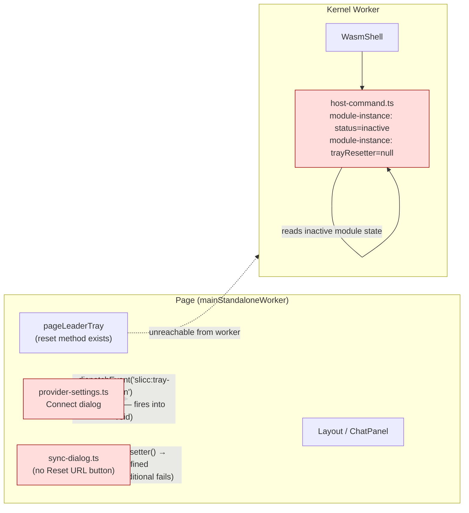
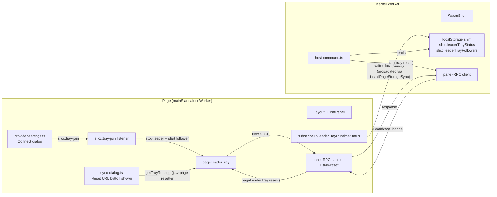

# Multi-Browser Sync — Followup fixes

**Status:** Proposed
**Date:** 2026-05-17
**Branch:** `fix/multi-browser-sync-followup`
**Builds on:** [`2026-05-17-multi-browser-sync-page-side-restoration.md`](./2026-05-17-multi-browser-sync-page-side-restoration.md) — that spec restored the page-side tray subsystem and is the architectural reference. This document picks up where that one left off and fixes the four post-merge gaps it surfaced.
**Related PR:** original page-side restoration was merged as PR #667; the gaps below were discovered in QA after merge.

## 1. Why

After the page-side restoration merged, four behaviours that the user expects to "just work" in standalone mode were found broken. All four are variants of the same root cause that the parent spec describes — the page↔kernel-worker split. The parent spec resolved most cases by moving the tray subsystem back to the page, but it did not wire **every** consumer to the page-thread side of that split.

Behaviours observed broken on commit `47eef924` of the merged branch:

1. **Runtime "Connect to another browser" never establishes a follower.** The settings dialog dispatches `window.dispatchEvent(new CustomEvent('slicc:tray-join', { detail: { joinUrl } }))` from `packages/webapp/src/ui/provider-settings.ts`. `mainStandaloneWorker` in `packages/webapp/src/ui/main.ts` does not install a listener for this event. `localStorage.slicc.trayJoinUrl` is still written by the dialog code, so a manual page reload picks it up via the boot-time follower path — but no user knows to reload, and the in-app affordance silently does nothing.

2. **Terminal `host` command always reports `status: inactive`.** `host-command.ts` runs inside the kernel worker (via `WasmShell`) and reads `getLeaderTrayRuntimeStatus()` from the worker's module instance of `tray-leader.ts`. The leader runs on the page thread, so the worker's module-level status singleton never gets updated. The avatar popover (page-thread) correctly shows the leader is live; the terminal shell does not.

3. **Reset URL / "Disconnect connected browsers" button is missing from the sync dialog.** `packages/webapp/src/ui/sync-dialog.ts` renders the button conditionally on `options.onReset` being truthy. `layout.ts` reads it from `getTrayResetter()`, which returns `undefined` because `setTrayResetter` is imported in `main.ts` but never called.

4. **Terminal `host reset` errors out as "not available in this environment".** Same root cause as #2 — worker-side `trayResetter` is null because `setTrayResetter` is only ever called on the page thread, and the parent spec did not call it at all.

## 2. Old flow (broken state on `47eef924`)



## 3. New flow (this spec)



## 4. Implementation

### 4.1 Files added

| Path                                                  | Purpose                                                                                                                                                                     |
| ----------------------------------------------------- | --------------------------------------------------------------------------------------------------------------------------------------------------------------------------- |
| `packages/webapp/tests/ui/panel-rpc-handlers.test.ts` | Targeted tests for the new `tray-reset` handler branch — verifies it calls the page-side `resetTray` callback, propagates the result, and throws when no callback is wired. |
| `docs/superpowers/specs/<this file>`                  | This spec.                                                                                                                                                                  |

### 4.2 Files modified

| Path                                                                     | Change                                                                                                                                                                                                                                                                                                                                                                                                                                                                                                                                                                                                                                                                                                                                                                                                                                                                        |
| ------------------------------------------------------------------------ | ----------------------------------------------------------------------------------------------------------------------------------------------------------------------------------------------------------------------------------------------------------------------------------------------------------------------------------------------------------------------------------------------------------------------------------------------------------------------------------------------------------------------------------------------------------------------------------------------------------------------------------------------------------------------------------------------------------------------------------------------------------------------------------------------------------------------------------------------------------------------------- |
| `packages/webapp/src/ui/main.ts`                                         | (i) Add `window.addEventListener('slicc:tray-join', ...)` in `mainStandaloneWorker` — on event, stop `pageLeaderTray`, clear its setters, then start `pageFollowerTray` against the new join URL. (ii) Call `setTrayResetter(() => pageLeaderTray.reset())` and `setConnectedFollowersGetter(...)` after `startPageLeaderTray` returns. (iii) Subscribe to `subscribeToLeaderTrayRuntimeStatus` and write the status JSON to `window.localStorage.setItem('slicc.leaderTrayStatus', ...)` — `installPageStorageSync` already propagates the write to the worker's shim. (iv) Pass an `onFollowerCountChanged` callback to `startPageLeaderTray` that serializes the peer list to `slicc.leaderTrayFollowers`. (v) Hoist `let pageLeaderTray = null` above the panel-RPC install site and pass a `resetTray` callback that calls `pageLeaderTray?.reset()` at invocation time. |
| `packages/webapp/src/shell/supplemental-commands/host-command.ts`        | (i) Add `getLeaderStatusWithFallback` / `getFollowersWithFallback` helpers — read the localStorage keys when the module globals are inactive / unset. Use as the new defaults in `createHostCommand`. (ii) Add `buildPanelRpcResetter()` — when `getTrayResetter()` is null, return a resetter that bridges through `getPanelRpcClient().call('tray-reset', undefined)`.                                                                                                                                                                                                                                                                                                                                                                                                                                                                                                      |
| `packages/webapp/src/kernel/panel-rpc.ts`                                | Add `'tray-reset'` to the `PanelRpcRequest` union (payload `undefined`) and to the `PanelRpcResults` map (`LeaderTrayRuntimeStatus`). Import the type.                                                                                                                                                                                                                                                                                                                                                                                                                                                                                                                                                                                                                                                                                                                        |
| `packages/webapp/src/ui/panel-rpc-handlers.ts`                           | (i) Add `StandalonePanelRpcHandlerOptions` with an optional `resetTray` callback. (ii) Implement the `tray-reset` handler — calls `options.resetTray()` if defined, else throws.                                                                                                                                                                                                                                                                                                                                                                                                                                                                                                                                                                                                                                                                                              |
| `packages/webapp/tests/shell/supplemental-commands/host-command.test.ts` | New sub-suite asserting (a) `host reset` routes through panel-RPC when no module-level resetter is set, (b) panel-RPC errors surface as `host reset:` failures, (c) without bridge or resetter, the existing "not available in this environment" error stands.                                                                                                                                                                                                                                                                                                                                                                                                                                                                                                                                                                                                                |
| `packages/webapp/tests/kernel/panel-rpc.test.ts`                         | New round-trip and rejection tests for the `tray-reset` op.                                                                                                                                                                                                                                                                                                                                                                                                                                                                                                                                                                                                                                                                                                                                                                                                                   |

### 4.3 Commit sequence

This branch starts from a clean checkout of `main`. Two commits are cherry-picked from the original branch, then one new commit per concern:

1. **`fix(ui): wire slicc:tray-join event and host setters in mainStandaloneWorker`** (cherry-picked) — fixes (1), (3) above and the setter half of (4). After this, the Reset URL button shows up and the runtime Connect path works in-page.
2. **`fix(ui): propagate leader tray status to kernel worker for host command`** (cherry-picked) — fixes (2). After this, `host` shows the correct state and followers list.
3. **`fix(host-command): bridge host reset from worker to page via panel-RPC`** — adds the worker→page action bridge (the open item from §11.3 of the parent spec). After this, `host reset` works from the terminal.
4. **`test: cover panel-RPC tray-reset and host-command bridge fallback`** — automated coverage for the new bridge end-to-end and the host-command worker-thread fallback.

Each commit independently passes `npm run typecheck` and `npm run test`.

## 5. API contracts

### 5.1 New panel-RPC op

```typescript
// packages/webapp/src/kernel/panel-rpc.ts
export type PanelRpcRequest =
  | /* …existing… */
  | { op: 'tray-reset'; payload?: undefined };

export interface PanelRpcResults {
  /* …existing… */
  'tray-reset': LeaderTrayRuntimeStatus;
}
```

### 5.2 Page-side handler

```typescript
// packages/webapp/src/ui/panel-rpc-handlers.ts
export interface StandalonePanelRpcHandlerOptions {
  resetTray?: () => Promise<LeaderTrayRuntimeStatus>;
}

export function createStandalonePanelRpcHandlers(
  options: StandalonePanelRpcHandlerOptions = {}
): PanelRpcHandlers;
```

### 5.3 Worker-side fallback

```typescript
// packages/webapp/src/shell/supplemental-commands/host-command.ts
function buildPanelRpcResetter(): (() => Promise<LeaderTrayRuntimeStatus>) | undefined {
  const client = getPanelRpcClient();
  if (!client) return undefined;
  return async () => await client.call('tray-reset', undefined);
}
```

## 6. Why these choices

### 6.1 Why panel-RPC over a new bridge protocol

The parent spec uses `lick-webhook-event` as a one-way fire-and-forget bridge. `host reset` needs a request/response with a typed result (the new `LeaderTrayRuntimeStatus`), so the fire-and-forget shape doesn't fit. The `panel-rpc` module already exists in `packages/webapp/src/kernel/` for exactly this need — DOM-bound shell commands invoked from the kernel worker. It has typed ops, correlation ids, timeout handling, and an existing test harness. Adding `tray-reset` is a one-line union extension.

### 6.2 Why localStorage for status propagation but panel-RPC for reset

`installPageStorageSync` is a one-way page→worker channel that already replicates `localStorage` writes. Leader status is **state** that's continuously updated; one-way replication is exactly the right shape. The bridge cost is zero because the channel already exists.

`host reset` is an **action** with a typed return value that depends on the page-side `LeaderTrayManager.start()` result. localStorage can't carry an RPC. Panel-RPC is the right tool.

### 6.3 Why hoist `pageLeaderTray` above the panel-RPC install site

`installPanelRpcHandler` runs before the tray init block. The `tray-reset` handler must close over `pageLeaderTray`, but TypeScript blocks references to a `let` before its declaration. The smallest change is to move the `let pageLeaderTray = null` declaration above the install site; the assignment in the tray init block happens later and the closure reads the current value at call time. Reordering avoids a holder-object indirection.

### 6.4 Why three resolution levels for the resetter

`options.resetTray ?? getTrayResetter() ?? buildPanelRpcResetter()` — explicit override (tests) > page-thread direct call > worker-thread bridge call. Each level falls back cleanly to the next. The bridge resetter returns `undefined` when no panel-RPC client is published, so the existing "not available in this environment" error still fires in environments that have neither (e.g. unit tests without the bridge).

## 7. Manual test plan

Run on two SLICC standalone instances at any two distinct ports (call them **Leader** and **Second**). Before every test: in the DevTools console, run `localStorage.clear()`, then in the SLICC terminal panel run `nuke 123456` (wipes IndexedDB and reloads). Login once on Leader; Second can stay unauthenticated.

| #   | Test                                              | Steps                                                                                                                                                                                                                 | Pass                                                                                                                                                                                                                                       |
| --- | ------------------------------------------------- | --------------------------------------------------------------------------------------------------------------------------------------------------------------------------------------------------------------------- | ------------------------------------------------------------------------------------------------------------------------------------------------------------------------------------------------------------------------------------------ |
| T0  | **PR §9 baseline — chat round-trip**              | On Leader: avatar → "Enable multi-browser sync" → copy join URL → send a chat message → wait for the agent's response. On Second: avatar → Account settings → "Connect to another browser" → paste the URL → Connect. | Within 15s: Leader's message and agent response appear on Second; Second can send a message and the agent responds; both messages stream on both sides.                                                                                    |
| T1  | **Runtime Connect to another browser**            | Same as T0 step 4 _without_ reloading Second after Connect.                                                                                                                                                           | Second becomes a follower with no manual reload. Chat mirrors. URL bar updates to `?tray=<join URL>`.                                                                                                                                      |
| T2  | **Terminal `host` parity**                        | On Leader: open Terminal tab. Type `host`.                                                                                                                                                                            | Output shows `status: leader` and `join_url: <same URL the avatar popover gave>`. Repeat after Second joins: `host` lists the follower under `followers:`. On Second: `host` shows follower state (state: connected, join URL, last ping). |
| T3  | **Terminal `host reset`**                         | On Leader with Second connected: in Terminal type `host reset`.                                                                                                                                                       | Output: "Tray session reset. All followers disconnected." plus a new `join_url:`. Second's data channel closes. Reopening the sync dialog on Leader shows the new join URL. Old join URL no longer accepts followers.                      |
| T4  | **Sync dialog "Reset URL" button**                | On Leader with Second connected: avatar → "Enable multi-browser sync" → click "Reset URL (disconnect connected browsers)".                                                                                            | Same effect as T3 via the UI. Button is present in the dialog (the parent spec's bug was that it was missing).                                                                                                                             |
| T5  | **`slicc:tray-join` listener (regression guard)** | On Second: in DevTools console, run `window.dispatchEvent(new CustomEvent('slicc:tray-join', { detail: { joinUrl: '<Leader's join URL>' } }))`.                                                                       | `slicc.trayJoinUrl` in localStorage becomes the dispatched URL; Second transitions from leader to follower within a few seconds without a page reload.                                                                                     |

All tests must pass on a clean (post-`nuke 123456`) state. Tests run in order, each starting with the cleanup protocol.

## 8. Risks

| Risk                                                                                        | Mitigation                                                                                                                                                                                                                                                                       |
| ------------------------------------------------------------------------------------------- | -------------------------------------------------------------------------------------------------------------------------------------------------------------------------------------------------------------------------------------------------------------------------------- |
| Panel-RPC default timeout (15s) is too short for a slow tray-worker round-trip              | `pageLeaderTray.reset()` involves a `POST` to the tray worker plus a `start` (another POST). Typical latency is well under 1s on a healthy network. If 15s becomes a problem in production, override per-call via `client.call('tray-reset', undefined, { timeoutMs: 30_000 })`. |
| `subscribeToLeaderTrayRuntimeStatus` write storm if leader status flaps                     | `setLeaderTrayRuntimeStatus` only fires listeners when state actually changes (existing dedup in the singleton). Even on bursty changes, localStorage writes are cheap and `installPageStorageSync` batches via the message channel.                                             |
| Hoisted `let pageLeaderTray = null` declaration extends the variable's TDZ across more code | Minor stylistic risk. The variable is only read after assignment; no callers between the hoisted declaration and the init block read it.                                                                                                                                         |
| Bridge handler outlives its page during reload                                              | `installPanelRpcHandler` returns a disposer; `mainStandaloneWorker` already wires it to `beforeunload`.                                                                                                                                                                          |
| Extension mode wiring (untested)                                                            | See §10.                                                                                                                                                                                                                                                                         |

## 9. Tests added

### Unit

- `tests/kernel/panel-rpc.test.ts` — `tray-reset` round-trip; error propagation.
- `tests/ui/panel-rpc-handlers.test.ts` — handler factory accepts/uses the `resetTray` callback; rejects clearly when callback is absent; surfaces resetter errors.
- `tests/shell/supplemental-commands/host-command.test.ts` — three new cases under the bridge-fallback sub-suite: routes through panel-RPC when no module-level resetter is set; surfaces panel-RPC errors as `host reset:` failures; preserves "not available in this environment" when neither resetter nor bridge is present.

Existing 40 host-command tests continue to pass. Total host-command test count: 43. Total panel-rpc + handlers tests: 13.

### Integration / manual

The manual test plan in §7 acts as the integration suite. No new automated integration tests are added in this PR because the page↔worker bridge involves `BroadcastChannel` semantics that the parent spec's harness does not yet model.

## 10. Extension mode — documented gaps (NOT fixed in this PR)

Of the four bugs that motivate this PR, three of them also affect extension mode. They are intentionally **not** fixed in this PR — the changes here target the standalone path. A code-inspection audit was run against extension boot files (`packages/chrome-extension/src/offscreen.ts`, `offscreen-bridge.ts`, and the `mainExtension` branch in `packages/webapp/src/ui/main.ts`); findings below.

| Bug                                      | Extension status        | Why                                                                                                                                                                         |
| ---------------------------------------- | ----------------------- | --------------------------------------------------------------------------------------------------------------------------------------------------------------------------- |
| `slicc:tray-join` listener               | Not applicable          | The extension path of `provider-settings.ts` uses `chrome.runtime.sendMessage({ type: 'refresh-tray-runtime', ... })` instead of the CustomEvent. The offscreen handles it. |
| `host` status display                    | Not applicable          | The extension's `WasmShell` runs in the offscreen document where the tray subsystem also runs; they share the same `tray-leader.ts` module instance.                        |
| `setTrayResetter` not called             | **Broken in extension** | `mainExtension` does not call `setTrayResetter(...)`. Reset URL button is missing from the sync dialog in extension mode as well.                                           |
| `setConnectedFollowersGetter` not called | **Broken in extension** | Same root as above. `host` in the extension's offscreen shell shows no followers.                                                                                           |
| `host reset` action                      | **Broken in extension** | `trayResetter` remains null in extension's offscreen module instance. `host reset` returns the same "not available in this environment" error.                              |

These three extension-mode gaps share the standalone root cause (setters aren't called by the entry boot function). A follow-up PR scoped to `mainExtension` can fix them by mirroring the wiring this PR adds to `mainStandaloneWorker`. **Reviewers: please decide whether you'd like that to land as a separate PR or be folded into this one.**

## 11. Out of scope

- Scoop / sprinkle UI sync on the follower. The parent spec's `startPageFollowerTray` API contract (§6.2 of that spec) listed `onScoopListUpdate` / `onSprinkleListUpdate` / `onSprinkleContentReady` callbacks; the implementation dropped them. The follower's chat mirrors correctly but the scoops and sprinkles panels stay empty. Separate PR — own root cause (missing callbacks, not a worker/page split).
- Extension-mode fixes for the three gaps in §10. Documented, not implemented here.
- Webhook event delivery (`lick-webhook-event` bridge from parent spec) — unchanged.
- Anything inside `packages/chrome-extension/src/` other than tests this PR is adding. Service worker, offscreen document, side panel — all untouched.
