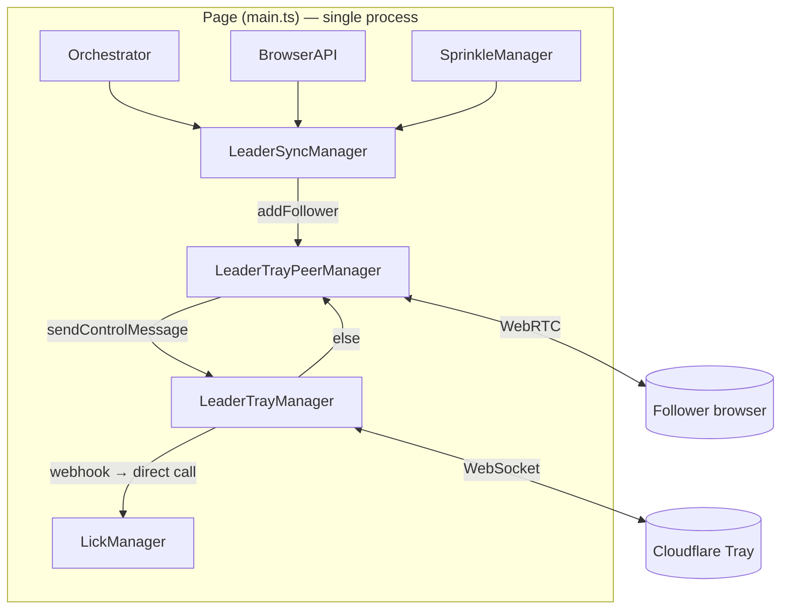
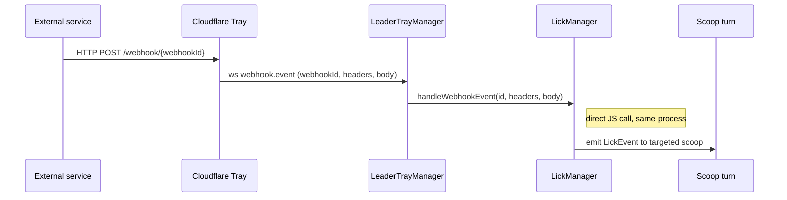
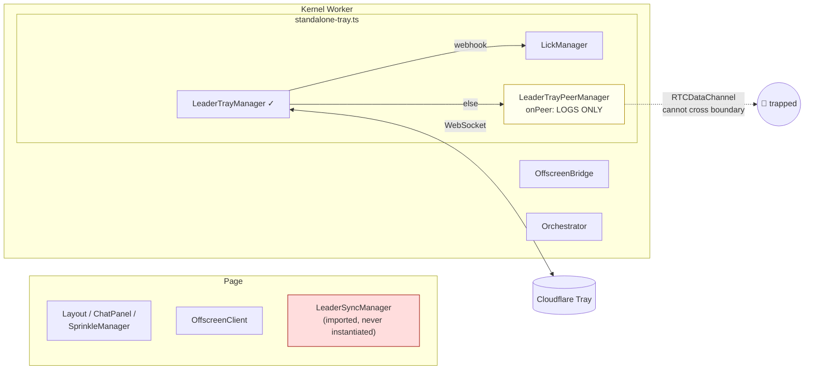
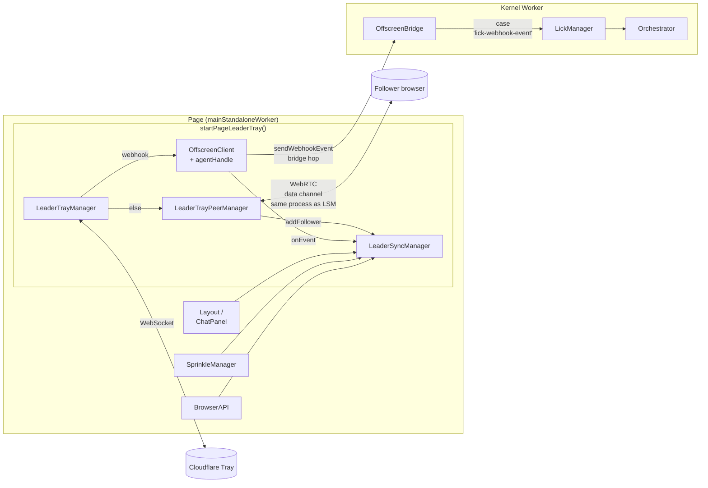
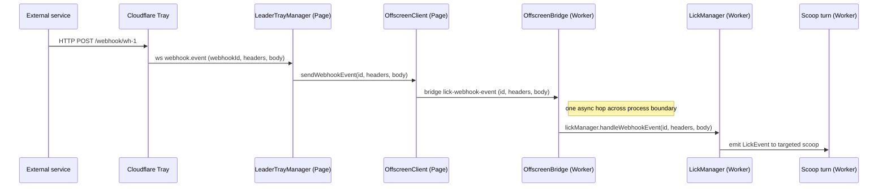

# Multi-Browser Sync — Page-Side Restoration

**Status:** Proposed
**Date:** 2026-05-17
**Branch:** `fix/rewire-standalone-leader-tray`
**Supersedes:** the worker-side approach in the initial commits of [PR #667](https://github.com/ai-ecoverse/slicc/pull/667) (commit `fe0c02e4`)
**Related docs:** `docs/architecture.md`, `packages/webapp/CLAUDE.md`

## 1. Why we're doing this

### 1.1 The original regression

Commit [`07cdce16`](https://github.com/ai-ecoverse/slicc/commit/07cdce16) ("ui: remove legacy inline-orchestrator standalone path", −1973 lines) removed four tightly-coupled instantiations from `main.ts` as part of consolidating the standalone path onto the kernel worker:

- **`LeaderTrayManager`** — was at `main.ts:3657-3689` ([permalink](https://github.com/ai-ecoverse/slicc/blob/248a62f598c454817362b4291dd85e76031a6741/packages/webapp/src/ui/main.ts#L3657-L3689)) — drove the tray connection state machine and the "Enable multi-browser sync" UI button
- **`LeaderTrayPeerManager`** — was at `main.ts:3636-3653` ([permalink](https://github.com/ai-ecoverse/slicc/blob/248a62f598c454817362b4291dd85e76031a6741/packages/webapp/src/ui/main.ts#L3636-L3653)) — accepted WebRTC connections from followers and wired each peer into `LeaderSyncManager.addFollower`
- **`LeaderSyncManager`** — was at `main.ts:3517-3596` ([permalink](https://github.com/ai-ecoverse/slicc/blob/248a62f598c454817362b4291dd85e76031a6741/packages/webapp/src/ui/main.ts#L3517-L3596)) — actually synced session data (chat, scoops, sprinkles, browser targets) to followers
- **`startFollowerJoin`** call — was at `main.ts:3504-3505` ([permalink](https://github.com/ai-ecoverse/slicc/blob/248a62f598c454817362b4291dd85e76031a6741/packages/webapp/src/ui/main.ts#L3504-L3505)) — started the follower side (`FollowerSyncManager`) when the user opens a join URL

None of the four were re-wired in `kernel-worker.ts` or anywhere else. The classes remain in the codebase, fully implemented, but imported and never instantiated. Effect: in standalone mode (CLI / macOS app), the multi-browser sync feature has been silently absent since `07cdce16` shipped.

### 1.2 Why the first fix attempt was architecturally wrong

PR #667 (commit `fe0c02e4`) put `LeaderTrayManager` and `LeaderTrayPeerManager` inside the kernel worker via `packages/webapp/src/kernel/standalone-tray.ts`. This restored the avatar-popover button but cannot restore the actual data sync, for two reasons:

1. **`LeaderSyncManager` depends on page-side state.** It needs `layout.panels.chat.getMessages()`, the `SprinkleManager`, the agent handle, and the selected scoop — all of which live on the page, not in the worker.
2. **`RTCDataChannel` instances cannot cross the worker↔page boundary.** With `LeaderTrayPeerManager` in the worker, the data channel it produces is trapped there. There is no Web API to transfer a `RTCDataChannel` to another thread.

Any architecture with `LeaderTrayPeerManager` in the worker is a dead-end for full feature parity.

### 1.3 What changes

Move the entire tray subsystem **back to the page**, where it lived pre-regression — both halves of it (leader and follower). The single dependency that moved into the worker (`LickManager`) is bridged via one new fire-and-forget bridge message (`lick-webhook-event`). Everything else stays on the page.

## 2. Old flow (pre-regression, pre-`07cdce16`)

Single page process. All collaborators in shared scope. Every arrow inside the page is a JavaScript function call — no serialization, no boundary.



Webhook flow pre-regression:



## 3. Current state on PR #667 (worker-side fix, partial)



Button works. Followers complete the WebRTC handshake but receive nothing — the data channel is trapped in the worker with no `LeaderSyncManager` on the same side to consume it.

## 4. New flow (this spec)



Webhook flow with the new bridge hop:



All other flows (follower join, agent → follower broadcast, follower → leader message) are unchanged from the pre-regression flow.

## 5. Implementation

### 5.1 Files added

| Path                                                  | Purpose                                                                           |
| ----------------------------------------------------- | --------------------------------------------------------------------------------- |
| `packages/webapp/src/ui/page-leader-tray.ts`          | `startPageLeaderTray(opts)` — boots leader trio, owns intervals, exposes `stop()` |
| `packages/webapp/src/ui/page-follower-tray.ts`        | `startPageFollowerTray(opts)` — boots `FollowerSyncManager`, exposes `stop()`     |
| `packages/webapp/tests/ui/page-leader-tray.test.ts`   | Leader helper unit tests                                                          |
| `packages/webapp/tests/ui/page-follower-tray.test.ts` | Follower helper unit tests                                                        |

### 5.2 Files modified

| Path                                                | Change                                                                                                                   |
| --------------------------------------------------- | ------------------------------------------------------------------------------------------------------------------------ |
| `packages/webapp/src/ui/main.ts`                    | `mainStandaloneWorker` calls `startPageLeaderTray` / `startPageFollowerTray` after `restoreOpenSprinkles()` (line ~2243) |
| `packages/chrome-extension/src/messages.ts`         | Add `WebhookEventMsg` (type `'lick-webhook-event'`) to `PanelToOffscreenMessage`                                         |
| `packages/chrome-extension/src/offscreen-bridge.ts` | `handleMessage` switch — new `case 'lick-webhook-event'` → `lickManager.handleWebhookEvent(...)`                         |
| `packages/webapp/src/ui/offscreen-client.ts`        | Add `sendWebhookEvent(webhookId, headers, body): void`                                                                   |

### 5.3 Files removed (revert)

| Path                                                   | Reason                                                        |
| ------------------------------------------------------ | ------------------------------------------------------------- |
| `packages/webapp/src/kernel/standalone-tray.ts`        | Worker-side approach replaced                                 |
| `packages/webapp/tests/kernel/standalone-tray.test.ts` | Tests for removed module                                      |
| `packages/webapp/src/kernel/kernel-worker.ts`          | Revert the `startStandaloneLeaderTray` call + two new imports |

### 5.4 Commit sequence (additive, no force-push)

1. **`revert: undo worker-side leader-tray fix`** — delete `kernel/standalone-tray.ts` + tests, undo block in `kernel-worker.ts`. Standalone reverts to pre-#667 state.
2. **`feat(bridge): add lick-webhook-event protocol`** — `messages.ts` + `offscreen-bridge.ts` + `offscreen-client.ts`. Typecheck-only addition; no caller yet.
3. **`feat(ui): page-leader-tray helper`** — new file + tests. Importable but not yet called.
4. **`feat(ui): page-follower-tray helper`** — new file + tests. Importable but not yet called.
5. **`feat(ui): wire page-side tray in mainStandaloneWorker`** — `main.ts` calls both helpers. Feature works end-to-end after this commit.

Each commit independently passes `npm run typecheck` and `npm run test`.

## 6. API contracts

### 6.1 `startPageLeaderTray`

```typescript
export interface StartPageLeaderTrayOptions {
  workerBaseUrl: string;

  // LeaderSyncManager dependencies (flat callbacks — no heavy UI imports inside helper)
  getMessages: () => ChatMessage[];
  getMessagesForScoop: (jid: string) => ChatMessage[];
  getScoopJid: () => string;
  getScoops: () => ScoopSummaryForSync[];
  getSprinkles: () => SprinkleSummaryForSync[];
  readSprinkleContent: (name: string) => Promise<string | null>;
  onFollowerMessage: (text: string, messageId: string, attachments?: MessageAttachment[]) => void;
  onFollowerAbort: () => void;
  onSprinkleLick: (sprinkleName: string, body: unknown, targetScoop?: string) => void;
  onFollowerCountChanged?: (count: number) => void;

  // LeaderTrayManager → LickManager bridge
  sendWebhookEvent: (id: string, headers: Record<string, string>, body: unknown) => void;

  // Agent event tap (helper owns subscription)
  onAgentEvent: (handler: (event: AgentEvent) => void) => () => void;

  // BrowserAPI + VFS for shared targets + sprinkle content
  browserAPI: BrowserAPI;
  browserTransport: CDPTransport;
  vfs: VirtualFS;

  // Test hooks
  _storeOverride?: LeaderTraySessionStore;
  _webSocketFactory?: (url: string) => LeaderTrayWebSocket;
  _fetchImpl?: typeof fetch;
}

export interface PageLeaderTrayHandle {
  stop(): void;
  reset(): Promise<TrayLeaderRuntimeStatus>; // for `host reset` command
  readonly leader: LeaderTrayManager;
  readonly peers: LeaderTrayPeerManager;
  readonly sync: LeaderSyncManager;
}

export function startPageLeaderTray(opts: StartPageLeaderTrayOptions): PageLeaderTrayHandle;
```

### 6.2 `startPageFollowerTray`

```typescript
export interface StartPageFollowerTrayOptions {
  joinUrl: string;
  getScoopJid: () => string;
  onAgentEvent: (event: AgentEvent) => void;
  onScoopListUpdate: (scoops: ScoopSummaryForSync[]) => void;
  onSprinkleListUpdate: (sprinkles: SprinkleSummaryForSync[]) => void;
  onSprinkleContentReady: (name: string, content: string) => void;
  sendUserMessageToLeader: (
    text: string,
    messageId: string,
    attachments?: MessageAttachment[]
  ) => void;
  sendAbortToLeader: () => void;
  _fetchImpl?: typeof fetch;
  _peerConnectionFactory?: () => RTCPeerConnection;
}

export interface PageFollowerTrayHandle {
  stop(): void;
  readonly follower: FollowerSyncManager;
}

export function startPageFollowerTray(opts: StartPageFollowerTrayOptions): PageFollowerTrayHandle;
```

### 6.3 Bridge message

```typescript
// packages/chrome-extension/src/messages.ts
export interface WebhookEventMsg {
  type: 'lick-webhook-event';
  webhookId: string;
  headers: Record<string, string>;
  body: unknown;
}

export type PanelToOffscreenMessage =
  | /* ...existing... */
  | SprinkleLickMsg
  | WebhookEventMsg
  | /* ...existing... */;
```

```typescript
// packages/chrome-extension/src/offscreen-bridge.ts (inside handleMessage switch)
case 'lick-webhook-event': {
  this.lickManager.handleWebhookEvent(msg.webhookId, msg.headers, msg.body);
  break;
}
```

```typescript
// packages/webapp/src/ui/offscreen-client.ts
sendWebhookEvent(webhookId: string, headers: Record<string, string>, body: unknown): void {
  this.send({ type: 'lick-webhook-event', webhookId, headers, body });
}
```

## 7. Why these choices

### 7.1 Why page-side over worker-side

|                                        | Worker-side (#667)                              | Page-side (this spec) |
| -------------------------------------- | ----------------------------------------------- | --------------------- |
| Restores avatar button                 | ✓                                               | ✓                     |
| Restores follower data sync            | ✗ — `LeaderSyncManager` can't move into worker  | ✓                     |
| RTCDataChannel crosses thread boundary | Has to (impossible)                             | No                    |
| New bridge protocol                    | BroadcastChannel + 2 message types (workaround) | 1 message type        |
| Closer to pre-regression architecture  | No                                              | Yes                   |

The decisive constraint is `RTCDataChannel` non-transferability + `LeaderSyncManager`'s page-side dependencies. Both are immovable; the tray manager position is the variable. Page-side it must be.

### 7.2 Why both leader and follower in one PR

Both halves were deleted by the same commit. Both have the same root cause (page-side state can't move into the worker). Shipping only the leader half = the join URL still leads to an empty session — a misleading half-fix. Follower path is small (~30-50 lines vs leader's ~150-200), so incremental cost is low.

### 7.3 Why two separate files

The two paths share zero implementation — different classes, different callbacks, different intervals. The pre-regression code had them in adjacent `if/else` branches but as fully separate code blocks. Two files matches existing `tray-leader.ts` / `tray-follower-sync.ts` naming in `scoops/`.

### 7.4 Why `src/ui/` not `src/scoops/`

`scoops/` is the domain layer. The page-tray helpers need `BrowserAPI`, `VirtualFS`, and (via callbacks) `Layout` and `OffscreenClient`. Putting them in `scoops/` inverts the dependency direction — `scoops/` would import from `ui/`, breaking layering. `src/ui/page-leader-tray.ts` mirrors the worker-side `src/kernel/standalone-tray.ts` pattern: boot wiring lives next to its host file.

### 7.5 Why flat-callback API

`page-leader-tray.ts` shouldn't import `Layout`, `OffscreenClient`, `SprinkleManager`. The `LeaderSyncManager` constructor already takes a flat-callback options object; the helper just forwards. Verbosity moves to the call site in `main.ts` where it documents the wiring; the helper stays a thin module that imports only domain types.

### 7.6 Why helper owns the agent-event tap

`LeaderSyncManager` runs three periodic broadcasts internally (scoops list, sprinkles list, browser targets) on `setInterval`. The agent-event broadcast tap is structurally the same — a long-lived subscription whose lifecycle is the helper's. Folding it into the helper's `stop()` gives one cleanup point. Exposing `broadcastEvent` for caller-side wiring would make one of three broadcast paths public and the other two private — asymmetric.

### 7.7 Why timing after `restoreOpenSprinkles()`

`LeaderSyncManager`'s `getSprinkles` callback reads `sprinkleManager.available()`. Reading before `sprinkleManager.refresh()` returns empty. Pre-regression code waited for the sprinkle manager before tray setup. Earlier timing buys ~100ms head-start against a 200-800ms tray handshake — unmeasurable.

### 7.8 Why `lick-webhook-event`

Explicit naming. Reader greps "webhook" and finds the bridge type, the tray's `webhook.event` control message, and `LickManager.handleWebhookEvent`. The `lick-` prefix makes the destination subsystem visible at a glance.

### 7.9 Why three fields, no ack

Three fields = exact signature of `LickManager.handleWebhookEvent`. The tray's wire-level `WebhookEventMessage` carries a `timestamp` too; `LickManager` discards it and generates its own, so the bridge needn't carry it. No ack because webhooks are fire-and-forget — pre-regression call had no return value.

### 7.10 Why keep `LickManager` in the worker

`LickManager` is wired deep into the orchestrator: scoops register webhooks via shell commands that run inside scoop contexts (worker), and the lick event handler routes events into scoop input queues (worker). Moving `LickManager` to the page would require bridging all those paths — webhook registration, cron registration, event delivery to scoops — far more bridge protocol than the single `lick-webhook-event` message.

### 7.11 Why no force-push

Maintain PR review history. Reviewers can see the architectural journey (worker-side attempt → revert → page-side fix) in the commit graph. The [comment linking the deleted code](https://github.com/ai-ecoverse/slicc/pull/667#issuecomment-4467568424) stays attached.

## 8. Risks and mitigations

| Risk                                                                                                     | Mitigation                                                                                                                                            |
| -------------------------------------------------------------------------------------------------------- | ----------------------------------------------------------------------------------------------------------------------------------------------------- |
| Page-side bug affects standalone but not extension (different code paths in `main.ts` vs `offscreen.ts`) | Extension path unchanged. Manual QA in both modes pre-merge.                                                                                          |
| Adding `lick-webhook-event` to bridge protocol — breaks out-of-tree consumers                            | None exist in repo. TypeScript exhaustiveness on the `switch` enforces handler.                                                                       |
| `host reset` command needs to recreate leaderSync — closure-captured manager would dangle                | Helper owns the tap. `reset()` reassigns internal state; subscription stays attached to the helper, not a specific manager instance.                  |
| Tray reconnect updates `window.history.replaceState` — only valid on page-side                           | Page-side fix makes this work again (worker can't touch `window`). Implemented in the leader's `onReconnected` callback inside `page-leader-tray.ts`. |

## 9. Tests

### Unit

- `page-leader-tray.test.ts` — boot, webhook relay, peer→sync wiring, stop teardown
- `page-follower-tray.test.ts` — boot, event rendering, message send, stop teardown
- `offscreen-bridge.test.ts` — `lick-webhook-event` case dispatches to `lickManager.handleWebhookEvent`

### Integration

- `mainStandaloneWorker` boot path test — fresh state, configured tray, leader status reaches `'leader'` within 10s

### Manual QA gates (clean-state)

- Fresh Chrome profile, no localStorage
- Configure tray runtime
- Reload — avatar shows "Enable multi-browser sync"
- Copy join URL → open in second profile → second profile sees leader's chat history
- Send message on leader → second profile renders streaming response
- Send message on follower → first profile sees user message → agent responds
- Webhook hits configured URL → cone receives event

## 10. Out of scope

- Re-architecting how `LickManager` registers webhooks (`webhook` shell command path) — works as-is via existing worker-side machinery
- Cron task delivery (`cron.event` is also a control message variant) — currently not delivered by tray in production; future bridge addition if it appears, mirroring `lick-webhook-event`
- Extension mode (`mainExtension` / `offscreen.ts`) — separate code path, intact, not touched
