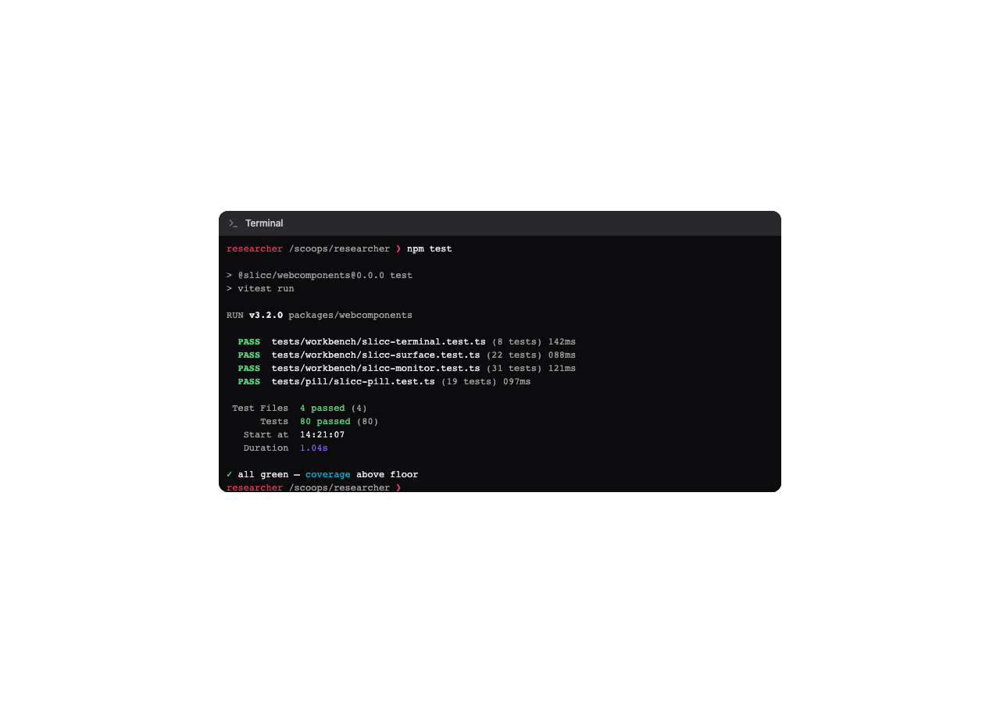
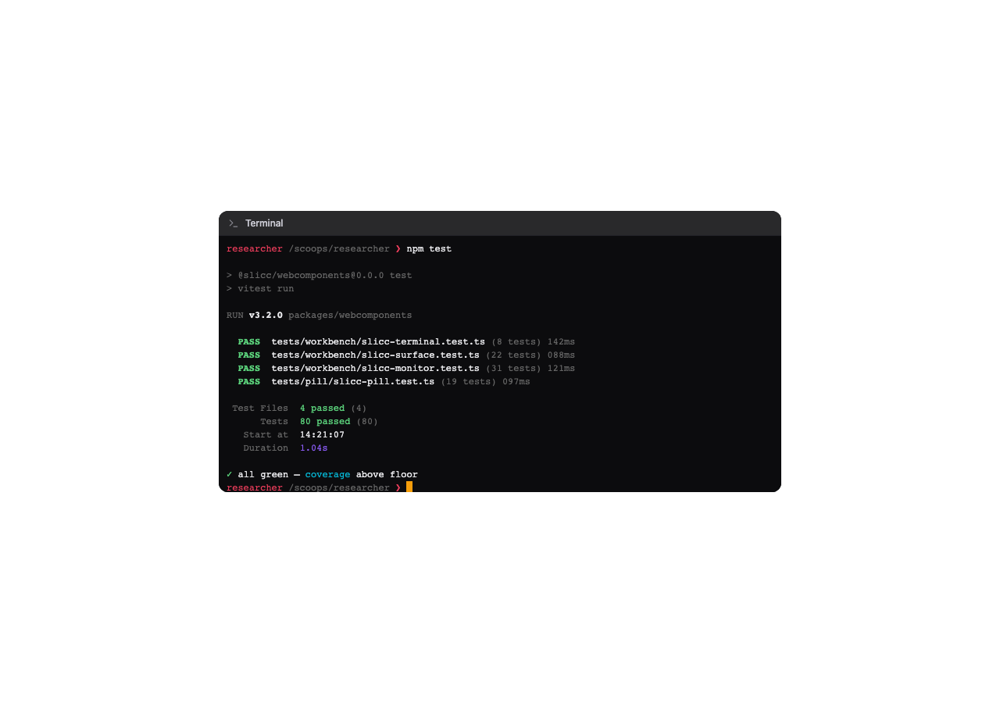
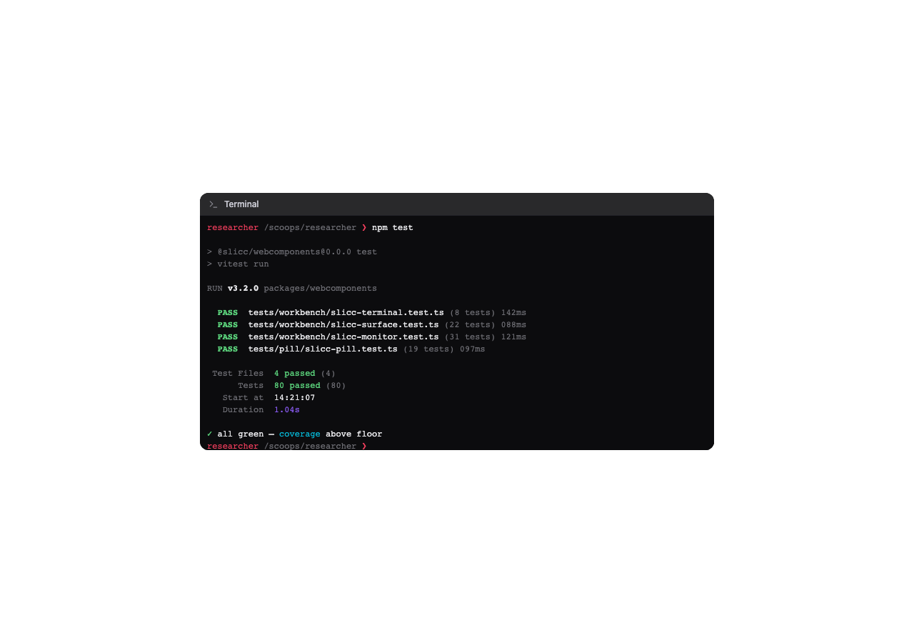
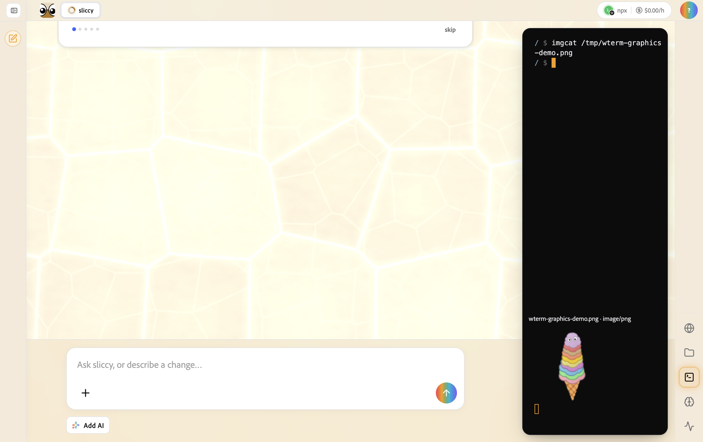

# wterm terminal migration

The reusable `<slicc-terminal>` component now uses `@wterm/dom@0.5.0` with
`@wterm/ghostty@0.5.0`. Ghostty is required for the [Kitty graphics support
merged in wterm PR #123](https://github.com/vercel-labs/wterm/pull/123); wterm's
default core does not expose images. The component retains its `write`,
`writeln`, `clear`, `focus`, `fit`, and `terminal-data` API. It adopts wterm's
stylesheet in the shadow root and maps the existing terminal palette to wterm's
CSS color variables.

## Visual comparison

All captures use the same `Workbench/Terminal/NpmTestRun` Storybook fixture at
1280×900. The panel is 720×360. Its dark surface intentionally stays the same
in both page themes.

| Theme | xterm.js before                                                | wterm with Ghostty after                                      |
| ----- | -------------------------------------------------------------- | ------------------------------------------------------------- |
| Light |  |  |
| Dark  |    |    |

The frame, text size, ANSI accents, and line spacing remain close. The wterm
cursor appears as a solid block in this state. Its DOM rows allow native text
selection. A browser test also sends a direct Kitty RGB image to Ghostty and
checks for wterm's image canvas.

## Live webapp image

[Terminal close-up](screenshots/wterm-spike/live-webapp-terminal.png)

The screenshot is from the running local webapp. The worker executed
`imgcat /tmp/wterm-graphics-demo.png`, emitted the PNG bytes, and the panel
sent them to `<slicc-terminal>` as a direct Kitty PNG transfer. Ghostty decoded
the 128×128 bundled SLICC image and wterm painted it on a canvas. The shell
remained usable; a subsequent `echo` command completed normally. The graphics
preview ignores pointer input and returns focus to the shell prompt after rendering.

For a repeatable local run, build the webapp and launch a local-worker dev
instance with `WORKER_BASE_URL`. Open the Terminal panel with
`?wterm-image-demo=1` on the app URL. The flag writes the bundled PNG to the
virtual `/tmp` and executes `imgcat` through the worker shell. An ordinary
`imgcat path.png` follows the same preview route without the flag.

## Interactive shell

The running shell in `packages/webapp/src/kernel/remote-terminal-view.ts`
uses the same Ghostty-backed `<slicc-terminal>` component as the PNG preview.
`terminal-line-editor.ts` handles input, cursor movement, in-memory history,
prompt redraw, and completion. The webapp no longer depends on xterm.js or
`xterm-readline`.

To recapture these screenshots, build Storybook and run
`packages/dev-tools/tools/storybook-affected-screenshots.mjs` with
`packages/webcomponents/src/workbench/slicc-terminal.stories.ts` in the
changed-file list. The script captures both page themes at 1280×900.
